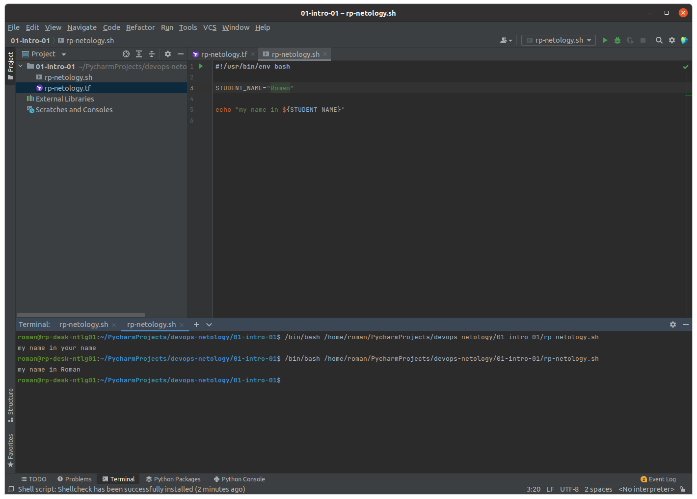
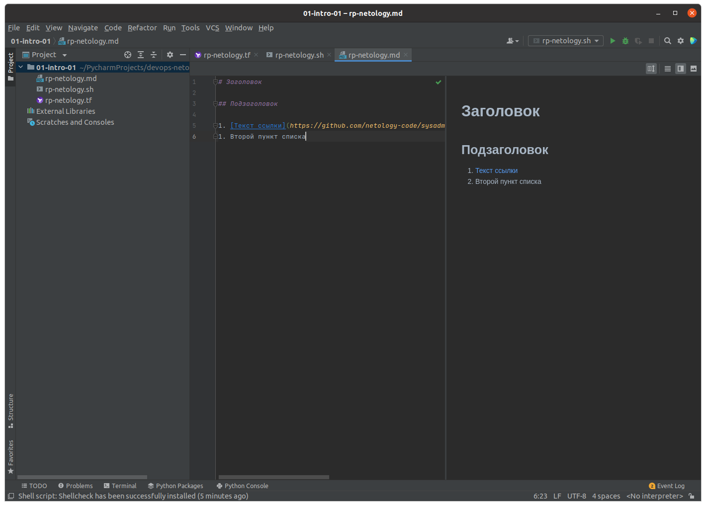
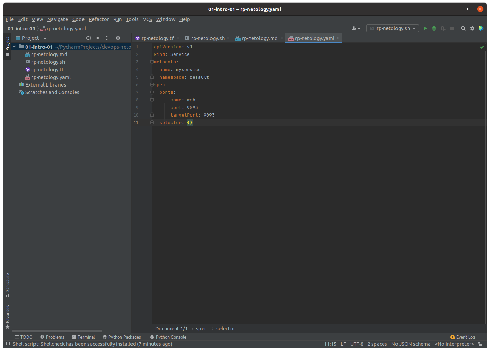
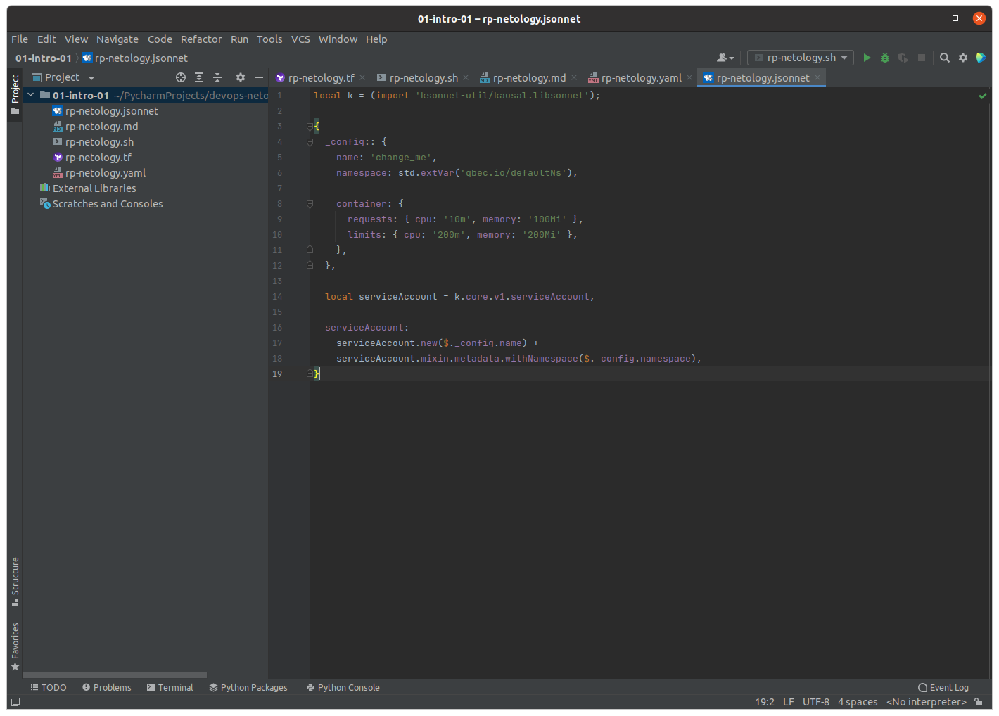

# 1.1. Введение в DevOps - Роман Поцелуев

## Задание №1 - Подготовка рабочей среды
  - Terraform: 
  - Bash: 
  - Markdown: 
  - Yaml: 
  - Jsonnet: 

## Задание №2 - Описание жизненного цикла задачи (разработки нового функционала)
Для начала давайте вкратце опишем обязанности участников процесса разработки ПО для данной задачи:
  - __Клиент__ - предоставляет требования к функциональности продукта
  - __Менеджер__ - взаимодействует с клиентами программного обеспечения для получения обратной связи для оценки результатов изменения в конечном продукте, формализует требования к функционалу продукта для следующих этапов процесса
  - __Разработчик__ - планирует, кодирует программное обеспечение и формирует видение проекта
  - __Тестировщик__ - тестирует разрабатываемый код
  - __DevOps инженер__ - предоставляет участникам среду и инструментарий для управления процессами разработки, развертывания, тестирования кода; разрабатывает инструменты внутренней автоматизации процессов; выполняет мониторинг сервисов среды

В соответствии с принципами DevOps процесс непрерывного жизненного цикла разработки программного обеспечения для данной задачи может состоять из следующих этапов:

  1. __Развитие__ - в соответствии с требованиями к продукту, участниками формируется видение проекта, планирование и кодирование программного обеспечения
  1. __Интеграция__ - этап включает компиляцию кода, модульное тестирование и упаковку
  1. __Тестирование__ - пакеты разворачиваются в тестовой среде и программное обеспечение проверяется на наличие ошибок
  1. __Развертывание__ - пакеты разворачиваются в производственной среде
  1. __Мониторинг__ - отслеживается производительность программного обеспечения и доступность сервисов
  1. __Обратная связь__ - на данном этапе выполняется анализ результатов изменения в конечном продукте посредством получения обратной связи от клиентовfs

Все этапы цикла подразумевает тесное сотрудничество участников. Большое внимание уделяется прозрачности и открытости в коллективе. Чем больше знаний распространяется между сотрудниками, тем больше обратной связи они получают - это помогает улучшить их работу в целом.
