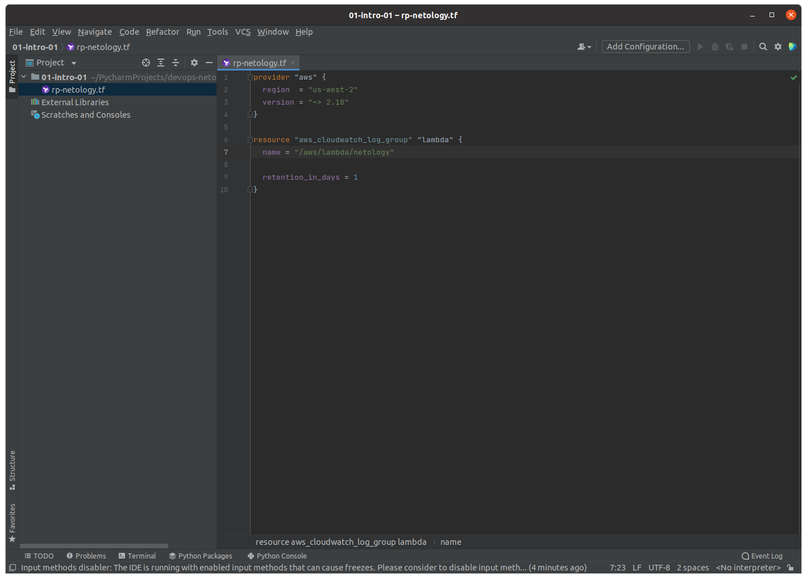

# 1.1. Введение в DevOps

## Задание №1 - Подготовка рабочей среды

Вы пришли на новое место работы или приобрели новый компьютер. Сначала надо настроить окружение для дальнейшей работы. 

**Что нужно сделать**

**Шаг 1.** Установить [PyCharm Community Edition](https://www.jetbrains.com/ru-ru/pycharm/download/). Это бесплатная версия IDE.   В качестве альтернативы можно установить [Visual Studio Code](https://code.visualstudio.com/Download) и дальнейшие шаги проделать в нём. Так вы сможете выбрать более удобный инструмент для себя.

**Шаг 2.** Установить плагины:

* Terraform.
* MarkDown.
* Yaml или Ansible Support.
* Jsonnet.
   
**Шаг 3.** Склонировать текущий репозиторий (команда `git clone`) или просто создать файлы для проверки плагинов.

**Шаг 4**. Убедитесь, что работает подсветка синтаксиса.

### Ответ

  - Terraform: 
  - Bash: 
  - Markdown: 
  - Yaml: 
  - Jsonnet: 

## Задание №2 - Описание жизненного цикла задачи (разработки нового функционала)

Чтобы лучше понимать предназначение инструментов, с которыми вам предстоит работать, составим схему жизненного цикла задачи в идеальном для вас случае.

### Описание истории

Представьте, что вы работаете в стартапе, который запустил интернет-магазин. Он достаточно успешно развивался, и пришло время налаживать процессы: у вас стало больше конечных клиентов, менеджеров и разработчиков.

Сейчас от клиентов вам приходят задачи, связанные с разработкой нового функционала. Задач много, и все они требуют выкладки на тестовые среды, одобрения тестировщика, проверки менеджером перед показом клиенту. В некоторых случаях вам будет необходим откат изменений. 

### Решение задачи

Вам нужно описать процесс решения задачи в соответствии с жизненным циклом разработки программного обеспечения. Использование конкретного метода разработки необязательно. 

Для решения главное — прописать по пунктам шаги решения задачи (релизации в конечный результат) с участием менеджера, разработчика (или команды разработчиков), тестировщика (или команды тестировщиков) и себя как DevOps-инженера. 

### Ответ

Для начала давайте вкратце опишем обязанности участников процесса разработки ПО для данной задачи:
  - __Клиент__ - предоставляет требования к функциональности продукта
  - __Менеджер__ - взаимодействует с клиентами программного обеспечения для получения обратной связи для оценки результатов изменения в конечном продукте, формализует требования к функционалу продукта для следующих этапов процесса
  - __Разработчик__ - планирует, кодирует программное обеспечение и формирует видение проекта
  - __Тестировщик__ - тестирует разрабатываемый код
  - __DevOps инженер__ - предоставляет участникам среду и инструментарий для управления процессами разработки, развертывания, тестирования кода; разрабатывает инструменты внутренней автоматизации процессов; выполняет мониторинг сервисов среды

В соответствии с принципами DevOps процесс непрерывного жизненного цикла разработки программного обеспечения для данной задачи может состоять из следующих этапов:

  1. __Развитие__ - в соответствии с требованиями к продукту, участниками формируется видение проекта, планирование и кодирование программного обеспечения
  1. __Интеграция__ - этап включает компиляцию кода, модульное тестирование и упаковку
  1. __Тестирование__ - пакеты разворачиваются в тестовой среде и программное обеспечение проверяется на наличие ошибок
  1. __Развертывание__ - пакеты разворачиваются в производственной среде
  1. __Мониторинг__ - отслеживается производительность программного обеспечения и доступность сервисов
  1. __Обратная связь__ - на данном этапе выполняется анализ результатов изменения в конечном продукте посредством получения обратной связи от клиентовfs

Все этапы цикла подразумевает тесное сотрудничество участников. Большое внимание уделяется прозрачности и открытости в коллективе. Чем больше знаний распространяется между сотрудниками, тем больше обратной связи они получают - это помогает улучшить их работу в целом.
