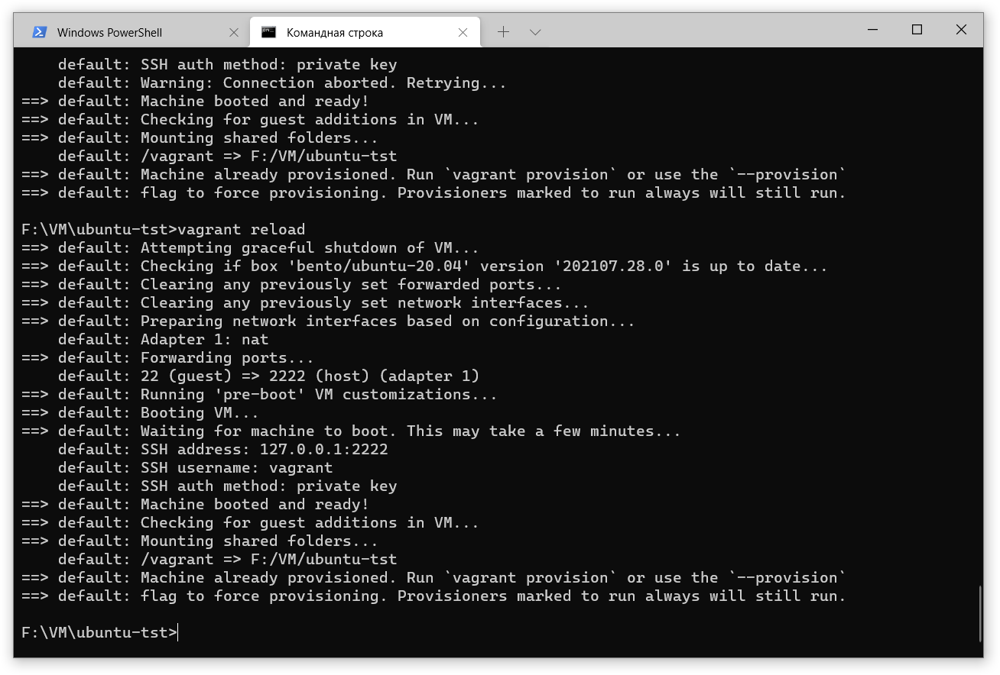
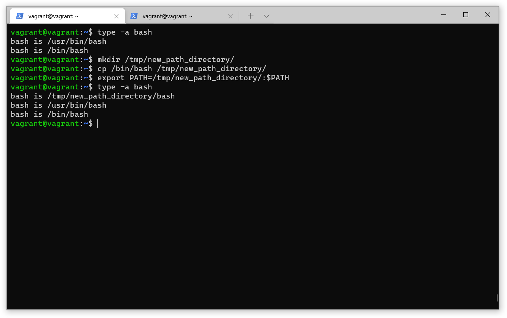

# 3.1. Работа в терминале, лекция 1
 
В рамках домашнего задания была выполнена установка ПП Oracle VirtualBox и Hashicorp Vagrant, из репозитория Vagrant развернута ВМ в среде виртуализации VirtualBox, подготовлены ответы на поставленные вопросы.

1. Развёртывание ВМ.

- **Ответ**

2. Какие ресурсы выделены ВМ по-умолчанию? 

- **Ответ**

3. Как добавить оперативной памяти или ресурсов процессора виртуальной машине?

- **Ответ**

4. Какой переменной можно задать длину журнала history, и на какой строчке manual это описывается? Что делает директива ignoreboth в bash?

- **Ответ**

    - переменная HISTFILESIZE задает количество команд, хранящихся в файле истории, а HISTSIZE указывает количество команд, которое сохраняется в памяти для текущей сессии.

    - ignoreboth – это сокращение от значений директив ignorespace и ignoredups, при установке значения в переменную HISTCONTROL, строки, начинающиеся с пробела и дубликаты, не будут сохранены в истории.    

5. В каких сценариях использования применимы скобки {} и на какой строчке man bash это описано?

- **Ответ**

    - используется в различных условных циклах, условных операторах,ограничивает тело функции, в командах выполняет подстановку элементов из списка и т.д.

6. Основываясь на предыдущем вопросе, как создать однократным вызовом touch 100000 файлов? А получилось ли создать 300000? Если нет, то почему?

- **Ответ**

7. В man bash поищите по /\[\[. Что делает конструкция [[ -d /tmp ]]?

- **Ответ**

    - Данная конструкция проверяет наличие каталога /tmp. [[ - расширенный вариант от [, является зарезервированным словом, а не командой, его bash выполняет как один элемент с кодом возврата 0 или 1. Внутри [[]] разрешается выполнение операторов &&, || которые приводят к ошибке в обычных скобках [].

8. Основываясь на знаниях о просмотре текущих (например, PATH) и установке новых переменных; командах, которые мы рассматривали, добейтесь в выводе type -a bash в виртуальной машине наличия первым пунктом в списке.

- **Ответ**

9. Чем отличается планирование команд с помощью batch и at?

- **Ответ**

    - at - это утилита командной строки, которая позволяет вам планировать выполнение команд в определенное время один раз.
    - batch или его псевдоним at -b планирует задания и выполняет их в пакетной очереди, если позволяет уровень загрузки системы. Значение нагрузки можно указать при вызове демона atd. Если средняя загрузка системы выше указанной, задания будут ждать в очереди.

