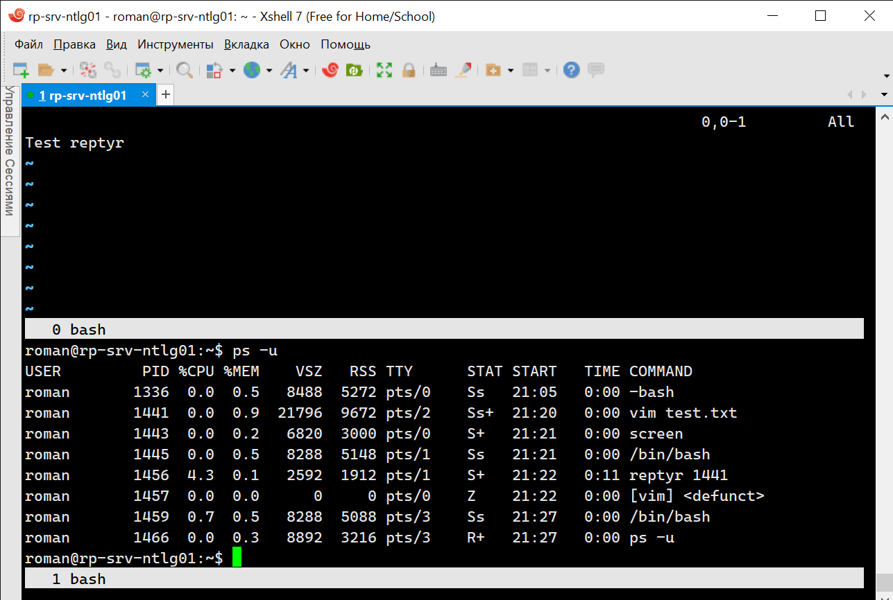

# 3.2. Работа в терминале, лекция 2
 
1. Какого типа команда `cd`? Попробуйте объяснить, почему она именно такого типа; опишите ход своих мыслей, если считаете что она могла бы быть другого типа.

- **Ответ**
  - При работе в оболочке все команды запускаются в контексте текущей папки. По умолчанию это домашний каталог, но его можно сменить используя команду cd. Это не отдельная утилита, ее нет в файловой системе. Это встроенная команда оболочки и меняет текущую папку только для оболочки, в которой выполняется.

2. Какая альтернатива без pipe команде `grep <some_string> <some_file> | wc -l`? `man grep` поможет в ответе на этот вопрос. Ознакомьтесь с [документом](http://www.smallo.ruhr.de/award.html) о других подобных некорректных вариантах использования pipe.

- **Ответ**


3. Какой процесс с PID `1` является родителем для всех процессов в вашей виртуальной машине Ubuntu 20.04?

- **Ответ**


4. Как будет выглядеть команда, которая перенаправит вывод stderr `ls` на другую сессию терминала?

- **Ответ**


5. Получится ли одновременно передать команде файл на stdin и вывести ее stdout в другой файл? Приведите работающий пример.

- **Ответ**


6. Получится ли находясь в графическом режиме, вывести данные из PTY в какой-либо из эмуляторов TTY? Сможете ли вы наблюдать выводимые данные?

- **Ответ**


7. Выполните команду `bash 5>&1`. К чему она приведет? Что будет, если вы выполните `echo netology > /proc/$$/fd/5`? Почему так происходит?

- **Ответ**

  - Команда запустит оболочку bash, создаст дескриптор 5 и перенаправит в STDOUT


8. Получится ли в качестве входного потока для pipe использовать только stderr команды, не потеряв при этом отображение stdout на pty? Напоминаем: по умолчанию через pipe передается только stdout команды слева от `|` на stdin команды справа. Это можно сделать, поменяв стандартные потоки местами через промежуточный новый дескриптор, который вы научились создавать в предыдущем вопросе.

- **Ответ**


9. Что выведет команда `cat /proc/$$/environ`? Как еще можно получить аналогичный по содержанию вывод?  

- **Ответ**

  - Файловая система proc содержит подробную информацию о внутреннем устройстве и работе операционной системе Linux. Приведенная команда выводит начальные переменные окружения, установленные для текущего процесса. Переменные окружения также можно получить командой env.

10.  Используя `man`, опишите что доступно по адресам `/proc/<PID>/cmdline`, `/proc/<PID>/exe`.

- **Ответ**

  - `cmdline` файл только для чтения содержит полную командную строку для процесса, если только процесс не является зомби.
  - `exe` файл представляет собой символическую ссылку, содержащую фактический путь к выполняемой команде.

11.  Узнайте, какую наиболее старшую версию набора инструкций SSE поддерживает ваш процессор с помощью `/proc/cpuinfo`.

- **Ответ**


12.  При открытии нового окна терминала и `vagrant ssh` создается новая сессия и выделяется pty. Это можно подтвердить командой `tty`, которая упоминалась в лекции 3.2. Однако:

     ```bash
     vagrant@netology1:~$ ssh localhost 'tty'
     not a tty
     ```

     Почитайте, почему так происходит, и как изменить поведение.
 
*- *Ответ**

  - Как видно из первого рисунка при запуске клиента ssh с такими параметрами псевдотерминал не предоставляется, команда запускается в контексте сервера SSH, но это можно исправить при добавлении ключа -t (Force pseudo-terminal allocation), второй рисунок


13.  Бывает, что есть необходимость переместить запущенный процесс из одной сессии в другую. Попробуйте сделать это, воспользовавшись `reptyr`. Например, так можно перенести в `screen` процесс, который вы запустили по ошибке в обычной SSH-сессии.

- **Ответ**




14.  `sudo echo string > /root/new_file` не даст выполнить перенаправление под обычным пользователем, так как перенаправлением занимается процесс shell'а, который запущен без `sudo` под вашим пользователем. Для решения данной проблемы можно использовать конструкцию `echo string | sudo tee /root/new_file`. Узнайте что делает команда `tee` и почему в отличие от `sudo echo` команда с `sudo tee` будет работать.

- **Ответ**

  - Команда tee в Linux считывает стандартный ввод и записывает его одновременно в стандартный вывод и в один или несколько указанных файлов.
  - Данный пример не работает, потому что благодаря sudo вы получаете рутовые привилегии, но перенаправление (>) работает уже от обычной учётной записи.
