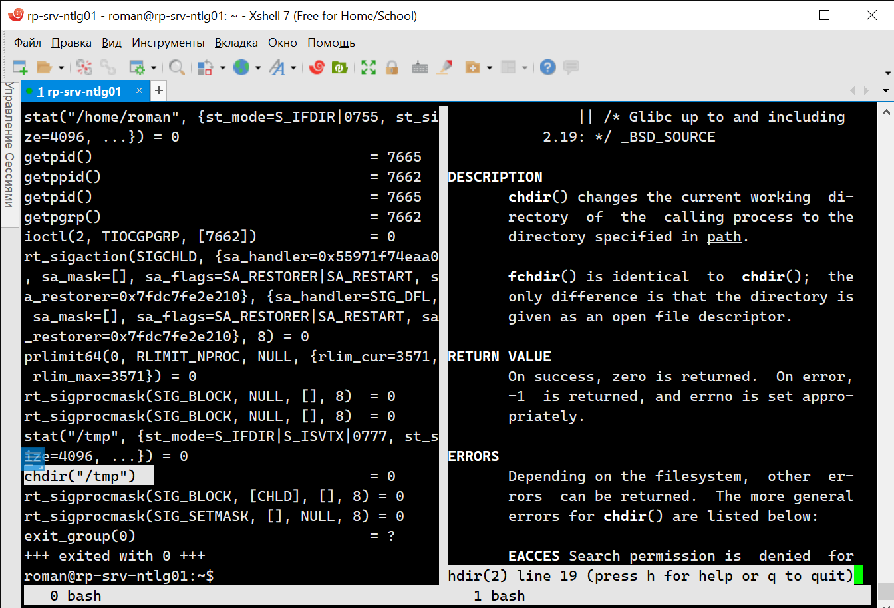
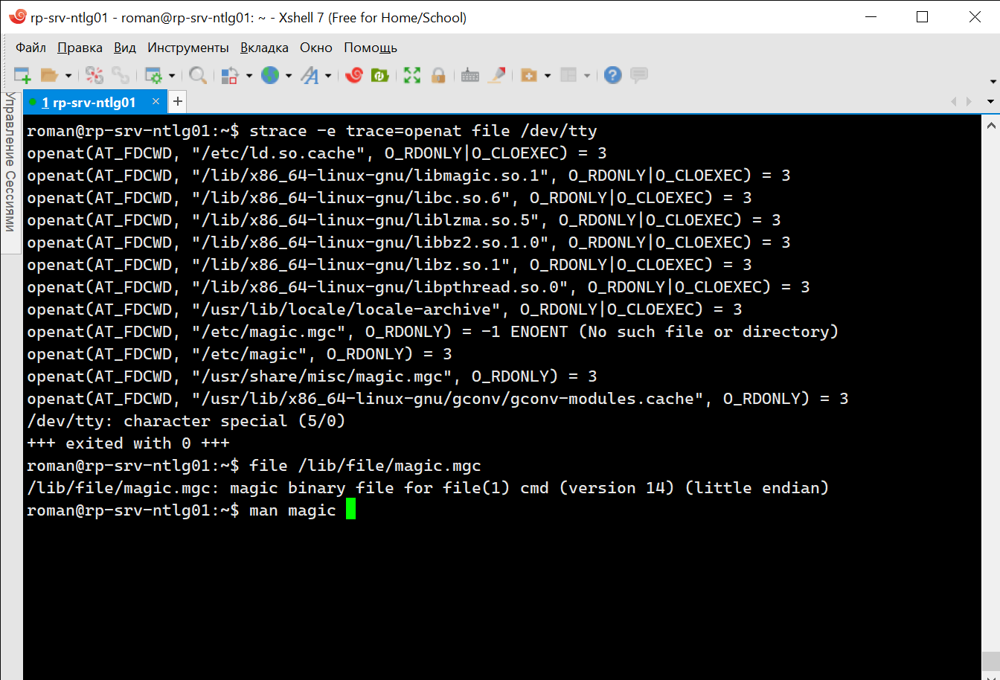
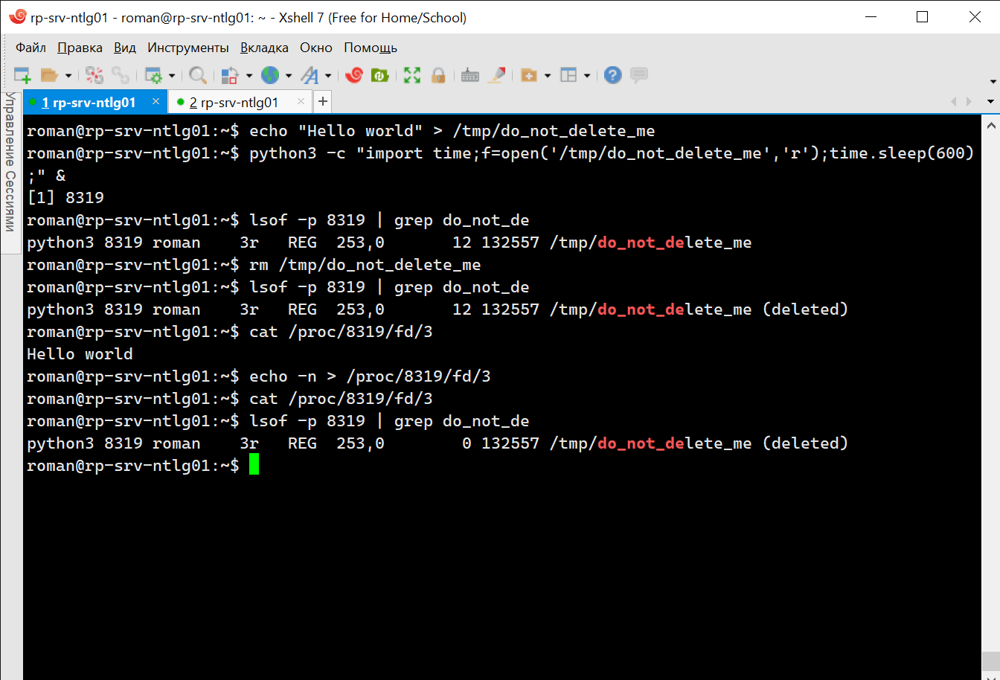
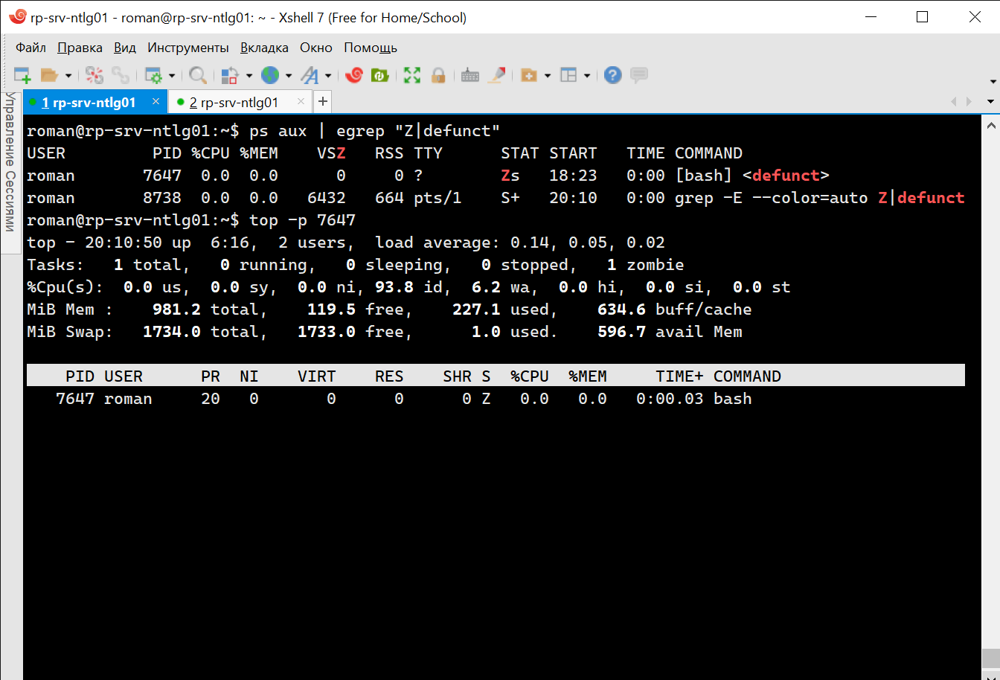
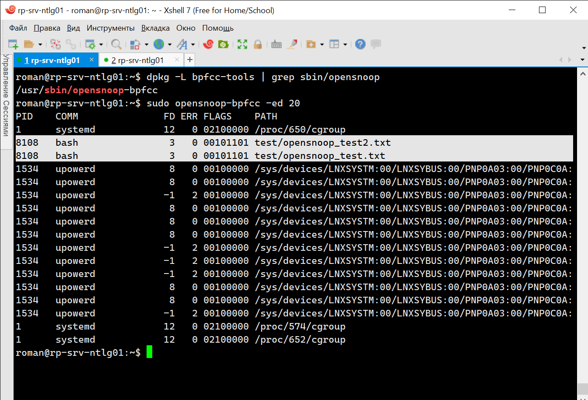
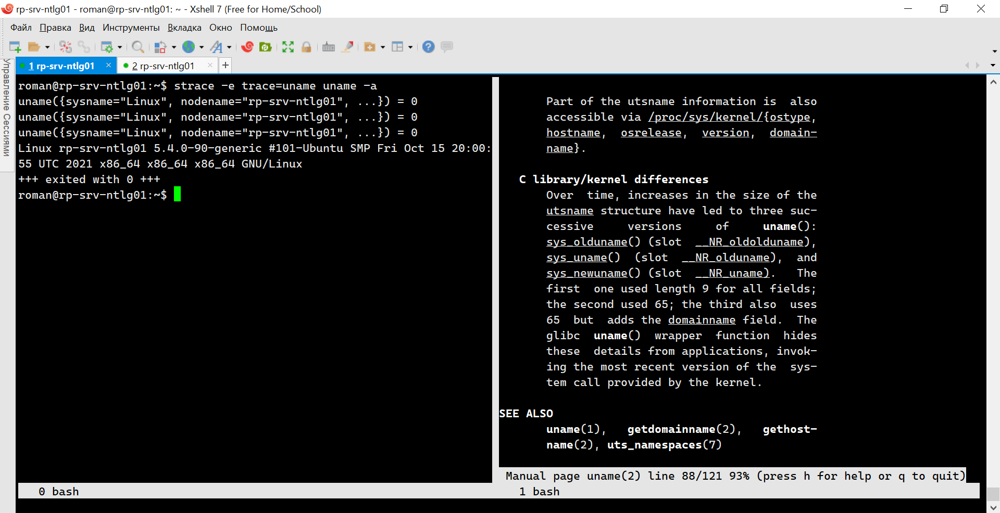
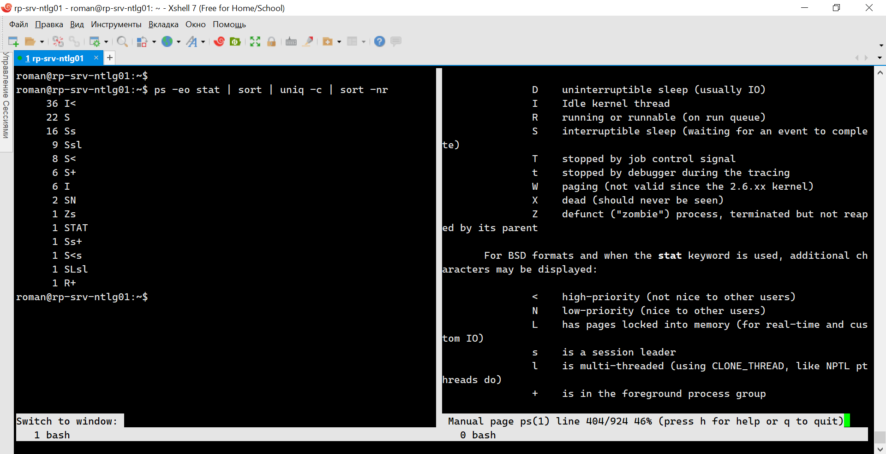

# 3.3. Операционные системы, лекция 1 - Роман Поцелуев

1. Какой системный вызов делает команда `cd`? В прошлом ДЗ мы выяснили, что `cd` не является самостоятельной программой, это `shell builtin`, поэтому запустить `strace` непосредственно на `cd` не получится. Тем не менее, вы можете запустить `strace` на `/bin/bash -c 'cd /tmp'`. В этом случае вы увидите полный список системных вызовов, которые делает сам `bash` при старте. Вам нужно найти тот единственный, который относится именно к `cd`.

2. Попробуйте использовать команду `file` на объекты разных типов на файловой системе. Например:
    ```bash
    vagrant@netology1:~$ file /dev/tty
    /dev/tty: character special (5/0)
    vagrant@netology1:~$ file /dev/sda
    /dev/sda: block special (8/0)
    vagrant@netology1:~$ file /bin/bash
    /bin/bash: ELF 64-bit LSB shared object, x86-64
    ```
    Используя `strace` выясните, где находится база данных `file` на основании которой она делает свои догадки.

3. Предположим, приложение пишет лог в текстовый файл. Этот файл оказался удален (deleted в lsof), однако возможности сигналом сказать приложению переоткрыть файлы или просто перезапустить приложение – нет. Так как приложение продолжает писать в удаленный файл, место на диске постепенно заканчивается. Основываясь на знаниях о перенаправлении потоков предложите способ обнуления открытого удаленного файла (чтобы освободить место на файловой системе).

4. Занимают ли зомби-процессы какие-то ресурсы в ОС (CPU, RAM, IO)?
  - Вся системная память и другие ресурсы, выделенные зомби-процессу, деаллокируются при его завершении с помощью системного вызова exit(). Но его запись в таблице остается доступной. Если родительский процесс не запущен, наличие зомби-процесса означает ошибку в операционной системе.

5. В iovisor BCC есть утилита `opensnoop`:
    ```bash
    root@vagrant:~# dpkg -L bpfcc-tools | grep sbin/opensnoop
    /usr/sbin/opensnoop-bpfcc
    ```
    На какие файлы вы увидели вызовы группы `open` за первую секунду работы утилиты? Воспользуйтесь пакетом `bpfcc-tools` для Ubuntu 20.04. Дополнительные [сведения по установке](https://github.com/iovisor/bcc/blob/master/INSTALL.md).

6. Какой системный вызов использует `uname -a`? Приведите цитату из man по этому системному вызову, где описывается альтернативное местоположение в `/proc`, где можно узнать версию ядра и релиз ОС.

7. Чем отличается последовательность команд через `;` и через `&&` в bash? Например:
    ```bash
    root@netology1:~# test -d /tmp/some_dir; echo Hi
    Hi
    root@netology1:~# test -d /tmp/some_dir && echo Hi
    root@netology1:~#
    ```
    Есть ли смысл использовать в bash `&&`, если применить `set -e`?
  - `;` - разделитель команд, позволяет записывать более одной команды в строке.
  - логическое И, в данном случае команда `hello` выполнится только после успешного завершения команды `test`
  - аргумент `-e` прекращает выполнение скрипта если команда завершилась ошибкой, выводит в stderr строку с ошибкой, т.е. процесс обработки для этой команды не изменится
8. Из каких опций состоит режим bash `set -euxo pipefail` и почему его хорошо было бы использовать в сценариях?
  - `set -e` - прекращает выполнение скрипта если команда завершилась ошибкой, выводит в stderr строку с ошибкой.
  - `set -u` - прекращает выполнение скрипта, если встретилась несуществующая переменная.
  - `set -x` - выводит выполняемые команды в stdout перед выполнением.
  - `set -o pipefail` - прекращает выполнение скрипта, даже если одна из частей пайпа завершилась ошибкой.
  - данная конструкция позволяет запускать скрипты с детализацией вывода ошибок, в основном используется при отладке.
9. Используя `-o stat` для `ps`, определите, какой наиболее часто встречающийся статус у процессов в системе. В `man ps` ознакомьтесь (`/PROCESS STATE CODES`) что значат дополнительные к основной заглавной буквы статуса процессов. Его можно не учитывать при расчете (считать S, Ss или Ssl равнозначными).
