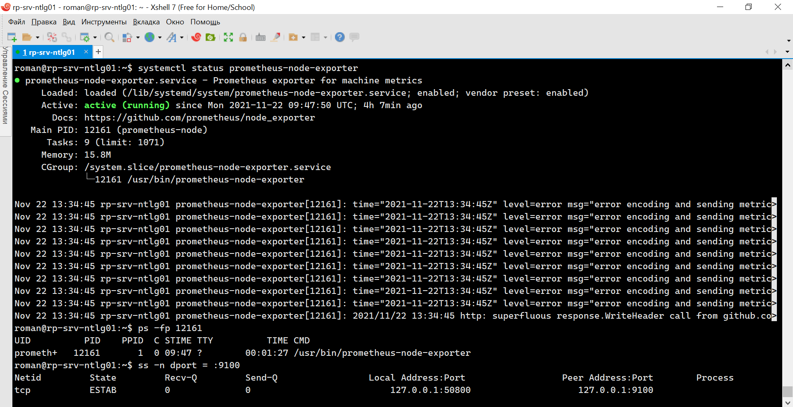
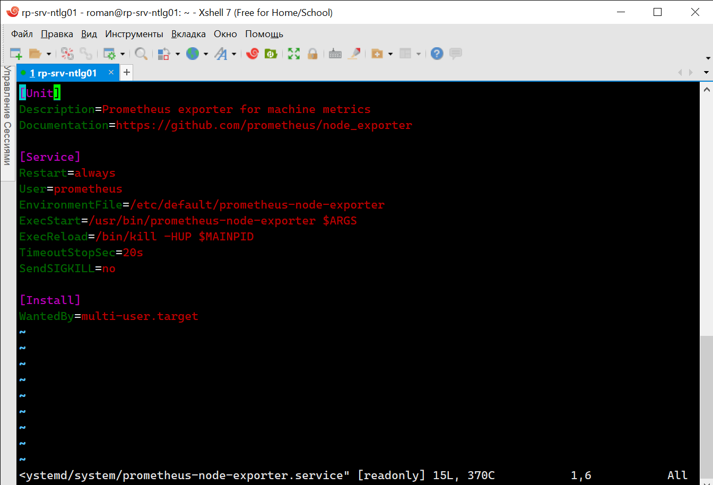
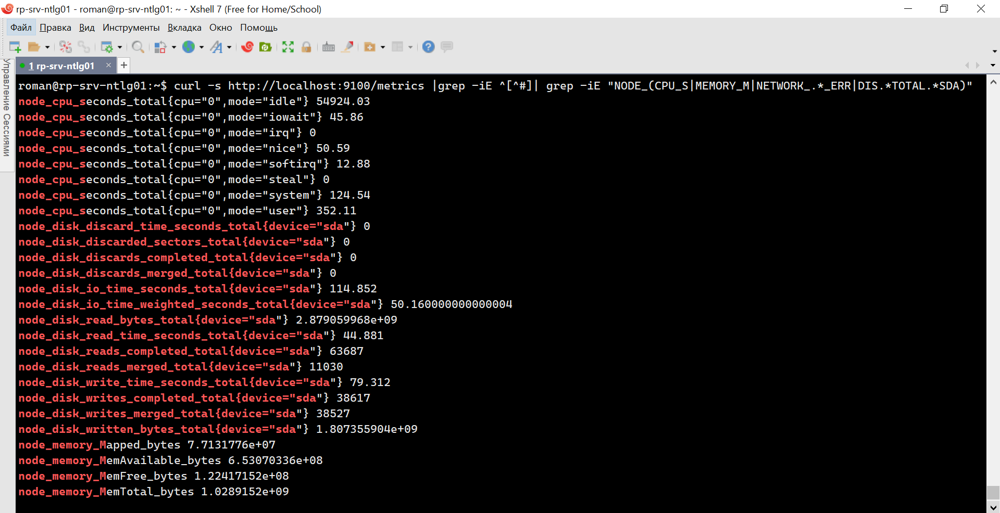
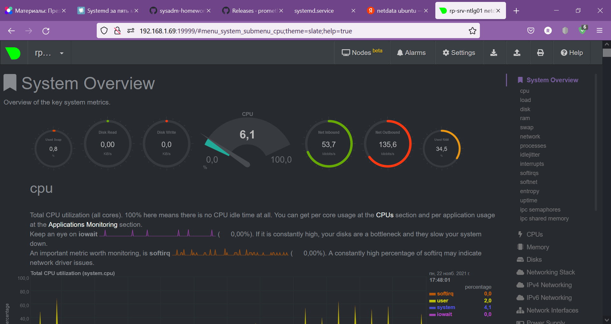
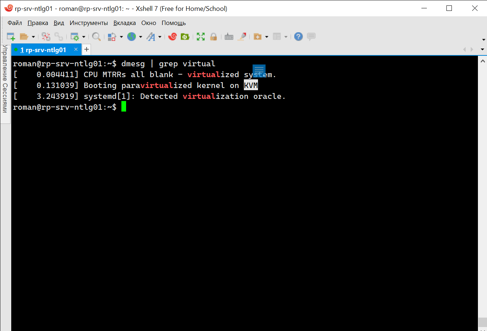
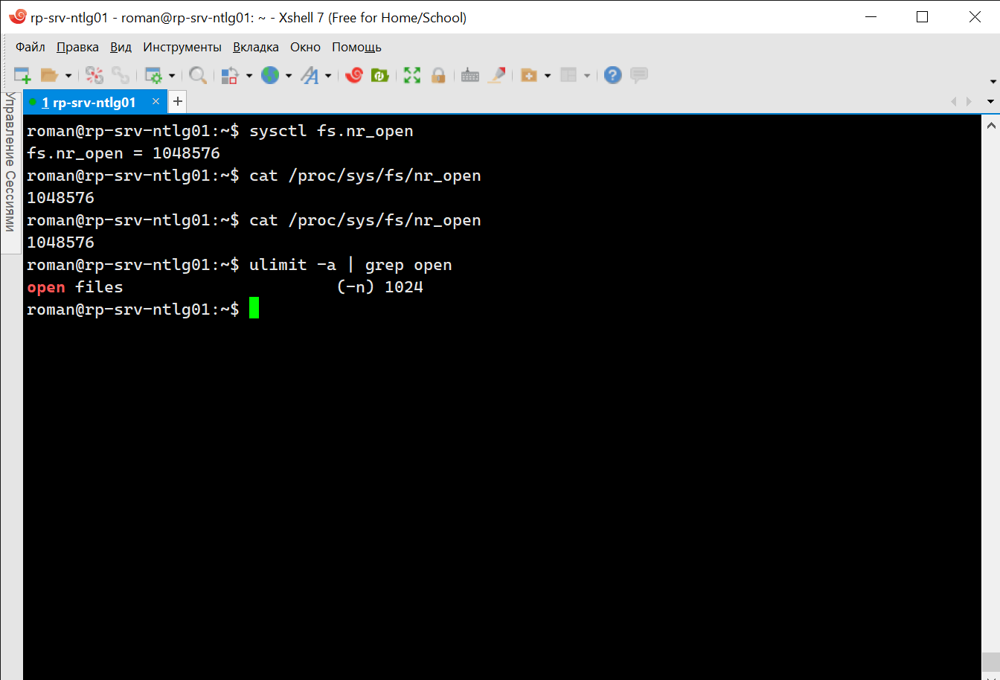
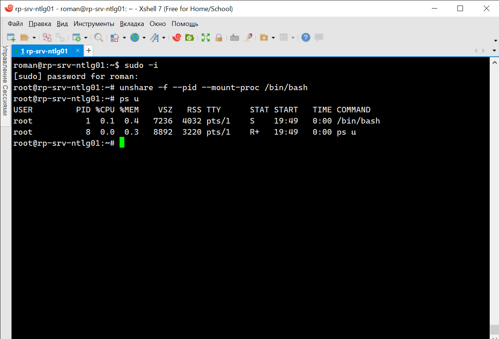
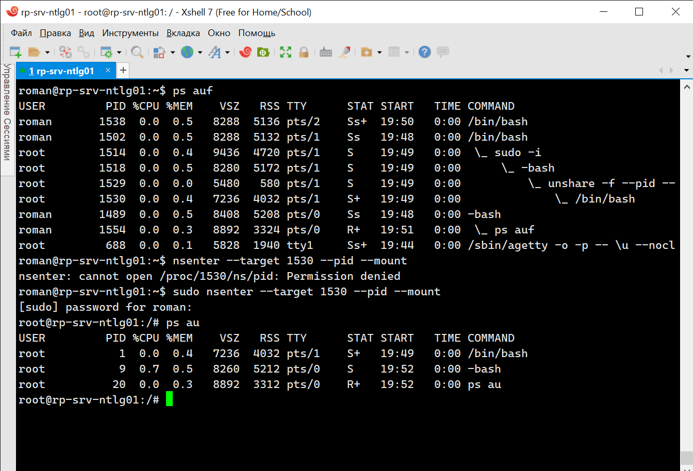

# 3.4. Операционные системы, лекция 2 - Роман Поцелуев

1. На лекции мы познакомились с [node_exporter](https://github.com/prometheus/node_exporter/releases). В демонстрации его исполняемый файл запускался в background. Этого достаточно для демо, но не для настоящей production-системы, где процессы должны находиться под внешним управлением. Используя знания из лекции по systemd, создайте самостоятельно простой [unit-файл](https://www.freedesktop.org/software/systemd/man/systemd.service.html) для node_exporter:

    * поместите его в автозагрузку,
    * предусмотрите возможность добавления опций к запускаемому процессу через внешний файл (посмотрите, например, на `systemctl cat cron`),
    * удостоверьтесь, что с помощью systemctl процесс корректно стартует, завершается, а после перезагрузки автоматически поднимается.

  - Выполнил установку Prometheus из стандартного репозитория Ubuntu, в комплекте с серверной частью установился node_explorer

  - Служба `Systemd` запускает процесс `prometheus-node-explorer` инициализация, которого происходит на `runlevel=3` из файла `/etc/systemd/system/multi-user.target.wants/prometheus-node-exporter.service: symbolic link to /lib/systemd/system/prometheus-node-exporter.service`, в котором видно, что процесс запускается командой `/usr/bin/prometheus-node-exporter $ARGS`, на вход которого поступает и файл настроек `etc/default/prometheus-node-exporter`

2. Ознакомьтесь с опциями node_exporter и выводом `/metrics` по-умолчанию. Приведите несколько опций, которые вы бы выбрали для базового мониторинга хоста по CPU, памяти, диску и сети.

  - За базовые параметры хоста можно выбрать метрики, представленные в запросе.

3. Установите в свою виртуальную машину [Netdata](https://github.com/netdata/netdata). Воспользуйтесь [готовыми пакетами](https://packagecloud.io/netdata/netdata/install) для установки (`sudo apt install -y netdata`). После успешной установки:
    * в конфигурационном файле `/etc/netdata/netdata.conf` в секции [web] замените значение с localhost на `bind to = 0.0.0.0`,
    * добавьте в Vagrantfile проброс порта Netdata на свой локальный компьютер и сделайте `vagrant reload`:

    ```bash
    config.vm.network "forwarded_port", guest: 19999, host: 19999
    ```

    После успешной перезагрузки в браузере *на своем ПК* (не в виртуальной машине) вы должны суметь зайти на `localhost:19999`. Ознакомьтесь с метриками, которые по умолчанию собираются Netdata и с комментариями, которые даны к этим метрикам.

  - после установки Netdata и настройки файла конфигурации удалось подключиться к приложению через браузер.

4. Можно ли по выводу `dmesg` понять, осознает ли ОС, что загружена не на настоящем оборудовании, а на системе виртуализации?
  - Можно понять по присутствующим сообщениям о virtual и KVM

5. Как настроен sysctl `fs.nr_open` на системе по-умолчанию? Узнайте, что означает этот параметр. Какой другой существующий лимит не позволит достичь такого числа (`ulimit --help`)?
  - Параметр sysctl `fs.nr_open` устанавливает системные ограничения на количество открытых дескрипторов. Команда ulimit и файла конфигурации /etc/security/limits.conf может устанавливать ограничения для отдельных процессов.  

6. Запустите любой долгоживущий процесс (не `ls`, который отработает мгновенно, а, например, `sleep 1h`) в отдельном неймспейсе процессов; покажите, что ваш процесс работает под PID 1 через `nsenter`. Для простоты работайте в данном задании под root (`sudo -i`). Под обычным пользователем требуются дополнительные опции (`--map-root-user`) и т.д.
  - Запуск процесса в отдельном неймспейсе.

  - Подключение к неймспейсу.

7. Найдите информацию о том, что такое `:(){ :|:& };:`. Запустите эту команду в своей виртуальной машине Vagrant с Ubuntu 20.04 (**это важно, поведение в других ОС не проверялось**). Некоторое время все будет "плохо", после чего (минуты) – ОС должна стабилизироваться. Вызов `dmesg` расскажет, какой механизм помог автоматической стабилизации. Как настроен этот механизм по-умолчанию, и как изменить число процессов, которое можно создать в сессии?
  - Так называемая fork bomb, функция, которая рекурсивно вызывает саму себя, тем самым порождая ответвления от запустившего процесса. Ограничена лимитом max user processes `ulimit -u`. При достижении лимита в журналах выводится сообщение `bash: fork: Resource temporarily unavailable`
    ```bash
    bomb() {
    bomb | bomb &
    };
    bomb  
    ```