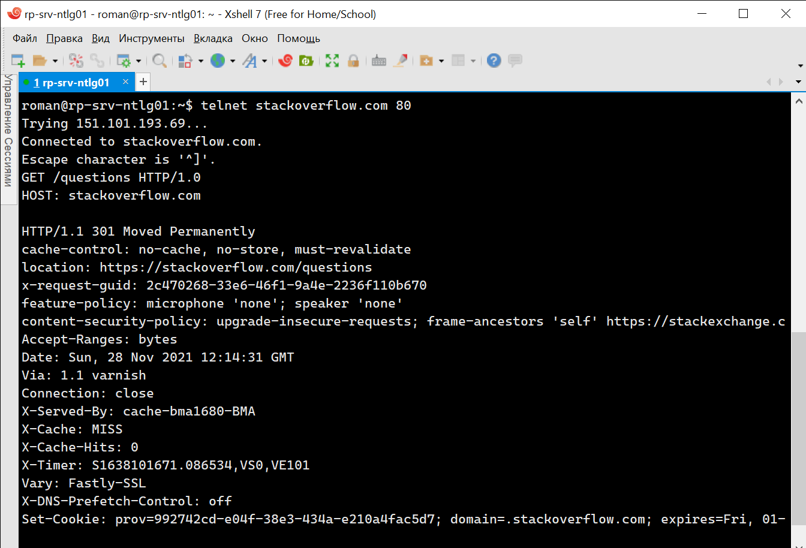
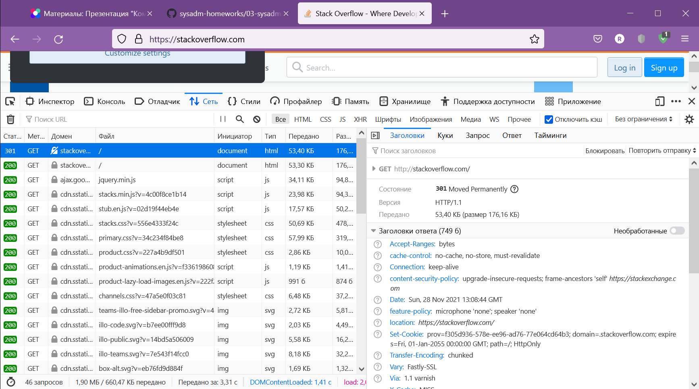
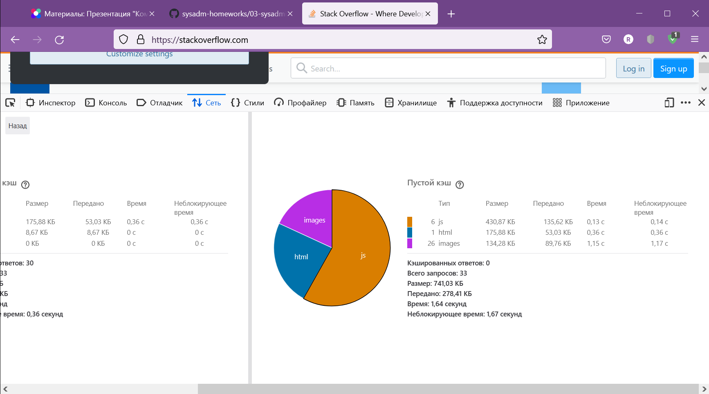
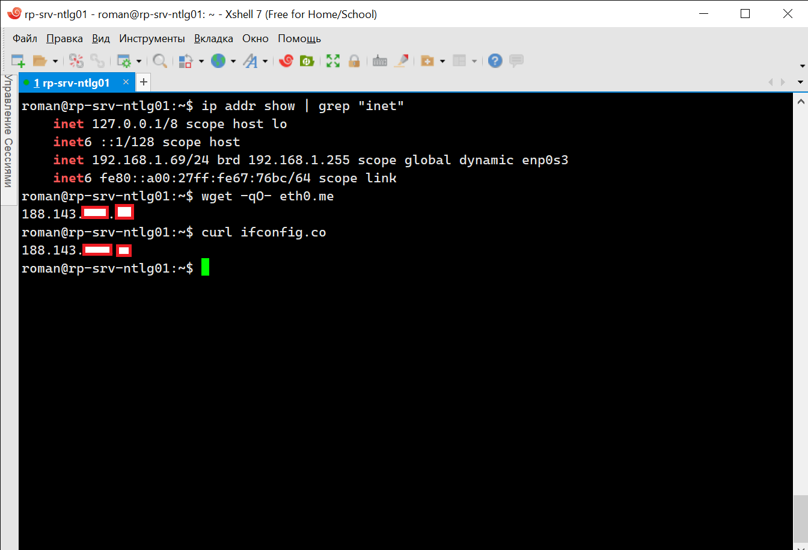
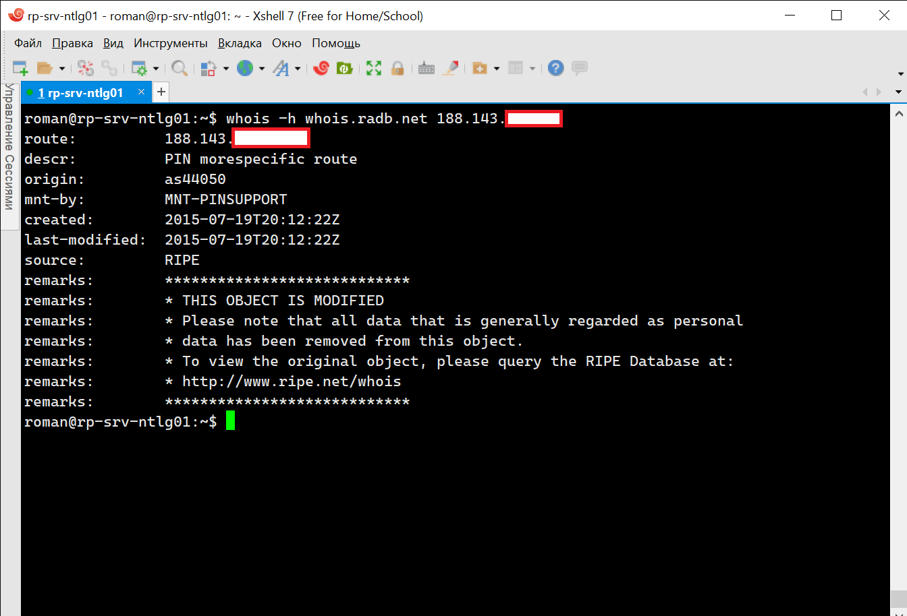
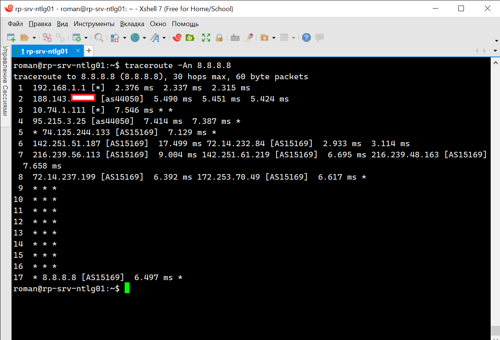
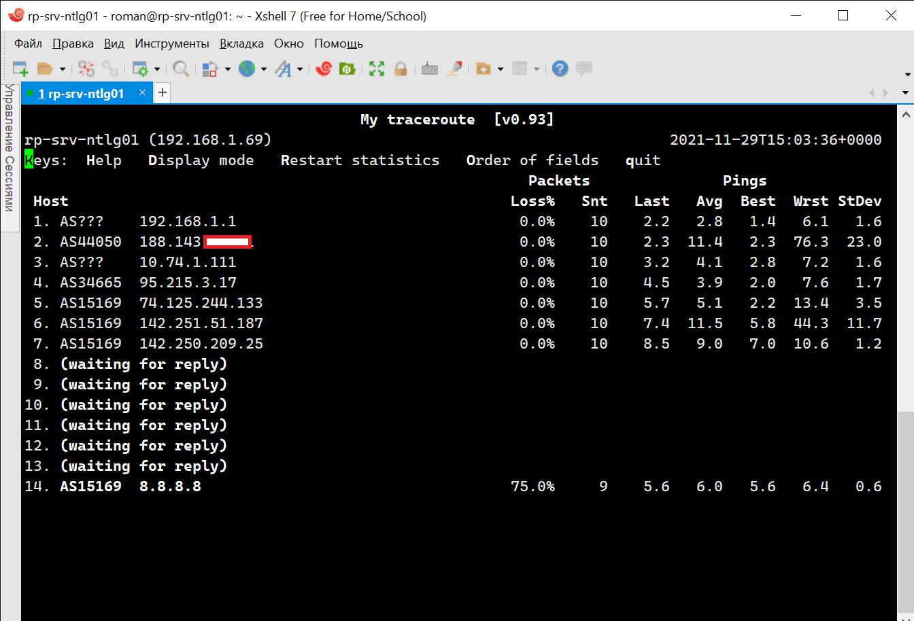
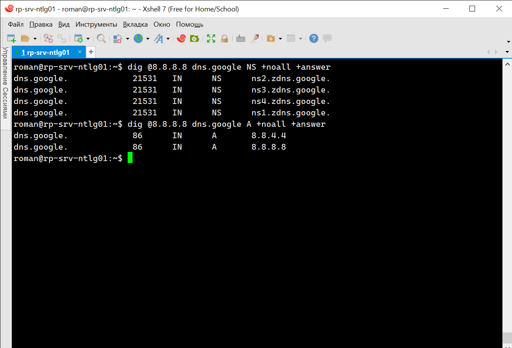
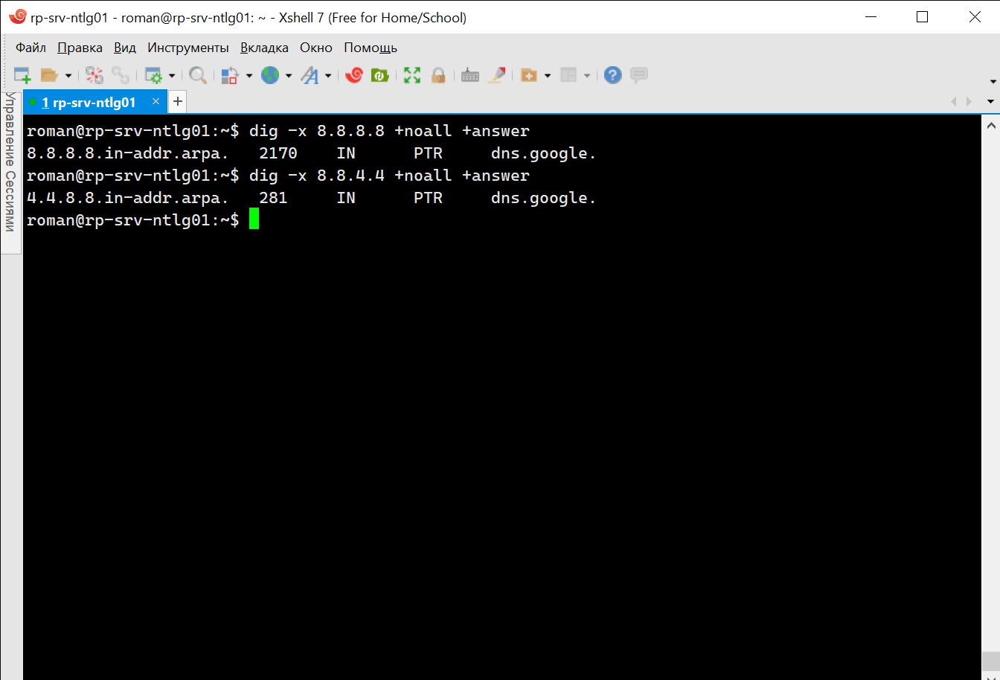

# 3.6. Компьютерные сети, лекция 1 - Роман Поцелуев

1. Работа c HTTP через телнет.
- Подключитесь утилитой телнет к сайту stackoverflow.com
`telnet stackoverflow.com 80`
- отправьте HTTP запрос
```bash
GET /questions HTTP/1.0
HOST: stackoverflow.com
[press enter]
[press enter]
```
- В ответе укажите полученный HTTP код, что он означает?

- **Ответ**

  - После подключения утилитой теленет к сайту мы отправляем запрос используя `HTTP` метод `GET` стандарта 1.0 к ресурсу `/questions` сервера `stackoverflow.com`. HTTP сервер выдает в ответ сообщение `HTTP/1.1 301 Moved Permanently`, код состояния которого говорит, что источник переехал на другой адрес. Новое размещение ресурса указаны в заголовке `location: https://stackoverflow.com/questions`. 


2. Повторите задание 1 в браузере, используя консоль разработчика F12.
- откройте вкладку `Network`
- отправьте запрос http://stackoverflow.com
- найдите первый ответ HTTP сервера, откройте вкладку `Headers`
- укажите в ответе полученный HTTP код.
- проверьте время загрузки страницы, какой запрос обрабатывался дольше всего?
- приложите скриншот консоли браузера в ответ.

- **Ответ**

  - Первый код ответа HTTP сервера такой же - `HTTP/1.1 301 Moved Permanently`

  - При пустом кэше браузера дольше всего обрабатываются запросы на получение изображений - 1,15 сек. 


3. Какой IP адрес у вас в интернете?

- **Ответ**

  - Адрес выданный провайдером для моего подключения можно посмотреть следующими командами:


4. Какому провайдеру принадлежит ваш IP адрес? Какой автономной системе AS? Воспользуйтесь утилитой `whois`

- **Ответ**



5. Через какие сети проходит пакет, отправленный с вашего компьютера на адрес 8.8.8.8? Через какие AS? Воспользуйтесь утилитой `traceroute`

- **Ответ**



6. Повторите задание 5 в утилите `mtr`. На каком участке наибольшая задержка - delay?

- **Ответ**



7. Какие DNS сервера отвечают за доменное имя dns.google? Какие A записи? воспользуйтесь утилитой `dig`

- **Ответ**



8. Проверьте PTR записи для IP адресов из задания 7. Какое доменное имя привязано к IP? воспользуйтесь утилитой `dig`

- **Ответ**


