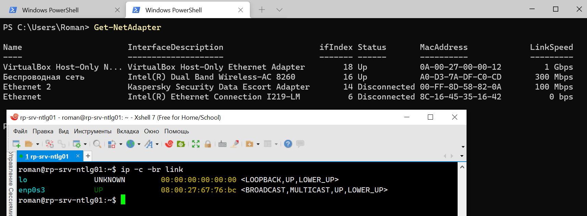
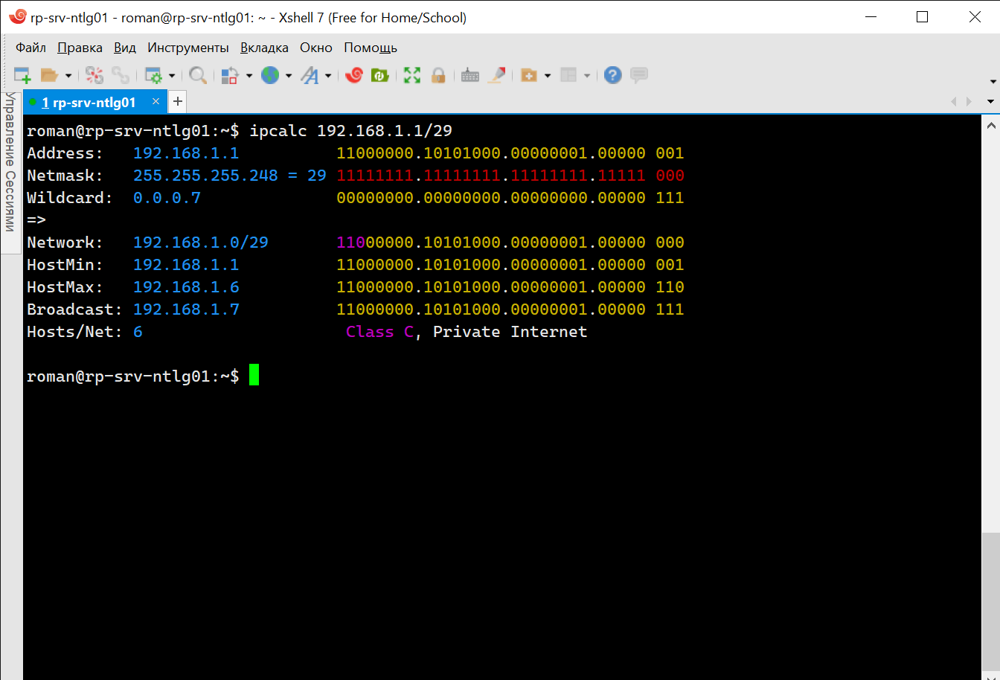
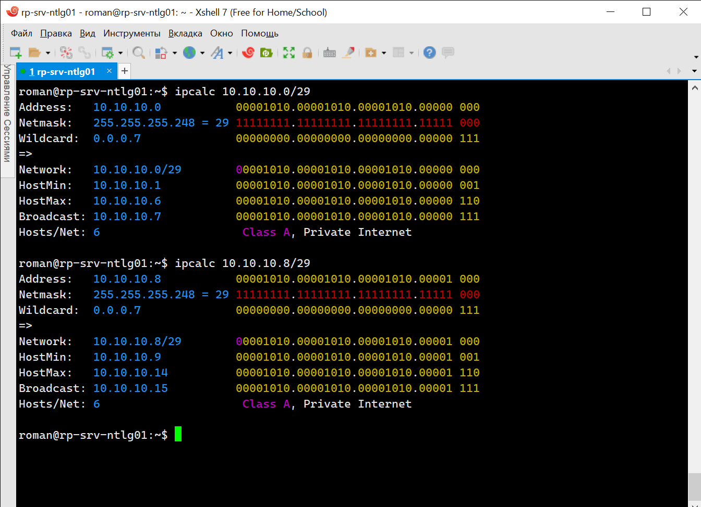
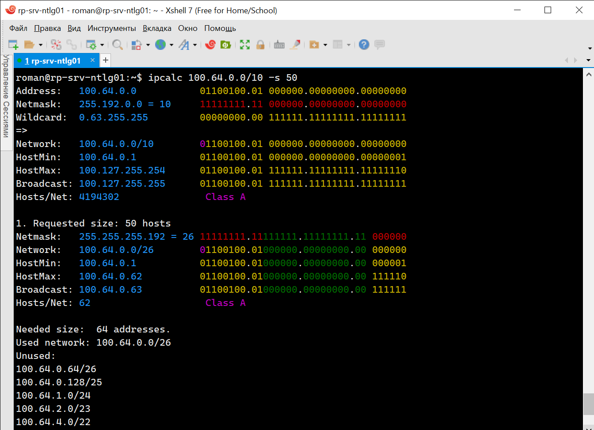
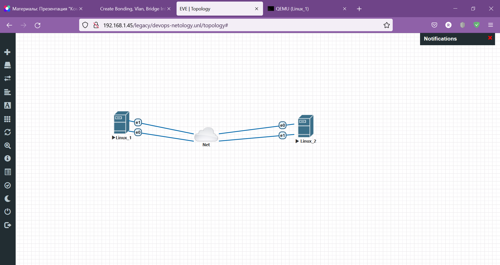
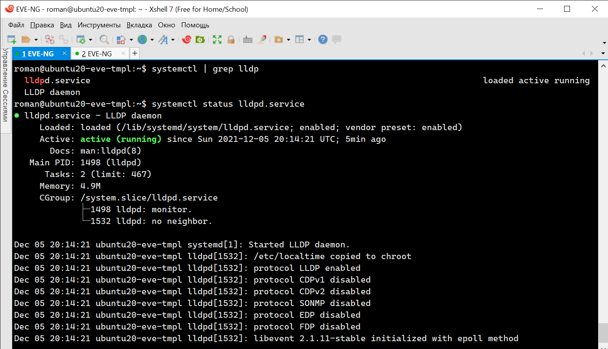
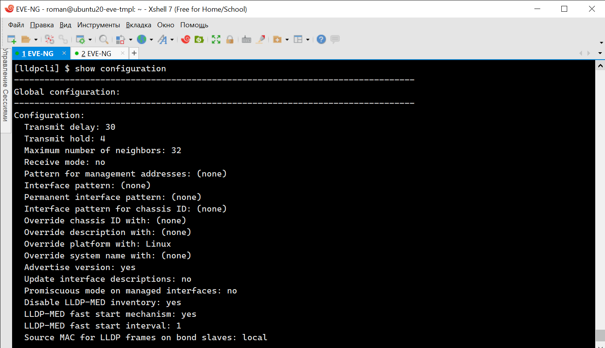
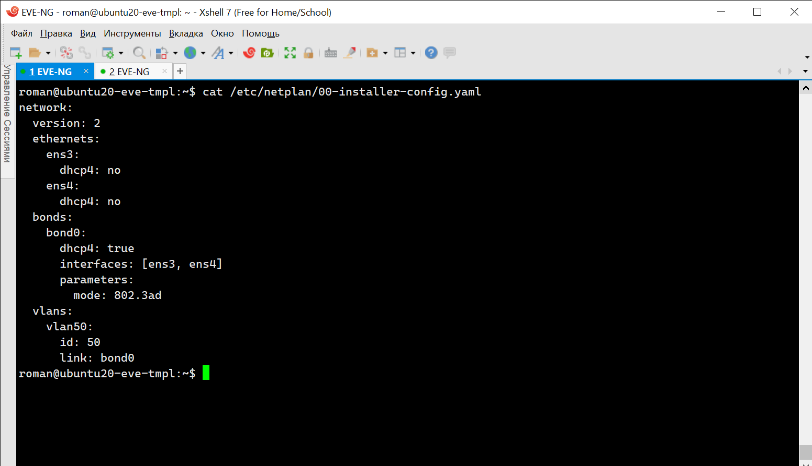
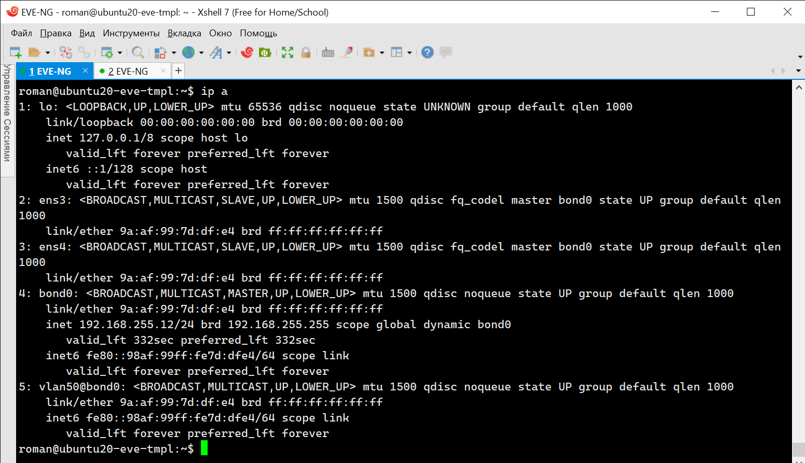
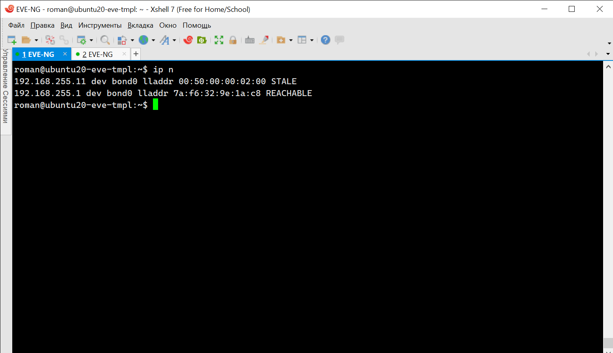

# 3.7. Компьютерные сети, лекция 2

1. Проверьте список доступных сетевых интерфейсов на вашем компьютере. Какие команды есть для этого в Linux и в Windows?

- **Ответ**



2. Какой протокол используется для распознавания соседа по сетевому интерфейсу? Какой пакет и команды есть в Linux для этого?

- **Ответ**

  - LLDP (Link Layer Discovery Protocol) — протокол канального уровня, который позволяет сетевым устройствам анонсировать в сеть информацию о себе и о своих возможностях, а также собирать эту информацию о соседних устройствах. LLDP это стандартный протокол, который описан в IEEE 802.1AB.
  - Установка `lldpd` в Ubuntu выполняется командой `sudo apt install lldpd`. После установки и запуска сервиса `ldpd`он сможет анонсировать в сеть информацию о себе и о своих возможностях, а также собирать эту информацию о соседних устройствах. Информацию о соседних устройствах можно увидеть с помощью команды `lldpctl`, подробную информацию по ключам запуска можно посмотреть на странице https://manpages.ubuntu.com/manpages/focal/man8/lldpcli.8.html.

3. Какая технология используется для разделения L2 коммутатора на несколько виртуальных сетей? Какой пакет и команды есть в Linux для этого? Приведите пример конфига.

- **Ответ**

  - VLAN (Virtual Local Area Network) — группа устройств, имеющих возможность взаимодействовать между собой напрямую на канальном уровне, хотя физически при этом они могут быть подключены к разным сетевым коммутаторам. И наоборот, устройства, находящиеся в разных VLAN'ах, невидимы друг для друга на канальном уровне, даже если они подключены к одному коммутатору, и связь между этими устройствами возможна только на сетевом и более высоких уровнях. Требования к VLAN описаны в стандарте IEEE 802.1Q.
  - Установка пакета для работы c `vlan` в Ubuntu выполняется командой `sudo apt install vlan`. После модуль загружается в ядро `sudo modprobe 8021q` и командами `vconfig` и `ip` настраивается VLAN для конкретного интерфейса. Для постоянной настройки требуется правка файлов `/etc/modules` и `/etc/network/interfaces`.
  - Пример настройки конфига можно посмотреть на странице https://wiki.ubuntu.com/vlan
```shell
auto eth1.10
iface eth1.10 inet static
    address 10.0.0.1
    netmask 255.255.255.0
    vlan-raw-device eth1
```

4. Какие типы агрегации интерфейсов есть в Linux? Какие опции есть для балансировки нагрузки? Приведите пример конфига.

- **Ответ**

  - Выделяют два типа агрегации LAG: **статические** - группы LAG, настроенные вручную, без использования протоколов; **динамические** - группы LAG в рамках протокола LACP, где согласовывается агрегирование каналов порта с другими портами LACP, находящимися на другом устройстве.
  - Linux поддерживает несколько режимов агрегации интерфейсов для балансировки нагрузки:
    - 0 (balance-rr) — round-robin распределение пакетов между интерфейсами. Обеспечивает отказоустойчивость и повышение пропускной способности.
    - 1 (active-backup) — в каждый момент времени работает только один интерфейс, в случае его выхода из строя, mac-адрес назначается второму интерфейсу и трафик переключается на него.
    - 2 (balance-xor) — обеспечивает балансировку между интерфейсами на основании MAC-адресов отправителя и получателя.
    - 3 (broadcast) — отправляет пакеты через все интерфейсы одновременно, обеспечивает отказоустойчивость.
    - 4 (802.3ad) — обеспечивает агрегацию на основании протокола 802.3ad.
    - 5 (balance-tlb) — в этом режиме входящий трафик приходит только на один «активный» интерфейс, исходящий же распределяется по всем интерфейсам.
    - 6 (balance-alb) — балансирует исходящий трафик как tlb, а так же входящий IPv4 трафик используя ARP.
  - Для примера приведем конфиг `/etc/network/interfaces` для режима `active-backup`
```shell
auto bond0

iface bond0 inet static
    address 10.31.1.5
    netmask 255.255.255.0
    network 10.31.1.0
    gateway 10.31.1.254
    bond-slaves eth0 eth1
    bond-mode active-backup
    bond-miimon 100
    bond-downdelay 200
    bond-updelay 200
```

5. Сколько IP адресов в сети с маской /29? Сколько /29 подсетей можно получить из сети с маской /24. Приведите несколько примеров /29 подсетей внутри сети 10.10.10.0/24.

- **Ответ**

  - Для использования можно получить 6 адресов.



  - Подсеть с маской 24 можно разбить на 32 подсети (2 в степени 5) с маской 29 (24+5), по восемь IP адресов в каждой (два из которых служебные).
  - На рисунке приведен пример двух подсетей 0 и 8 с маской 29.



6. Задача: вас попросили организовать стык между 2-мя организациями. Диапазоны 10.0.0.0/8, 172.16.0.0/12, 192.168.0.0/16 уже заняты. Из какой подсети допустимо взять частные IP адреса? Маску выберите из расчета максимум 40-50 хостов внутри подсети.

- **Ответ**

  - IP можно взять из диапазона Carrier-grade NAT 100.64.0.0/10, для сети с 50 адресами необходима маска 26.



7. Как проверить ARP таблицу в Linux, Windows? Как очистить ARP кеш полностью? Как из ARP таблицы удалить только один нужный IP?

- **Ответ**

  - Команды для Windows (удаление требует повышения прав): `arp -a`, `arp -d <ip address>`,`netsh interface IP delete arpcache`
  - Команды для Linux: `ip neigh show`,`sudo ip neigh del dev <interface> <ip address>`,`sudo ip neigh flush all`

 ---
## Задание для самостоятельной отработки (необязательно к выполнению)

 8*. Установите эмулятор EVE-ng.
 
 Инструкция по установке - https://github.com/svmyasnikov/eve-ng

 Выполните задания на lldp, vlan, bonding в эмуляторе EVE-ng. 

**Решение**

  - Выполнена установка EVE-ng community edition и реализована предлагаемая топология 



  - Выполнена установка lldp службы на двух ВМ ubuntu, устройства не увидели друг друга по протоколу LLDP, т.к. протокол работает только между непосредственно присоединенными устройствами





   - На одной ВМ настроен vlan, bonding через файл конфигурации netplan.





