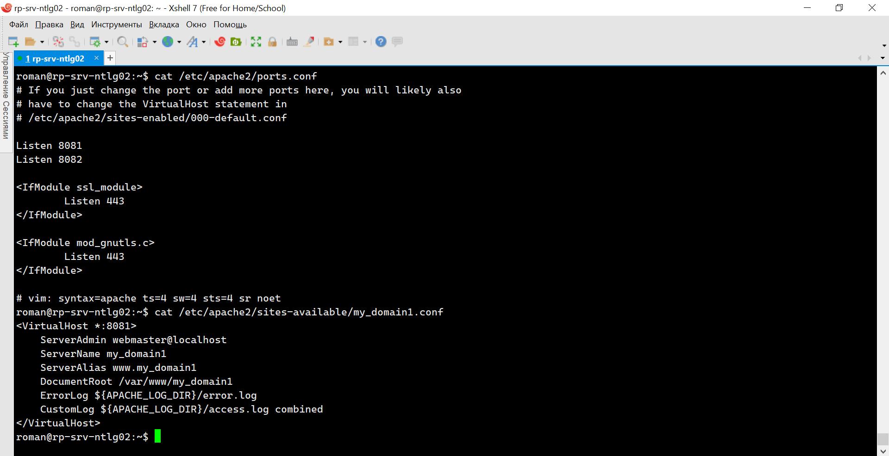
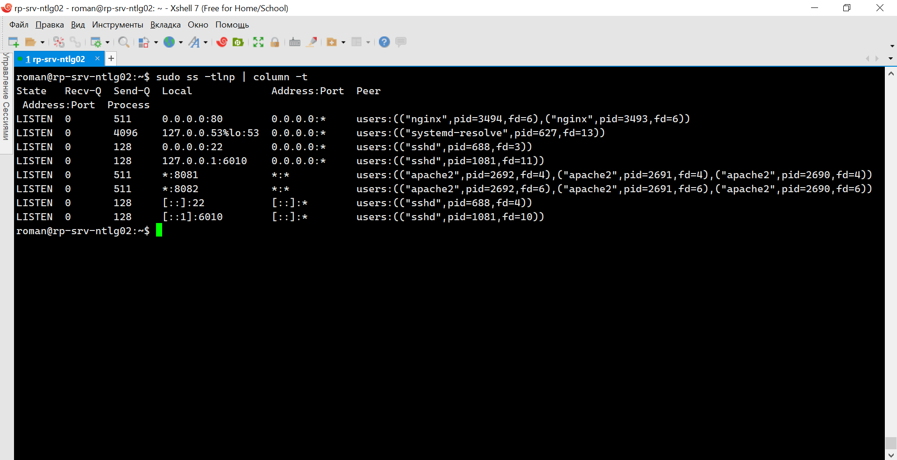

# 3.8. Компьютерные сети, лекция 3 - Роман Поцелуев

1. Подключитесь к публичному маршрутизатору в интернет. Найдите маршрут к вашему публичному IP
```
telnet route-views.routeviews.org
Username: rviews
show ip route x.x.x.x/32
show bgp x.x.x.x/32
```

  - Доступно 5 маршрутов, оптимальный проходит через 64.71.137.241.


2. Создайте dummy0 интерфейс в Ubuntu. Добавьте несколько статических маршрутов. Проверьте таблицу маршрутизации.

 - В задании использована настройка параметров командой ip и после перезагрузки настройки сбросятся. Начиная с релиза Ubuntu 17.10, для управления конфигурацией сети используется утилита Netplan. Все конфигурационные файлы Netplan находятся в папке /etc/netplan/ и имеют формат yaml. Конфигурация Netplan в настоящее время не поддерживает сценарии подключения. Обработка хуков up и down для поднятия интерфейсов dummy и их удаления выполняется через скрипты для networkd-dispatcher https://netplan.io/faq. Для автоматического запуска dummy нужно разместить скрипт в каталог /etc/networkd-dispatcher/routable.d/ для удаления в /etc/networkd-dispatcher/off.d/.


3. Проверьте открытые TCP порты в Ubuntu, какие протоколы и приложения используют эти порты? Приведите несколько примеров.

  - Воспользуемся утилитой ss. В колонке Process видны имена и PID процессов, использующих эти порты, также можно посмотреть IP адреса входящих соединений


4. Проверьте используемые UDP сокеты в Ubuntu, какие протоколы и приложения используют эти порты?

  - Аналогично можно узнать информацию по UDP подключениям


5. Используя diagrams.net, создайте L3 диаграмму вашей домашней сети или любой другой сети, с которой вы работали. 


 ---
## Задание для самостоятельной отработки (необязательно к выполнению)

6*. Установите Nginx, настройте в режиме балансировщика TCP или UDP.

Проверку работы Nginx в качестве балансировщика выполним на примере пересылки http запросов на 80 порта Nginx двум виртуальным сайтам сервера Apache, размещенным на этой же ВМ на разных портах.

  - Проверка работы сервисов Nginx и Apache


   
  - Вывод конфигурации сервисов


  
  - Вывод портов на которых запущены процессы



  - При балансировке по умолчанию round robin, ответ может приходить от разных сайтов


7*. Установите bird2, настройте динамический протокол маршрутизации RIP.

  - На EVE-ng community edition реализована предлагаемая топология, и выполнена установка bird2.


  - Вывод конфигурации для первой ВМ и проверка доступа к dummy интерфейсу на второй ВМ по протоколу ICMP, информация о котором получена по RIP. 


  - Вывод конфигурации для первой ВМ и проверка доступа к dummy интерфейсу на второй ВМ по протоколу ICMP.


8*. Установите Netbox, создайте несколько IP префиксов, используя curl проверьте работу API.

 - Почитал про развертывание Netbox через развертывание по "частям" https://jtprog.ru/netbox/ или в контейнере https://github.com/netbox-community/netbox-docker. Проблем в развертывании не увидел, но проект большой и его изучение и настройка может занять много времени, поэтому решил отложить.
