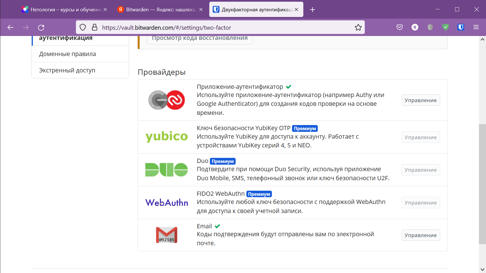

# 3.9. Элементы безопасности информационных систем - Роман Поцелуев

1. Установите Bitwarden плагин для браузера. Зарегистрируйтесь и сохраните несколько паролей.

2. Установите Google authenticator на мобильный телефон. Настройте вход в Bitwarden акаунт через Google authenticator OTP.

3. Установите apache2, сгенерируйте самоподписанный сертификат, настройте тестовый сайт для работы по HTTPS.

  - После установки apache2 активируем модуль SSL командой `sudo a2enmod ssl`
  - Генерируем ключ `sudo openssl req -x509 -nodes -days 365 -newkey rsa:2048 -keyout /etc/ssl/private/apache-selfsigned.key -out /etc/ssl/certs/apache-selfsigned.crt`

  - Создаем виртуальный сайт и активируем его `sudo a2ensite rp-srv-ntlg01.conf`

  - После перезапуска службы Apache проверяем работу сайта

  - Смотрим информацию о ключе

4. Проверьте на TLS уязвимости произвольный сайт в интернете (кроме сайтов МВД, ФСБ, МинОбр, НацБанк, РосКосмос, РосАтом, РосНАНО и любых госкомпаний, объектов КИИ, ВПК ... и тому подобное).

  - Выполним экспресс тестирование TLS настроек web-сервера www.google.com скриптом testssl.sh

5. Установите на Ubuntu ssh сервер, сгенерируйте новый приватный ключ. Скопируйте свой публичный ключ на другой сервер. Подключитесь к серверу по SSH-ключу.
 
  - Генерируем ключ

  - Копируем ключ на удаленный сервер

  - Подключаемся к серверу

6. Переименуйте файлы ключей из задания 5. Настройте файл конфигурации SSH клиента, так чтобы вход на удаленный сервер осуществлялся по имени сервера.

  - Выполним настройку конфигурации SSH клиента в файле `~/.ssh/config` для подключения к серверу по алиасу.

7. Соберите дамп трафика утилитой tcpdump в формате pcap, 100 пакетов. Откройте файл pcap в Wireshark.

  - Выполним дамп трафика на 22 порту с терминала ВМ и выполним подключение ssh клиентом

  - Видно, что пакеты передаются по SSHv2, зашифрованные алгоритмом chacha20-poly1305@openssh.com

 ---
## Задание для самостоятельной отработки (необязательно к выполнению)

8*. Просканируйте хост scanme.nmap.org. Какие сервисы запущены?

  - Выполним сканирование утилитой nmap, видно, что хост принимает запросы на ТCP соединения на порты http, ssh, nping-echo. 

9*. Установите и настройте фаервол ufw на web-сервер из задания 3. Откройте доступ снаружи только к портам 22,80,443

 ---
