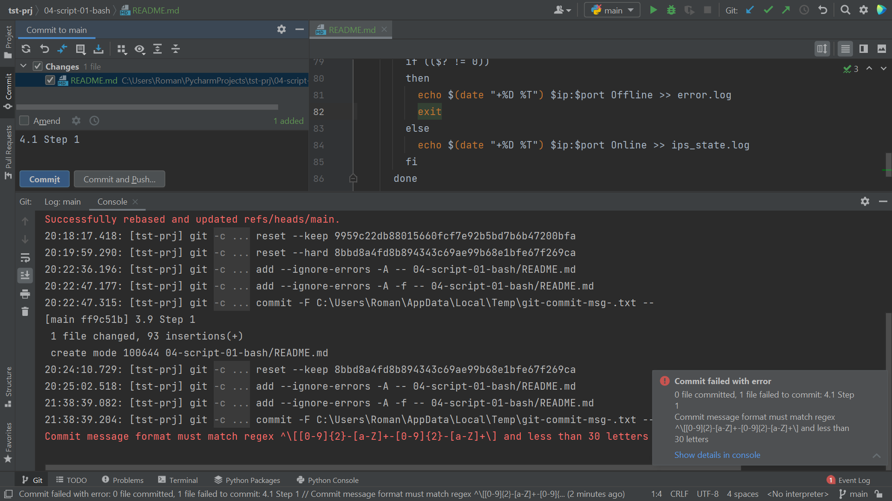

# 4.1. Командная оболочка Bash: Практические навыки - Роман Поцелуев

## Обязательные задания

1. Есть скрипт:
	```bash
	a=1
	b=2
	c=a+b
	d=$a+$b
	e=$(($a+$b))
	```
    * Какие значения переменным c,d,e будут присвоены?
    * Почему?
  
   __Ответ:__
   - c=a+b - присвоение переменной c строки "a+b"
   - d=1+2 - присвоение переменной d строки в которой раскрыты переменные a и b
   - e=3 - присвоение переменной e результата арифметической операции сложение над раскрытыми в переменными a и b

1. На нашем локальном сервере упал сервис и мы написали скрипт, который постоянно проверяет его доступность, записывая дату проверок до тех пор, пока сервис не станет доступным. В скрипте допущена ошибка, из-за которой выполнение не может завершиться, при этом место на Жёстком Диске постоянно уменьшается. Что необходимо сделать, чтобы его исправить:
	```bash
	while ((1==1)
	do
	curl https://localhost:4757
	if (($? != 0))
	then
	date >> curl.log
	fi
	done
	```
   
   __Ответ:__
	```bash
    #!/usr/bin/env bash
	while ((1==1)) #Пропущена скобка
	do
	  curl https://localhost:4757
	  if (($? != 0))
	  then
	    date >> curl.log
      else break #Сервис стал доступным, выходим из цикла
	  fi
      sleep 5 #Ставим интервал перед проверками
	done
	```

1. Необходимо написать скрипт, который проверяет доступность трёх IP: 192.168.0.1, 173.194.222.113, 87.250.250.242 по 80 порту и записывает результат в файл log. Проверять доступность необходимо пять раз для каждого узла.
   
   __Ответ:__
	```bash
    #!/usr/bin/env bash
    ips=(192.168.0.1 173.194.222.113 87.250.250.24)
    port=80

    for ip in ${ips[@]}
    do
      for i in {1..5}
      do
        nc -vzw3 $ip $port &> /dev/null && state="Online" || state="Offline"
        echo $(date "+%D %T") $ip:$port $state >> ips_state.log
      done
    done
    ```

1. Необходимо дописать скрипт из предыдущего задания так, чтобы он выполнялся до тех пор, пока один из узлов не окажется недоступным. Если любой из узлов недоступен - IP этого узла пишется в файл error, скрипт прерывается
   
   __Ответ:__
   ```bash
    #!/usr/bin/env bash
    ips=(192.168.0.1 173.194.222.113 87.250.250.24)
    port=80

    while ((1==1))
    do
      for ip in ${ips[@]}
      do
        nc -vzw3 $ip $port &> /dev/null
        if (($? != 0))
        then
          echo $(date "+%D %T") $ip:$port Offline >> error.log
          exit
        else
          echo $(date "+%D %T") $ip:$port Online >> ips_state.log
        fi
      done
      sleep 5
    done
    ```

## Дополнительное задание (со звездочкой*) - необязательно к выполнению

Мы хотим, чтобы у нас были красивые сообщения для коммитов в репозиторий. Для этого нужно написать локальный хук для git, который будет проверять, что сообщение в коммите содержит код текущего задания в квадратных скобках и количество символов в сообщении не превышает 30. Пример сообщения: \[04-script-01-bash\] сломал хук.
   
   __Ответ:__

    - Для обработки сообщения в коммите внесем следующий код в файл `.git\commit-msg` проекта.
   ```bash
    regex="^\[[0-9]{2}-[a-Z]+-[0-9]{2}-[a-Z]+\]"
    read -r firstline < $1
    if echo $firstline | grep -iEq $regex && [ ${#firstline} -le 30 ]
    then
      exit 0
    else
      echo "Commit message format must match regex $regex and less than 30 letters"
      exit 1
    fi
   ```

