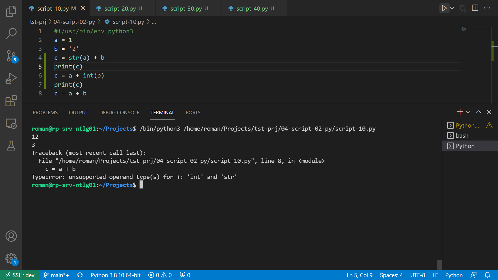
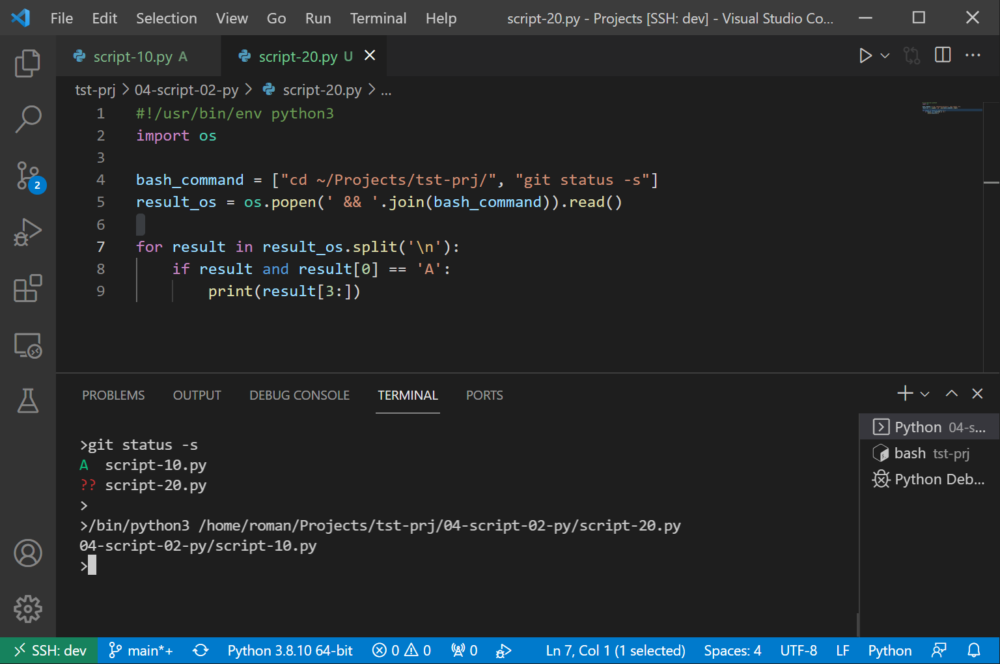
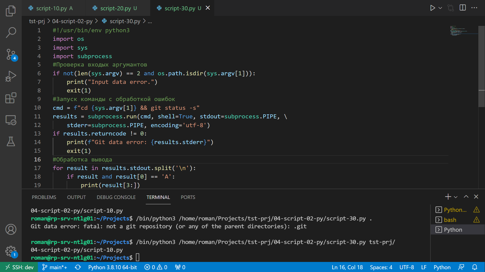
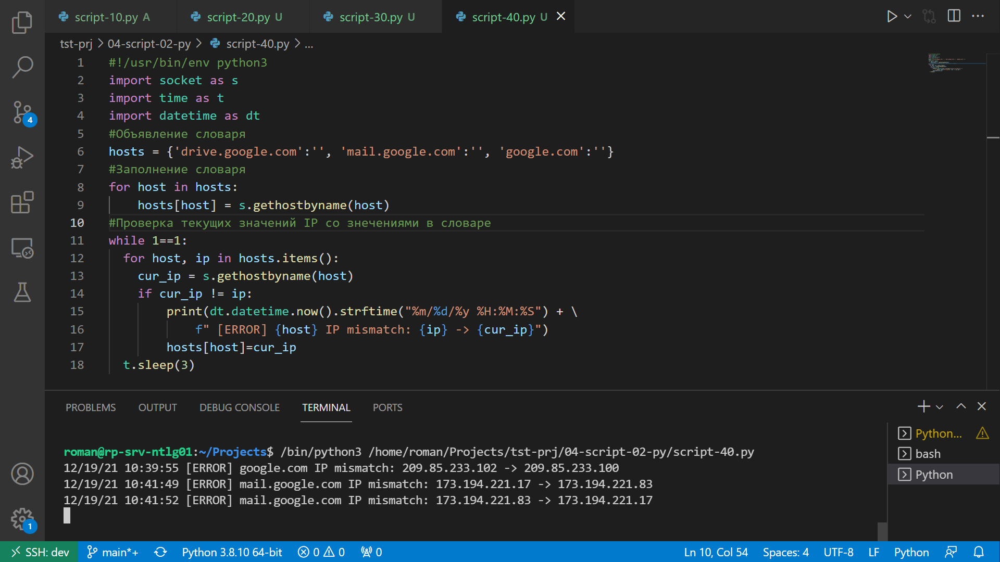

# 4.2. Использование Python для решения типовых DevOps задач - Роман Поцелуев

## Обязательные задания

1. Есть скрипт:
	```python
    #!/usr/bin/env python3
	a = 1
	b = '2'
	c = a + b
	```
	* Какое значение будет присвоено переменной c?
	* Как получить для переменной c значение 12?
	* Как получить для переменной c значение 3?

__Ответ:__

* Данном примере произойдет ошибка при сложении разных форматов данных, для выполнения операции сложения нужно использовать методы преобразования форматов. [Код скрипта](./script-10.py).



2. Мы устроились на работу в компанию, где раньше уже был DevOps Engineer. Он написал скрипт, позволяющий узнать, какие файлы модифицированы в репозитории, относительно локальных изменений. Этим скриптом недовольно начальство, потому что в его выводе есть не все изменённые файлы, а также непонятен полный путь к директории, где они находятся. Как можно доработать скрипт ниже, чтобы он исполнял требования вашего руководителя?

	```python
    #!/usr/bin/env python3

    import os

	bash_command = ["cd ~/netology/sysadm-homeworks", "git status"]
	result_os = os.popen(' && '.join(bash_command)).read()
    is_change = False
	for result in result_os.split('\n'):
        if result.find('modified') != -1:
            prepare_result = result.replace('\tmodified:   ', '')
            print(prepare_result)
            break

	```

__Ответ:__

* Для получения информации об изменениях в файлах локального репозитория используем ключ `--short` для команды `git status`, обработка вывода будет более лаконична. В скрипте для примера возьмем добавленные файлы. [Код скрипта](./script-20.py).



3. Доработать скрипт выше так, чтобы он мог проверять не только локальный репозиторий в текущей директории, а также умел воспринимать путь к репозиторию, который мы передаём как входной параметр. Мы точно знаем, что начальство коварное и будет проверять работу этого скрипта в директориях, которые не являются локальными репозиториями.

__Ответ:__

* [Скрипт с комментариями](./script-30.py)



4. Наша команда разрабатывает несколько веб-сервисов, доступных по http. Мы точно знаем, что на их стенде нет никакой балансировки, кластеризации, за DNS прячется конкретный IP сервера, где установлен сервис. Проблема в том, что отдел, занимающийся нашей инфраструктурой очень часто меняет нам сервера, поэтому IP меняются примерно раз в неделю, при этом сервисы сохраняют за собой DNS имена. Это бы совсем никого не беспокоило, если бы несколько раз сервера не уезжали в такой сегмент сети нашей компании, который недоступен для разработчиков. Мы хотим написать скрипт, который опрашивает веб-сервисы, получает их IP, выводит информацию в стандартный вывод в виде: <URL сервиса> - <его IP>. Также, должна быть реализована возможность проверки текущего IP сервиса c его IP из предыдущей проверки. Если проверка будет провалена - оповестить об этом в стандартный вывод сообщением: [ERROR] <URL сервиса> IP mismatch: <старый IP> <Новый IP>. Будем считать, что наша разработка реализовала сервисы: drive.google.com, mail.google.com, google.com.

__Ответ:__

* [Скрипт с комментариями](./script-40.py)



## Дополнительное задание (со звездочкой*) - необязательно к выполнению

Так получилось, что мы очень часто вносим правки в конфигурацию своей системы прямо на сервере. Но так как вся наша команда разработки держит файлы конфигурации в github и пользуется gitflow, то нам приходится каждый раз переносить архив с нашими изменениями с сервера на наш локальный компьютер, формировать новую ветку, коммитить в неё изменения, создавать pull request (PR) и только после выполнения Merge мы наконец можем официально подтвердить, что новая конфигурация применена. Мы хотим максимально автоматизировать всю цепочку действий. Для этого нам нужно написать скрипт, который будет в директории с локальным репозиторием обращаться по API к github, создавать PR для вливания текущей выбранной ветки в master с сообщением, которое мы вписываем в первый параметр при обращении к py-файлу (сообщение не может быть пустым). При желании, можно добавить к указанному функционалу создание новой ветки, commit и push в неё изменений конфигурации. С директорией локального репозитория можно делать всё, что угодно. Также, принимаем во внимание, что Merge Conflict у нас отсутствуют и их точно не будет при push, как в свою ветку, так и при слиянии в master. Важно получить конечный результат с созданным PR, в котором применяются наши изменения. 

__Ответ__

Создавая пул-реквест, вы просите другого разработчика (например, человека, занимающегося поддержкой проекта) забрать ветку из вашего репозитория в его репозиторий. Описание Github API на создание пул-реквеста представлено на странице  https://docs.github.com/en/rest/reference/pulls#create-a-pull-request. Ниже приведен пример функции с описанием параметров для создания пул-реквеста на Githab. Чтобы полностью выполнить задание нужно добавить процедуры проверки входных параметров.

```python
import json
import requests

def create_pull_request(project_name, repo_name, title, description, head_branch, base_branch, git_token):
    """Creates the pull request for the head_branch against the base_branch"""
    git_pulls_api = "https://github.com/api/v3/repos/{0}/{1}/pulls".format(
        project_name,
        repo_name)
    headers = {
        "Authorization": "token {0}".format(git_token),
        "Content-Type": "application/json"}

    payload = {
        "title": title,
        "body": description,
        "head": head_branch,
        "base": base_branch,
    }

    r = requests.post(
        git_pulls_api,
        headers=headers,
        data=json.dumps(payload))

    if not r.ok:
        print("Request Failed: {0}".format(r.text))

create_pull_request(
    "Project", # Имя проекта
    "Repository", # Имя репозитория
    "My pull request title", # Заголовок пул-реквеста
    "My pull request description", # Описание пул-реквеста
    "Your branch", # Ветка вашего проекта
    "Base branch", # Ветка исходного проекта
    "Your git token", # Токен для авторизации на Github
)
```