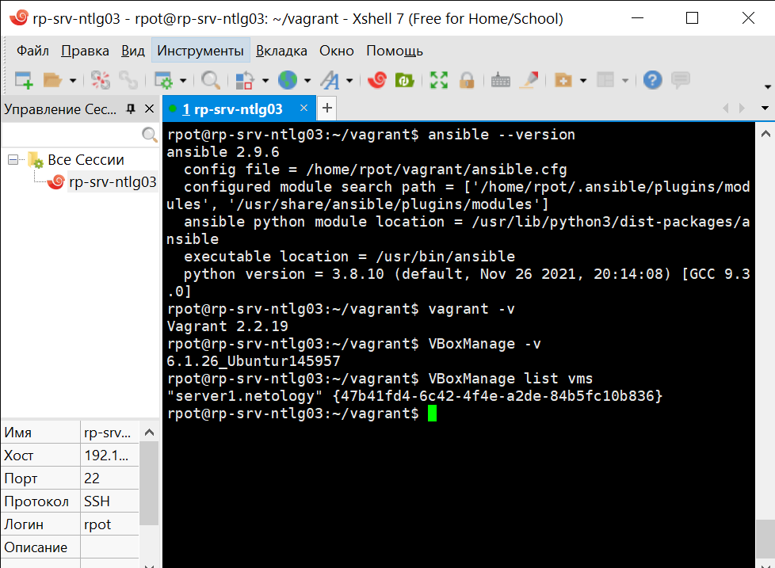
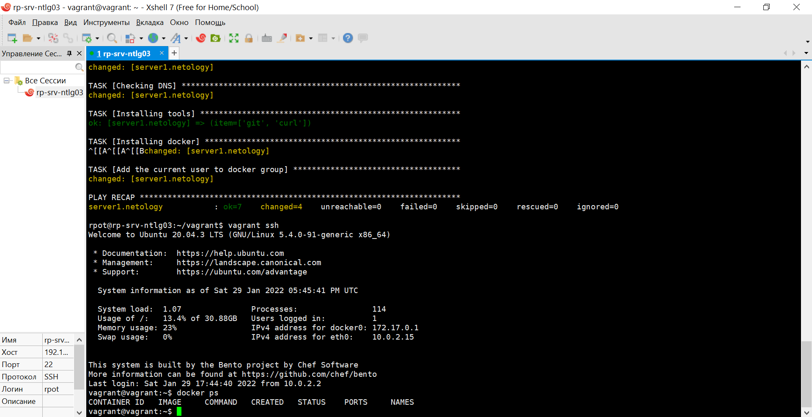

# 5.2. Применение принципов IaaC в работе с виртуальными машинами - Роман Поцелуев

## Задача 1

- Опишите своими словами основные преимущества применения на практике IaaC паттернов.
- Какой из принципов IaaC является основополагающим?

__Ответ:__

Основными преимуществами применения на практике IaaC паттернов можно назвать:

- позволяет сосредоточиться на реализации бизнес-требований, а не рутинной работе по сопровождению инфраструктуры;

- центализованный подход к хранению и применению конфигурации гарантирует идентичность среды и качество результата;

- использование системы управления версиями позволяет отслеживать историю изменения конфигураций и гибко управлять инфраструктурой;

- оперативность применения требований к инфраструктуре позволяет минимизировать время реализации решения, тем самым сокращая расходы.

Основополагающим принципом является идемпотентность при котором мы получаем результат идентичный предыдущему и всем последующим выполнениям.

## Задача 2

- Чем Ansible выгодно отличается от других систем управление конфигурациями?
- Какой, на ваш взгляд, метод работы систем конфигурации более надёжный push или pull?

__Ответ:__

Главное отличие Ansible от других подобных систем в том, что Ansible использует существующую SSH инфраструктуру и не требует установки специального PKI-окружения.

Как обычно это бывает, у каждого подхода есть свои плюсы и минусы. Некоторые задачи легче осуществить с одним и сложнее - с другим. К примеру Pull-модель подходит для управления на большом количестве кластеров и уменьшает требования к управляющему серверу, в то время как Push проще в обслуживании.

## Задача 3

Установить на личный компьютер:

- VirtualBox
- Vagrant
- Ansible

*Приложить вывод команд установленных версий каждой из программ, оформленный в markdown.*

__Ответ:__



## Задача 4 (*)

Воспроизвести практическую часть лекции самостоятельно.

- Создать виртуальную машину.
- Зайти внутрь ВМ, убедиться, что Docker установлен с помощью команды
```
docker ps
```

__Ответ:__

