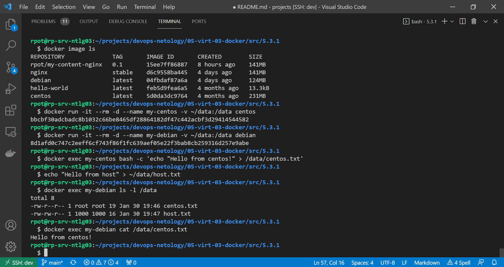

# 5.3. Введение. Экосистема. Архитектура. Жизненный цикл Docker контейнера - Роман Поцелуев

## Задача 1

Сценарий выполнения задачи:

- создайте свой репозиторий на https://hub.docker.com;
- выберете любой образ, который содержит веб-сервер Nginx;
- создайте свой fork образа;
- реализуйте функциональность:
запуск веб-сервера в фоне с индекс-страницей, содержащей HTML-код ниже:
```
<html>
<head>
Hey, Netology
</head>
<body>
<h1>I’m DevOps Engineer!</h1>
</body>
</html>
```
Опубликуйте созданный форк в своем репозитории и предоставьте ответ в виде ссылки на https://hub.docker.com/username_repo.

__Ответ:__

Ссылка на образ https://hub.docker.com/r/rpot/my-content-nginx. Ссылка на [Dockerfile](src/5.3.4/Dockerfile).

## Задача 2

Посмотрите на сценарий ниже и ответьте на вопрос:
"Подходит ли в этом сценарии использование Docker контейнеров или лучше подойдет виртуальная машина, физическая машина? Может быть возможны разные варианты?"

Детально опишите и обоснуйте свой выбор.

--

Сценарий:

- Высоконагруженное монолитное java веб-приложение;
- Nodejs веб-приложение;
- Мобильное приложение c версиями для Android и iOS;
- Шина данных на базе Apache Kafka;
- Elasticsearch кластер для реализации логирования продуктивного веб-приложения - три ноды elasticsearch, два logstash и две ноды kibana;
- Мониторинг-стек на базе Prometheus и Grafana;
- MongoDB, как основное хранилище данных для java-приложения;
- Gitlab сервер для реализации CI/CD процессов и приватный (закрытый) Docker Registry.

__Ответ:__

- Для высоконагруженного монолитного java веб-приложения лучше подойдет отдельный физический сервер, т.к. его нельзя разбить на микросервисы для организации контейнеров и высоконагруженных приложений лучше использовать физические сервера для сокращения времени отклика при обращении к аппаратныи ресурсам сервера;
- Nodejs веб-приложение оптимальным вариантом будет применение контейнера включающего все зависимости, сведения, конфигурацию для дальнейшего развертывания;
- Мобильное приложение c версиями для Android и iOS - это чаще всего графические приложения, что не подходит для контейнеризации, лучше использовать виртуальный сервер;
- Шина данных на базе Apache Kafka - для высоконагруженных приложений лучше использовать ВМ, в остальных случаях хорошо справится контейнер;
- Elastic Stack хорошо работает в контейнерах, но для промышленной реализации в связи с высокой нагрузкой лучше использовать виртуальные машины;
- Мониторинг-стек на базе Prometheus и Grafana не хранит в себе данных и хорошо реализуется контейнерами;
- СУБД MongoDB можно разместить в контейнере файлы БД хранить на подключаемом томе;
- Gitlab сервер для реализации CI/CD процессов и приватный (закрытый) Docker Registry лучше изолировать на отдельный виртуальной машине, т.к. сервер содержит приватные данные, доступ к которым должен быть ограничен на уровне ОС.

## Задача 3

- Запустите первый контейнер из образа ***centos*** c любым тэгом в фоновом режиме, подключив папку ```/data``` из текущей рабочей директории на хостовой машине в ```/data``` контейнера;
- Запустите второй контейнер из образа ***debian*** в фоновом режиме, подключив папку ```/data``` из текущей рабочей директории на хостовой машине в ```/data``` контейнера;
- Подключитесь к первому контейнеру с помощью ```docker exec``` и создайте текстовый файл любого содержания в ```/data```;
- Добавьте еще один файл в папку ```/data``` на хостовой машине;
- Подключитесь во второй контейнер и отобразите листинг и содержание файлов в ```/data``` контейнера.

__Ответ:__



## Задача 4 (*)

Воспроизвести практическую часть лекции самостоятельно.

Соберите Docker образ с Ansible, загрузите на Docker Hub и пришлите ссылку вместе с остальными ответами к задачам.

__Ответ:__

Ссылка на образ https://hub.docker.com/r/rpot/my-ansible. Ссылка на [Dockerfile](src/5.3.4/Dockerfile).