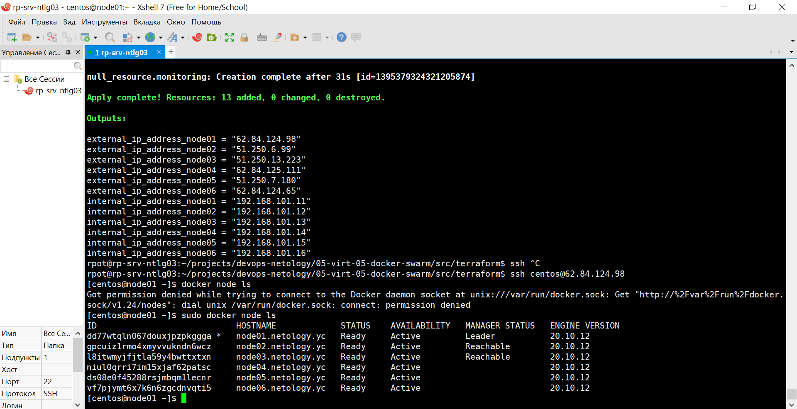
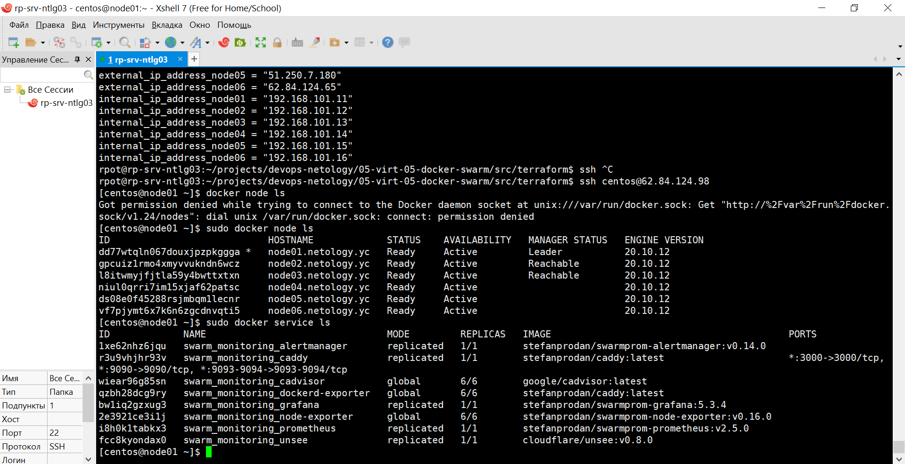
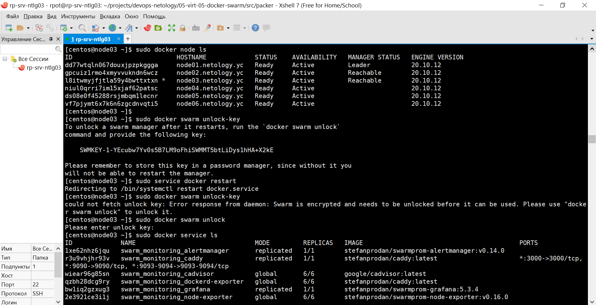

# 5.5. Оркестрация кластером Docker контейнеров на примере Docker Swarm

## Задача 1

Дайте письменные ответы на следующие вопросы:

- В чём отличие режимов работы сервисов в Docker Swarm кластере: replication и global?
- Какой алгоритм выбора лидера используется в Docker Swarm кластере?
- Что такое Overlay Network?

__Ответ__

- Если сервис создается с параметром `--replicas`, например `docker service create --name redis --replicas=5 redis:3.0.6`, то он будет запущен в определенном количестве экземпляров, при этом на одном сервере кластера может запуститься несколько или ни одного экземпляра. Если с параметром `--mode global`, например `docker service create --mode global --name redis2 redis:3.0.6`, то сервис будет запущен на каждом сервере и в единственном экземпляре.

- Docker Swarm кластер использует алгоритм RAFT, который обеспечивает безопасную и эффективную реализацию для управления глобальным состоянием менеджеров кластера и выбора лидера. Raft допускает (N-1)/2 потерь менеджмент узлов и требует, чтобы большинство или кворум (N/2)+1 членов согласились на значения, предлагаемые кластеру. Например, если в кластере из 5 менеджеров 3 узла недоступны, то система не сможет больше обрабатывать запросы на планирование дополнительных задач и балансировку, хотя существующие задачи продолжат выполняться. Среди менеджеров выбирается лидер, его задача гарантировать согласованность. Лидер отправляет `keepalive` пакеты с заданной периодичностью и если пакеты не пришли, менеджеры начинают выборы нового лидера.

- Сервис, запущенный на кластере, по умолчанию может быть соединён с тремя и более сетями. Первая сеть, docker_gwbridge, позволяет контейнерам поддерживать связь с внешним миром. Сеть ingress это overlay-сеть, которая нужна, чтобы устанавливать входящие соединения из внешнего мира. И сети overlay, которые создает сам пользователь, эти сети служат общей подсетью для сервисов единой сети, в которой они могут обмениваться данными напрямую (даже если они запущены на разных физических хостах). Overlay-сеть использует технологию vxlan, которая инкапсулирует layer 2 фреймы в layer 4 пакеты (UDP/IP). При помощи этого действия Docker создает виртуальные сети поверх существующих связей между серверами, которые могут оказаться внутри одной подсети. Любые точки, которые являются частью этой виртуальной сети, выглядят друг для друга так, будто они связаны поверх свича и не заботятся об устройстве основной физической сети. vxlan использует udp port 4789.

## Задача 2

Создать ваш первый Docker Swarm кластер в Яндекс.Облаке

Для получения зачета, вам необходимо предоставить скриншот из терминала (консоли), с выводом команды:
```
docker node ls
```

__Ответ__



## Задача 3

Создать ваш первый, готовый к боевой эксплуатации кластер мониторинга, состоящий из стека микросервисов.

Для получения зачета, вам необходимо предоставить скриншот из терминала (консоли), с выводом команды:
```
docker service ls
```

__Ответ__



## Задача 4 (*)

Выполнить на лидере Docker Swarm кластера команду (указанную ниже) и дать письменное описание её функционала, что она делает и зачем она нужна:
```
# см.документацию: https://docs.docker.com/engine/swarm/swarm_manager_locking/
docker swarm update --autolock=true
```

__Ответ__

Когда демон Docker перезапускается, ключ TLS, используемый для шифрования связи между узлами кластера, и ключ, используемый для шифрования и расшифровки журналов Raft на диске, загружаются в память каждого узла менеджера. Если ключи не защищены, то злоумышленник может получить доступ к [Docker secrets](https://docs.docker.com/engine/swarm/secrets/). Docker позволяет защитить ключи и требовать ручную разблокировку узла кластера. Эта функция называется автоблокировкой и включается при инициализации кластера командой `docker swarm init --autolock` или параметр можно включить на работающем кластере командой `docker swarm update --autolock=true`, при этом ключ разблокировки будет включен в вывод команды. После включения автоблокировки при попытке перезапуска Docker `sudo service docker restart`, если мы попытаемся обратится к службе, например `docker service ls` получим сообщение "Error response from daemon: Swarm is encrypted and needs to be unlocked before it can be used. Please use "docker swarm unlock" to unlock it." и для работы службы в составе кластера нам нужно будет разблокировать ключ командой `docker swarm unlock`. Для просмотра ключа используется команда `docker swarm unlock-key`, для смены `docker swarm unlock-key --rotate`.


