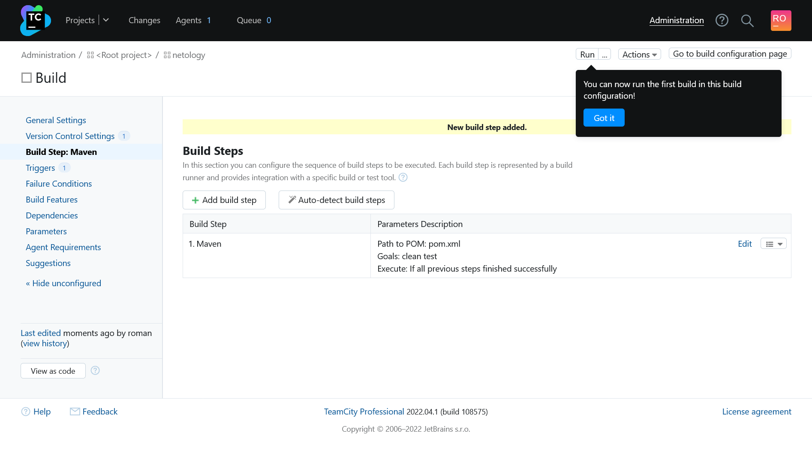
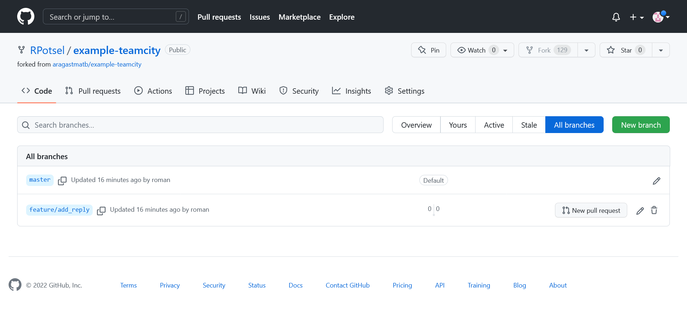
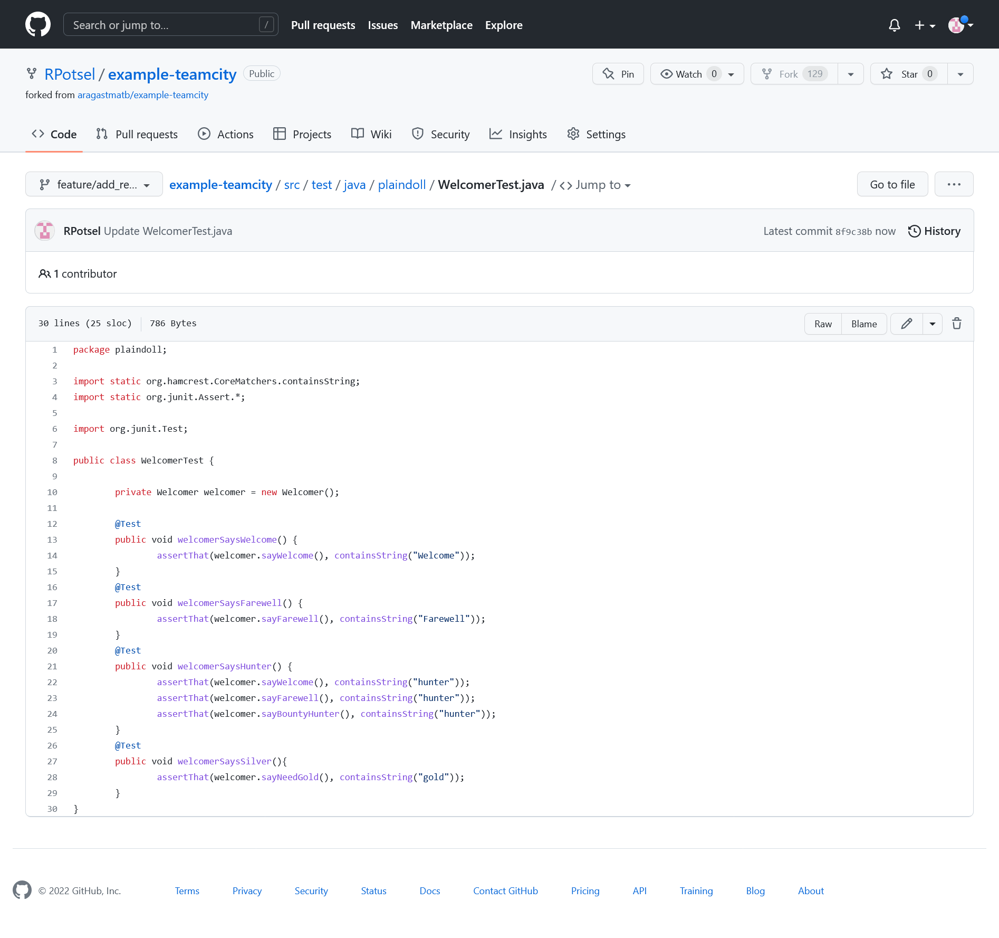

# 09.05 Teamcity

__Ответ:__

https://github.com/RPotsel/example-teamcity

## Подготовка к выполнению

1. В Ya.Cloud создайте новый инстанс (4CPU4RAM) на основе образа `jetbrains/teamcity-server`
2. Дождитесь запуска teamcity, выполните первоначальную настройку
3. Создайте ещё один инстанс(2CPU4RAM) на основе образа `jetbrains/teamcity-agent`. Пропишите к нему переменную окружения `SERVER_URL: "http://<teamcity_url>:8111"`
4. Авторизуйте агент
5. Сделайте fork [репозитория](https://github.com/aragastmatb/example-teamcity)
6. Создать VM (2CPU4RAM) и запустить [playbook](./infrastracture)

## Основная часть

1. Создайте новый проект в teamcity на основе fork
2. Сделайте autodetect конфигурации

__Ответ:__

3. Сохраните необходимые шаги, запустите первую сборку master'a

__Ответ:__

4. Поменяйте условия сборки: если сборка по ветке `master`, то должен происходит `mvn clean deploy`, иначе `mvn clean test`

__Ответ:__

5. Для deploy будет необходимо загрузить [settings.xml](./teamcity/settings.xml) в набор конфигураций maven у teamcity, предварительно записав туда креды для подключения к nexus

__Ответ:__

6. В pom.xml необходимо поменять ссылки на репозиторий и nexus

__Ответ:__

7. Запустите сборку по master, убедитесь что всё прошло успешно, артефакт появился в nexus

__Ответ:__

8. Мигрируйте `build configuration` в репозиторий

__Ответ:__

9. Создайте отдельную ветку `feature/add_reply` в репозитории

__Ответ:__

10. Напишите новый метод для класса Welcomer: метод должен возвращать произвольную реплику, содержащую слово `hunter`

__Ответ:__

11. Дополните тест для нового метода на поиск слова `hunter` в новой реплике

__Ответ:__

12. Сделайте push всех изменений в новую ветку в репозиторий

__Ответ:__

13. Убедитесь что сборка самостоятельно запустилась, тесты прошли успешно

__Ответ:__

14. Внесите изменения из произвольной ветки `feature/add_reply` в `master` через `Merge`

__Ответ:__

15. Убедитесь, что нет собранного артефакта в сборке по ветке `master`
16. Настройте конфигурацию так, чтобы она собирала `.jar` в артефакты сборки

__Ответ:__

17. Проведите повторную сборку мастера, убедитесь, что сбора прошла успешно и артефакты собраны

__Ответ:__

18. Проверьте, что конфигурация в репозитории содержит все настройки конфигурации из teamcity

__Ответ:__

19. В ответ предоставьте ссылку на репозиторий

__Ответ:__

https://github.com/RPotsel/example-teamcity
