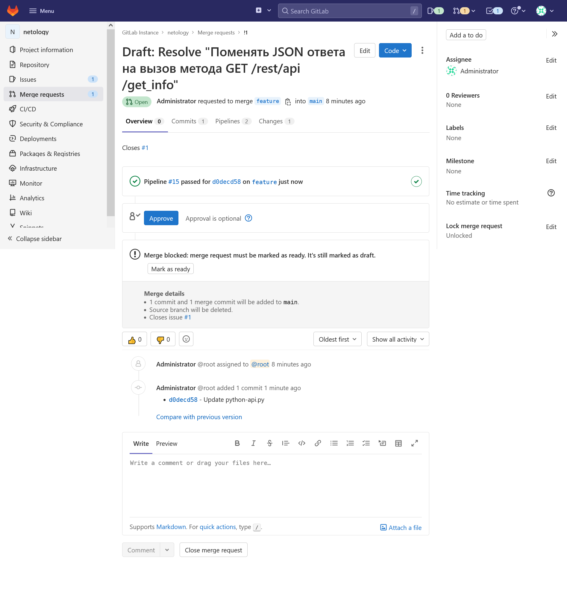

# 09.06 Gitlab

__Итоговый ответ:__

Кластер Kubernetes остановлен, чтобы не тратить ресурсы. Работает только ВМ GitLab.

[Временная ссылка на репозиторий](http://51.250.88.173/gitlab-instance-956097a3/netology)

## Подготовка к выполнению

1. Необходимо [подготовить gitlab к работе по инструкции](https://cloud.yandex.ru/docs/tutorials/infrastructure-management/gitlab-containers)
2. Создайте свой новый проект
3. Создайте новый репозиторий в gitlab, наполните его [файлами](./repository)
4. Проект должен быть публичным, остальные настройки по желанию

## Основная часть

### DevOps

В репозитории содержится код проекта на python. Проект - RESTful API сервис. Ваша задача автоматизировать сборку образа с выполнением python-скрипта:
1. Образ собирается на основе [centos:7](https://hub.docker.com/_/centos?tab=tags&page=1&ordering=last_updated)
2. Python версии не ниже 3.7
3. Установлены зависимости: `flask` `flask-jsonpify` `flask-restful`
4. Создана директория `/python_api`
5. Скрипт из репозитория размещён в /python_api
6. Точка вызова: запуск скрипта
7. Если сборка происходит на ветке `master`: должен подняться pod kubernetes на основе образа `python-api`, иначе этот шаг нужно пропустить

__Ответ:__

- [Dockerfile](./src/gitlab-netology/Dockerfile)
- [gitlab-ci](./src/gitlab-netology/.gitlab-ci.yml)
- [k8s](./src/gitlab-netology/k8s.yaml)

Yandex Cloud


Успешное прохождение pipeline


Проверка запуска пода
```BASH
$ kubectl logs deployment/python-api-deployment -n python-api
 * Serving Flask app 'python-api' (lazy loading)
 * Environment: production
   WARNING: This is a development server. Do not use it in a production deployment.
   Use a production WSGI server instead.
 * Debug mode: off
 * Running on all addresses.
   WARNING: This is a development server. Do not use it in a production deployment.
 * Running on http://10.1.128.24:5290/ (Press CTRL+C to quit)
```

### Product Owner

Вашему проекту нужна бизнесовая доработка: необходимо поменять JSON ответа на вызов метода GET `/rest/api/get_info`, необходимо создать Issue в котором указать:
1. Какой метод необходимо исправить
2. Текст с `{ "message": "Already started" }` на `{ "message": "Running"}`
3. Issue поставить label: feature

__Ответ:__

[Python-api.py](./src/gitlab-netology/python-api.py)

Созданное задание


### Developer

Вам пришел новый Issue на доработку, вам необходимо:
1. Создать отдельную ветку, связанную с этим issue
2. Внести изменения по тексту из задания
3. Подготовить Merge Requst, влить необходимые изменения в `master`, проверить, что сборка прошла успешно

__Ответ:__

Успешный Merge Requst


### Tester

Разработчики выполнили новый Issue, необходимо проверить валидность изменений:
1. Поднять докер-контейнер с образом `python-api:latest` и проверить возврат метода на корректность
2. Закрыть Issue с комментарием об успешности прохождения, указав желаемый результат и фактически достигнутый

__Ответ:__

Проверка запуска пода и результат запроса через ВМ GitLab

```BASH
$ kubectl logs deployment/python-api-deployment -n python-api
 * Serving Flask app 'python-api' (lazy loading)
 * Environment: production
   WARNING: This is a development server. Do not use it in a production deployment.
   Use a production WSGI server instead.
 * Debug mode: off
 * Running on all addresses.
   WARNING: This is a development server. Do not use it in a production deployment.
 * Running on http://10.1.128.29:5290/ (Press CTRL+C to quit)

$ ssh yc-user@51.250.88.173
Welcome to Ubuntu 18.04.6 LTS (GNU/Linux 4.15.0-112-generic x86_64)

 * Documentation:  https://help.ubuntu.com
 * Management:     https://landscape.canonical.com
 * Support:        https://ubuntu.com/advantage
New release '20.04.4 LTS' available.
Run 'do-release-upgrade' to upgrade to it.

#################################################################
This instance runs Yandex.Cloud Marketplace product
Only 80, 443 and 22 tcp ports are open by default
To view all network permissions exec “sudo iptables-save” and “sudo ip6tables-save”

Documentation for Yandex Cloud Marketplace images available at https://cloud.yandex.ru/docs

#################################################################

Last login: Sat Jul  2 13:57:29 2022 from 188.143.204.38

yc-user@gitlab:~$ curl http://10.1.128.29:5290/get_info
{"version": 4, "method": "GET", "message": "Running"}
```

Закрытие задания


## Итог

После успешного прохождения всех ролей - отправьте ссылку на ваш проект в гитлаб, как решение домашнего задания

__Ответ:__

[Временная ссылка на репозиторий](http://51.250.88.173/gitlab-instance-956097a3/netology

### :bangbang: Не забудьте оставить GitLab рабочим после выполнения задания и погасить все ресурсы в Yandex.Cloud сразу после получения зачета по домашнему заданию.

## Необязательная часть

Автомазируйте работу тестировщика, пусть у вас будет отдельный конвейер, который автоматически поднимает контейнер и выполняет проверку, например, при помощи curl. На основе вывода - будет приниматься решение об успешности прохождения тестирования
