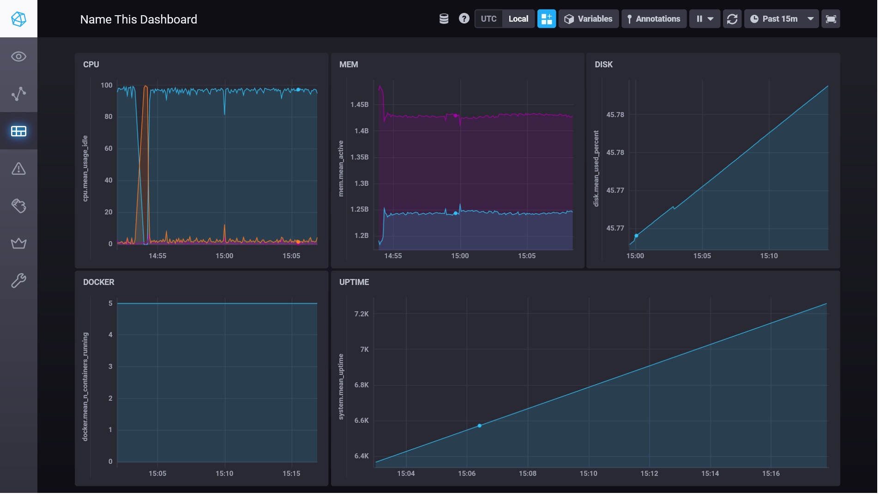

# 10.02. Системы мониторинга - Роман Поцелуев

## Обязательные задания

1. Опишите основные плюсы и минусы pull и push систем мониторинга.

__Ответ:__

__Pull__ модель (инициатор передачи - система мониторинга)

Плюсы:
- нет проблем с перегрузкой очередей, система мониторинга сама забирает данные;
- легче контролировать подлинность данных, информация собирается только с заданных агентов;
- получать данные можно по http запросам, тем самым упрощается отладка данных;
- можно защитить трафик tls протоколом.
Минусы
- агенты не могут работать за NAT;
- большая нагрузка сервер при сборе и обработке логов, т.к. используется HTTP over TCP.

__Push__ модель (инициатор передачи - агент)
Плюсы:
- использование протокола UDP позволяет уменьшить размер передаваемых данных и увеличить скорость обработки;
- агенты могут работать за NAT;
- на агенте можно указать много резервных нод систем мониторинга;
- более гибкая настройка отправки пакетов данных, т.к отправку можно настроить индивидуально на каждом агенте.
Минусы
- индивидуальная настройка клиентов в том числе и по сетевому взаимодействию;
- сервер не контролирует частоту отправки и объём данных;
- можно получить DDoS атаку от агента. 

2. Какие из ниже перечисленных систем относятся к push модели, а какие к pull? А может есть гибридные?

__Ответ:__

| Система | Модель |
| - | - |
| Prometheus  | Pull, Push с Pushgateway |
| TICK | Push |
| Zabbix | Push, Pull с Zabbix Proxy |
| VictoriaMetrics | Push, Pull (зависит от источника) |
| Nagios | Pull |

3. Склонируйте себе [репозиторий](https://github.com/influxdata/sandbox/tree/master) и запустите TICK-стэк, 
используя технологии docker и docker-compose.

В виде решения на это упражнение приведите выводы команд с вашего компьютера (виртуальной машины):

    - curl http://localhost:8086/ping
    - curl http://localhost:8888
    - curl http://localhost:9092/kapacitor/v1/ping

А также скриншот веб-интерфейса ПО chronograf (`http://localhost:8888`). 

P.S.: если при запуске некоторые контейнеры будут падать с ошибкой - проставьте им режим `Z`, например
`./data:/var/lib:Z`

__Ответ:__

```BASH
$ curl http://localhost:8086/ping
$ curl http://localhost:8888
<!DOCTYPE html><html><head><meta http-equiv="Content-type" content="text/html; charset=utf-8"><title>Chronograf</title><link rel="icon shortcut" href="/favicon.fa749080.ico"><link rel="stylesheet" href="/src.9cea3e4e.css"></head><body> <div id="react-root" data-basepath=""></div> <script src="/src.a969287c.js"></script> </body></html>
$ curl http://localhost:9092/kapacitor/v1/ping
$
```
Скриншот веб-интерфейса ПО chronograf


4. Перейдите в веб-интерфейс Chronograf (`http://localhost:8888`) и откройте вкладку `Data explorer`.

    - Нажмите на кнопку `Add a query`
    - Изучите вывод интерфейса и выберите БД `telegraf.autogen`
    - В `measurments` выберите mem->host->telegraf_container_id , а в `fields` выберите used_percent. 
    Внизу появится график утилизации оперативной памяти в контейнере telegraf.
    - Вверху вы можете увидеть запрос, аналогичный SQL-синтаксису. 
    Поэкспериментируйте с запросом, попробуйте изменить группировку и интервал наблюдений.

Для выполнения задания приведите скриншот с отображением метрик утилизации места на диске 
(disk->host->telegraf_container_id) из веб-интерфейса.

__Ответ:__

Скриншот с отображением метрик утилизации места на диске


5. Изучите список [telegraf inputs](https://github.com/influxdata/telegraf/tree/master/plugins/inputs). 
Добавьте в конфигурацию telegraf следующий плагин - [docker](https://github.com/influxdata/telegraf/tree/master/plugins/inputs/docker):
```
[[inputs.docker]]
  endpoint = "unix:///var/run/docker.sock"
```

Дополнительно вам может потребоваться донастройка контейнера telegraf в `docker-compose.yml` дополнительного volume и 
режима privileged:
```
  telegraf:
    image: telegraf:1.4.0
    privileged: true
    volumes:
      - ./etc/telegraf.conf:/etc/telegraf/telegraf.conf:Z
      - /var/run/docker.sock:/var/run/docker.sock:Z
    links:
      - influxdb
    ports:
      - "8092:8092/udp"
      - "8094:8094"
      - "8125:8125/udp"
```

После настройке перезапустите telegraf, обновите веб интерфейс и приведите скриншотом список `measurments` в 
веб-интерфейсе базы telegraf.autogen . Там должны появиться метрики, связанные с docker.

Факультативно можете изучить какие метрики собирает telegraf после выполнения данного задания.

__Ответ:__

Скриншот с отображением метрик docker


## Дополнительное задание (со звездочкой*) - необязательно к выполнению

В веб-интерфейсе откройте вкладку `Dashboards`. Попробуйте создать свой dashboard с отображением:

    - утилизации ЦПУ
    - количества использованного RAM
    - утилизации пространства на дисках
    - количество поднятых контейнеров
    - аптайм
    - ...
    - фантазируйте)
    
    ---

__Ответ:__

Скриншот с отображением dashboard


