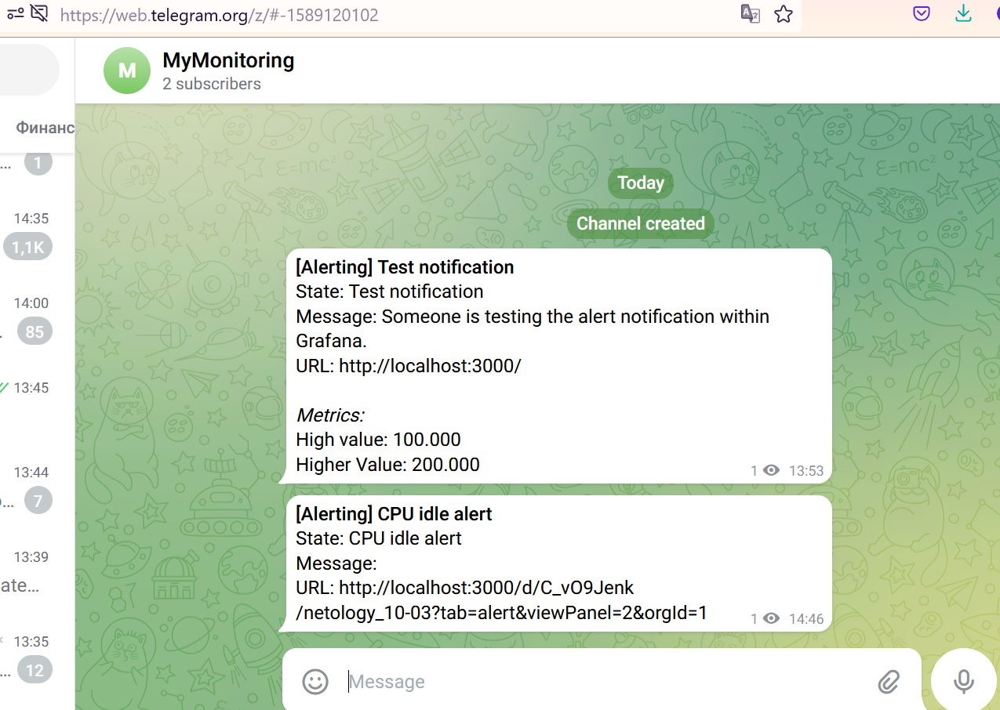
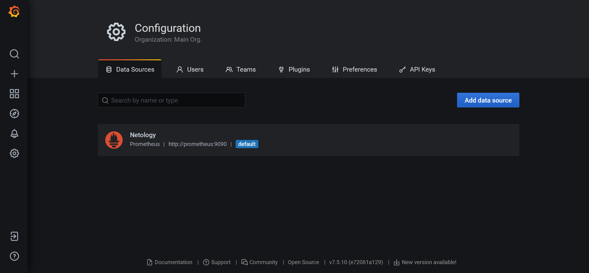
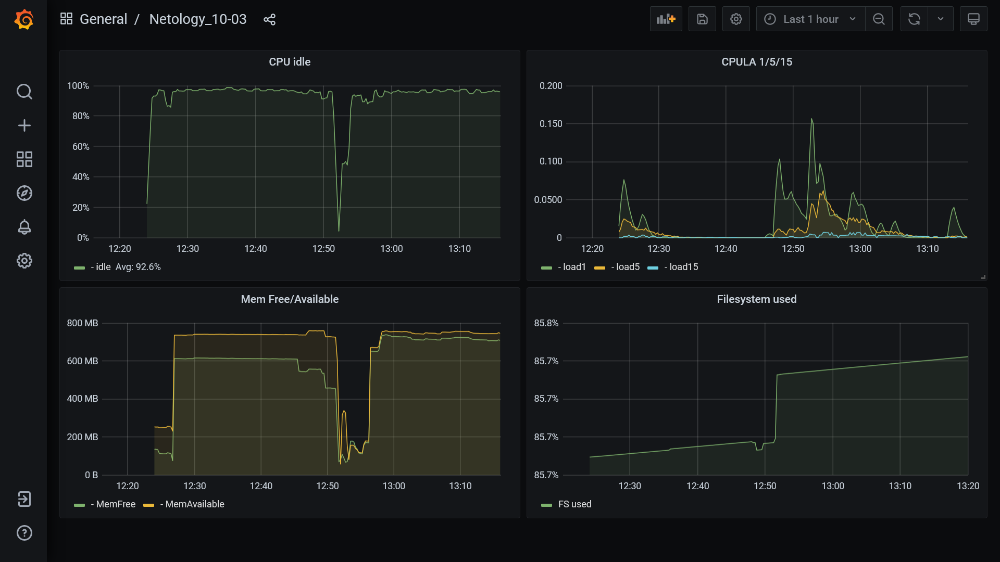
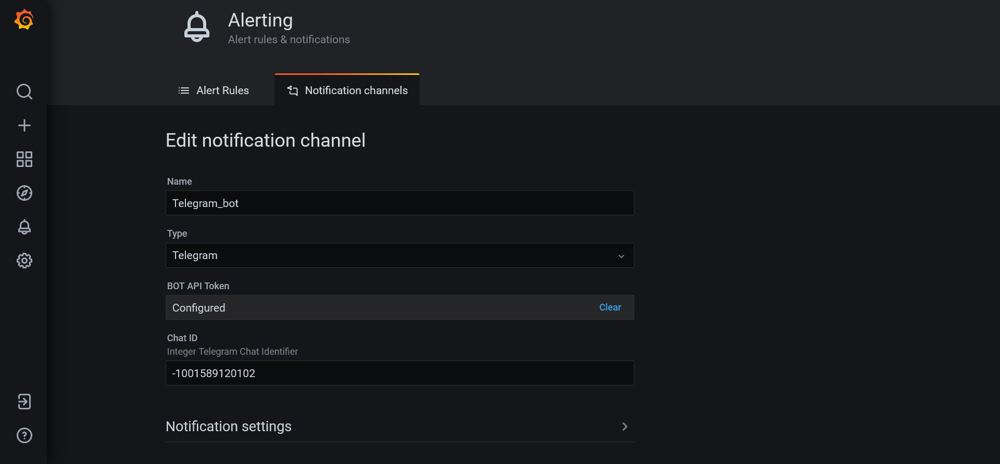
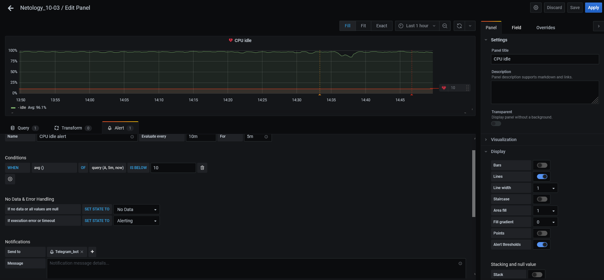
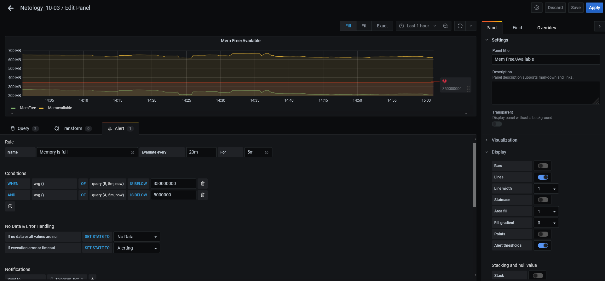

# 10.03. Grafana - Роман Поцелуев

## Задание повышенной сложности

**В части задания 1** не используйте директорию [help](./help) для сборки проекта, самостоятельно разверните grafana, где в роли источника данных будет выступать prometheus, а сборщиком данных node-exporter:
- grafana
- prometheus-server
- prometheus node-exporter

За дополнительными материалами, вы можете обратиться в официальную документацию grafana и prometheus.

В решении к домашнему заданию приведите также все конфигурации/скрипты/манифесты, которые вы 
использовали в процессе решения задания.

**Ответ:**

Ссылки на документы, которые использовались при создании фалов настроек приведены с самих файлах.

- [docker-compose](./src/monitoring/docker-compose.yml)
- [Grafana datasource](./src/monitoring/grafana/provisioning/datasources/netology.yaml)
- [Grafana dashboard config](./src/monitoring/grafana/provisioning/dashboards/netology-dashboards.yml)
- [Prometheus config](./src/monitoring/prometheus/prometheus.yml)

**В части задания 3** вы должны самостоятельно завести удобный для вас канал нотификации, например Telegram или Email
и отправить туда тестовые события.

В решении приведите скриншоты тестовых событий из каналов нотификаций.

**Ответ:**



## Обязательные задания

### Задание 1
Используя директорию [help](./help) внутри данного домашнего задания - запустите связку prometheus-grafana.

Зайдите в веб-интерфейс графана, используя авторизационные данные, указанные в манифесте docker-compose.

Подключите поднятый вами prometheus как источник данных.

Решение домашнего задания - скриншот веб-интерфейса grafana со списком подключенных Datasource.



## Задание 2
Изучите самостоятельно ресурсы:
- [promql-for-humans](https://timber.io/blog/promql-for-humans/#cpu-usage-by-instance)
- [understanding prometheus cpu metrics](https://www.robustperception.io/understanding-machine-cpu-usage)

**Ответ:**

Создайте Dashboard и в ней создайте следующие Panels:
- Утилизация CPU для nodeexporter (в процентах, 100-idle)
```
avg by(instance)(rate(node_cpu_seconds_total{instance="node-exporter:9100", mode="idle"}[$__rate_interval])) * 100
```
- CPULA 1/5/15
```
avg by (instance)(rate(node_load1{instance="node-exporter:9100"}[$__rate_interval]))
avg by (instance)(rate(node_load5{instance="node-exporter:9100"}[$__rate_interval]))
avg by (instance)(rate(node_load15{instance="node-exporter:9100"}[$__rate_interval]))
```
- Количество свободной оперативной памяти
```
node_memory_MemFree_bytes{instance="node-exporter:9100"}
node_memory_MemAvailable_bytes{instance="node-exporter:9100"}
```
- Количество места на файловой системе
```
100 - node_filesystem_avail_bytes{fstype!='tmpfs', instance="node-exporter:9100"} / node_filesystem_size_bytes * 100
```
Для решения данного ДЗ приведите promql запросы для выдачи этих метрик, а также скриншот получившейся Dashboard.



## Задание 3
Создайте для каждой Dashboard подходящее правило alert (можно обратиться к первой лекции в блоке "Мониторинг").

Для решения ДЗ - приведите скриншот вашей итоговой Dashboard.


**Ответ:**

Настройка Notification channels



Настройка правила для CPU


Настройка правила для Memory


## Задание 4
Сохраните ваш Dashboard.

Для этого перейдите в настройки Dashboard, выберите в боковом меню "JSON MODEL".

Далее скопируйте отображаемое json-содержимое в отдельный файл и сохраните его.

В решении задания - приведите листинг этого файла.

**Ответ**

[Dashboard json](./src/monitoring/grafana/provisioning/dashboards/10-03-netology-dashboard.json)