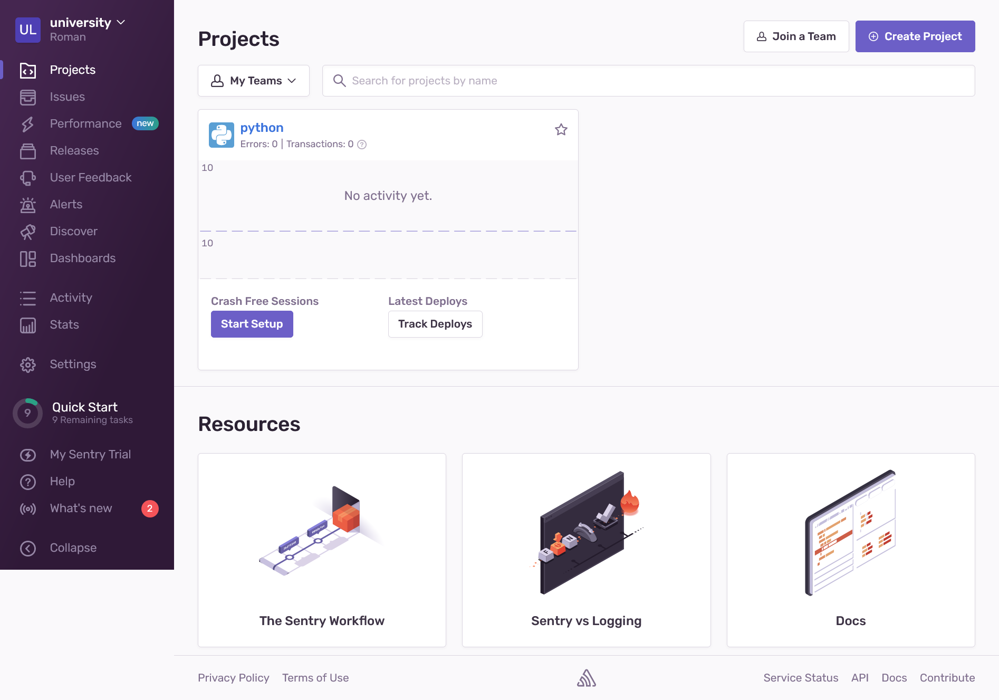
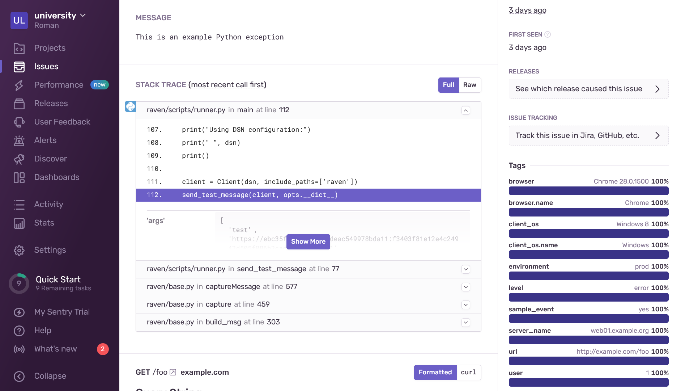
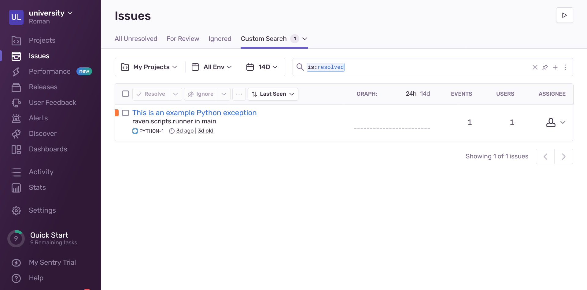
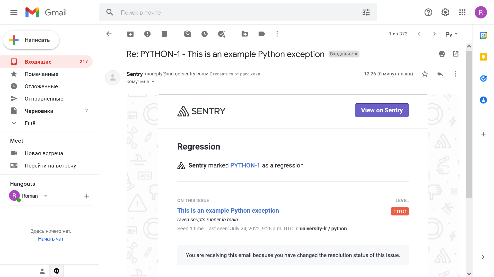
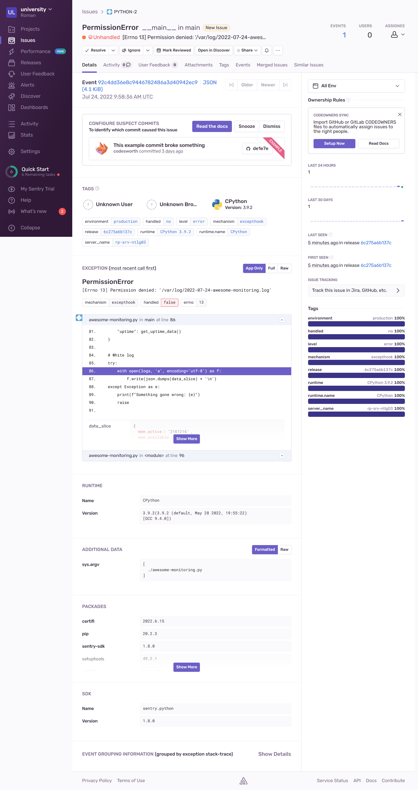

# 10.05. Sentry - Роман Поцелуев

## Задание 1

Так как self-hosted Sentry довольно требовательная к ресурсам система, мы будем использовать Free cloud аккаунт.

Free cloud account имеет следующие ограничения:
- 5 000 errors
- 10 000 transactions
- 1 GB attachments

Для подключения Free cloud account:
- зайдите на sentry.io
- нажмите "Try for free"
- используйте авторизацию через ваш github-account
- далее следуйте инструкциям

Для выполнения задания - пришлите скриншот меню Projects.

__Ответ:__

## Задание 2

Создайте python проект и нажмите `Generate sample event` для генерации тестового события.

Изучите информацию, представленную в событии.

Перейдите в список событий проекта, выберите созданное вами и нажмите `Resolved`.

Для выполнения задание предоставьте скриншот `Stack trace` из этого события и список событий проекта, после нажатия `Resolved`.

__Ответ:__

## Задание 3

Перейдите в создание правил алёртинга.

Выберите проект и создайте дефолтное правило алёртинга, без настройки полей.

Снова сгенерируйте событие `Generate sample event`.

Для выполнения задания - пришлите скриншот тела сообщения из оповещения на почте.

Дополнительно поэкспериментируйте с правилами алёртинга. 
Выбирайте разные условия отправки и создавайте sample events. 

__Ответ:__

## Задание повышенной сложности

Создайте проект на ЯП python или GO (небольшой, буквально 10-20 строк), подключите к нему sentry SDK и отправьте несколько тестовых событий.
Поэкспериментируйте с различными передаваемыми параметрами, но помните об ограничениях free учетной записи cloud Sentry.

Для выполнения задания пришлите скриншот меню issues вашего проекта и 
пример кода подключения sentry sdk/отсылки событий.

__Ответ:__

- [Скрипт генерирующий ошибку](./src/awesome-monitoring.py)

- Ошибка в Sentry

