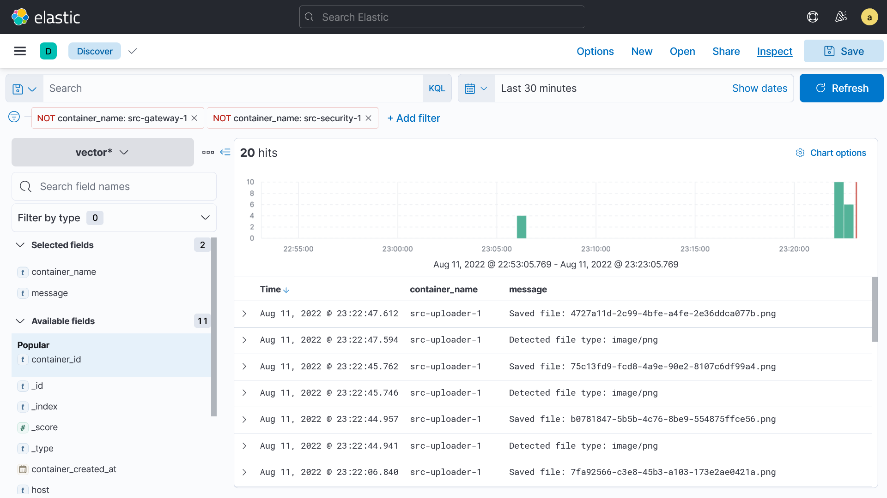
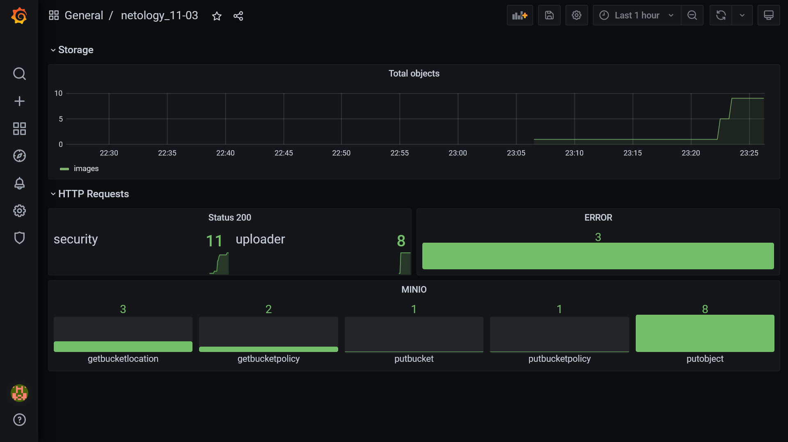

# 11.03 Микросервисы: подходы - Роман Поцелуев

Вы работаете в крупной компанию, которая строит систему на основе микросервисной архитектуры.
Вам как DevOps специалисту необходимо выдвинуть предложение по организации инфраструктуры, для разработки и эксплуатации.

## Задача 1: Обеспечить разработку

Предложите решение для обеспечения процесса разработки: хранение исходного кода, непрерывная интеграция и непрерывная поставка. 
Решение может состоять из одного или нескольких программных продуктов и должно описывать способы и принципы их взаимодействия.

Решение должно соответствовать следующим требованиям:
- Облачная система;
- Система контроля версий Git;
- Репозиторий на каждый сервис;
- Запуск сборки по событию из системы контроля версий;
- Запуск сборки по кнопке с указанием параметров;
- Возможность привязать настройки к каждой сборке;
- Возможность создания шаблонов для различных конфигураций сборок;
- Возможность безопасного хранения секретных данных: пароли, ключи доступа;
- Несколько конфигураций для сборки из одного репозитория;
- Кастомные шаги при сборке;
- Собственные докер образы для сборки проектов;
- Возможность развернуть агентов сборки на собственных серверах;
- Возможность параллельного запуска нескольких сборок;
- Возможность параллельного запуска тестов;

Обоснуйте свой выбор.

__Ответ:__

Для реализации решения для обеспечения процесса разработки сегодня можно использовать множество инструментов. Основа инструментария это сервис или приложение, на базе которого реализуется CI/CD процесс: Jenkins, TeamCity, Gitlab CI, GitHub Actions и т.п. Основная задача CI/CD-инструмента - координировать деятельность множества систем: системы контроля версий, инструментов сборки, фреймворков автоматизированного тестирования, менеджеров зависимостей, баг-трекеров и платформ контейнеризации. Попробуем составить сравнительную таблицу требований для нашего проекта к этим системам [1], [2].

| Требования | Jenkins | TeamСity | Gitlab | GitHub [3] |
|---|---|---|---|---|
| Облачная система | Нет | Да | Да | Да |
| Система контроля версий Git | Да | Да | Да | Да |
| Репозиторий на каждый сервис | Да | Да | Да | Да |
| Запуск сборки по событию из системы контроля версий | Да | Да | Да | Да |
| Запуск сборки по кнопке с указанием параметров | Да | Да | Да | Нет |
| Возможность привязать настройки к каждой сборке | Да | Да | Да | Да |
| Возможность создания шаблонов для различных конфигураций сборок | Да | Да | Нет | Да |
| Возможность безопасного хранения секретных данных: пароли, ключи доступа | Да | Да | Да | Да |
| Несколько конфигураций для сборки из одного репозитория | Да | Да | Да | Да |
| Кастомные шаги при сборке | Да | Да | Да | Да |
| Собственные докер образы для сборки проектов | Нет | Да | Да | Нет |
| Возможность развернуть агентов сборки на собственных серверах | Нет | Да | Да | Нет |
| Возможность параллельного запуска нескольких сборок | Да | Да | Да | Да |
| Возможность параллельного запуска тестов | Да | Да | Да | Да |

[1]: https://katalon.com/resources-center/blog/ci-cd-tools
[2]: https://knapsackpro.com/ci_comparisons/github-actions/vs/gitlab-ci
[3]: https://habr.com/ru/company/jugru/blog/505994/?ysclid=l6hzh83obg814521105

Для реализации в проекте CI/CD процессов я бы не рекомендовал использовать GitHub Actions, т.к. это довольно таки запутано. Для закрытых контуров и при повышенным требованиях к информационной безопасности можно использовать Jenkins, который имеет открытый код, полностью бесплатен и широко используется. TeamСity полностью подходит под наши требования, но он самый дорогой из предложенных. Можно рекомендовать остановиться на Gitlab, как самом универсальном инструменте, это не просто хранилище исходного кода, а полноценная DevOps-платформа, где можно вести проекты с задачами и досками, отслеживать состояние окружений, хранить всевозможные типы артефактов, использовать интегрированное контейнер-хранилище, подключать Terraform-модуль и многое другое. 

## Задача 2: Логи

Предложите решение для обеспечения сбора и анализа логов сервисов в микросервисной архитектуре.
Решение может состоять из одного или нескольких программных продуктов и должно описывать способы и принципы их взаимодействия.

Решение должно соответствовать следующим требованиям:
- Сбор логов в центральное хранилище со всех хостов обслуживающих систему;
- Минимальные требования к приложениям, сбор логов из stdout;
- Гарантированная доставка логов до центрального хранилища;
- Обеспечение поиска и фильтрации по записям логов;
- Обеспечение пользовательского интерфейса с возможностью предоставления доступа разработчикам для поиска по записям логов;
- Возможность дать ссылку на сохраненный поиск по записям логов;

Обоснуйте свой выбор.

__Ответ:__

Самым [популярным](https://landscape.cncf.io/card-mode?category=logging&grouping=category) для данных требований решением является основанный на базе Elasticsearch - ELK стек (Elasticsearch/LogStash/Kibana). Можно заменить LogStash и Kibana на fluentd и Graylog, но решение все равно будет зависеть от Elasticsearch. ELK имеет большое комьюнити и хорошо документировано. Альтернативой может послужить PLG (Promtail/Grafana loki/Grafana) стек, он более производителен, но язык LogQL менее функционален. Promtail имеет нативную интеграцию с Kebernetis, что в  может оказаться более выгодным решением для нашей задачи, чем ELK.

## Задача 3: Мониторинг

Предложите решение для обеспечения сбора и анализа состояния хостов и сервисов в микросервисной архитектуре.
Решение может состоять из одного или нескольких программных продуктов и должно описывать способы и принципы их взаимодействия.

Решение должно соответствовать следующим требованиям:
- Сбор метрик со всех хостов, обслуживающих систему;
- Сбор метрик состояния ресурсов хостов: CPU, RAM, HDD, Network;
- Сбор метрик потребляемых ресурсов для каждого сервиса: CPU, RAM, HDD, Network;
- Сбор метрик, специфичных для каждого сервиса;
- Пользовательский интерфейс с возможностью делать запросы и агрегировать информацию;
- Пользовательский интерфейс с возможность настраивать различные панели для отслеживания состояния системы;

Обоснуйте свой выбор.

__Ответ:__

Наиболее популярные решения, которые применяются в подавляющем большинстве организаций: TICK (Telegraf/Influxdb/Chronograf/Kapacitor), Prometheus (Node exporter/Prometheus/Grafana) или Zabbix. Все они подходят для наших требований. Я бы не рекомендовал использовать Zabbix, т.к. система ресурсоемкая и при большом числе узлов мониторинга система может показать низкую производительность. Оптимальным решением будет использование связки Node exporter/Prometheus/Grafana, основными преимуществами которой являются:

- Высокая производительность;
- Простой и мощный язык запросов;
- Множество готовых дашбордов Grafana и агентов Node exporter;
- Библиотеки для возможности создания своих агентов;
- Хорошая документация и большое комьюнити.

## Задача 4: Логи * (необязательная)

Продолжить работу по задаче API Gateway: сервисы используемые в задаче пишут логи в stdout.

Добавить в систему сервисы для сбора логов Vector Да ElasticSearch Да Kibana со всех сервисов обеспечивающих работу API.

### Результат выполнения:

docker compose файл запустив который можно перейти по адресу http://localhost:8081 по которому доступна Kibana.
Логин в Kibana должен быть admin пароль qwerty123456

__Ответ:__

Для доступа к сервисам в [конфиге NGinx](./src/gateway/nginx.conf) открыты порты: 9091 - storage console, 9092 - grafana, 9093 - kibana. Внесены изменения в следующие файлы:

- [docker-compose](./src/docker-compose.yaml)
- [файл конфигурации](./src/gateway/nginx.conf)
- [скрипт для создания пользователей](./src/logging/elasticsearch/initializer.sh)
- [файл конфигурации Vector](./src/logging/vector/vector.toml)
- [переменные окружения](./src/.env)

## Задача 5: Мониторинг * (необязательная)

Продолжить работу по задаче API Gateway: сервисы используемые в задаче предоставляют набор метрик в формате prometheus:

- Сервис security по адресу /metrics
- Сервис uploader по адресу /metrics
- Сервис storage (minio) по адресу /minio/v2/metrics/cluster

Добавить в систему сервисы для сбора метрик (Prometheus и Grafana) со всех сервисов обеспечивающих работу API.
Построить в Graphana dashboard показывающий распределение запросов по сервисам.

### Результат выполнения: 

docker compose файл запустив который можно перейти по адресу http://localhost:8081 по которому доступна Grafana с настроенным Dashboard.
Логин в Grafana должен быть admin пароль qwerty123456

__Ответ:__

Для доступа к сервисам в [конфиге NGinx](./src/gateway/nginx.conf) открыты порты: 9091 - storage console, 9092 - grafana, 9093 - kibana. Внесены изменения в следующие файлы:

- [docker-compose](./src/docker-compose.yaml)
- [файл конфигурации NGinx](./src/gateway/nginx.conf)
- [источники метрик для prometheus](./src/monitoring/prometheus/prometheus.yml)
- [дашборд grafana](./src/monitoring/grafana/provisioning/dashboards/11-03-netology-dashboard.json)
- [переменные окружения](./src/.env)

