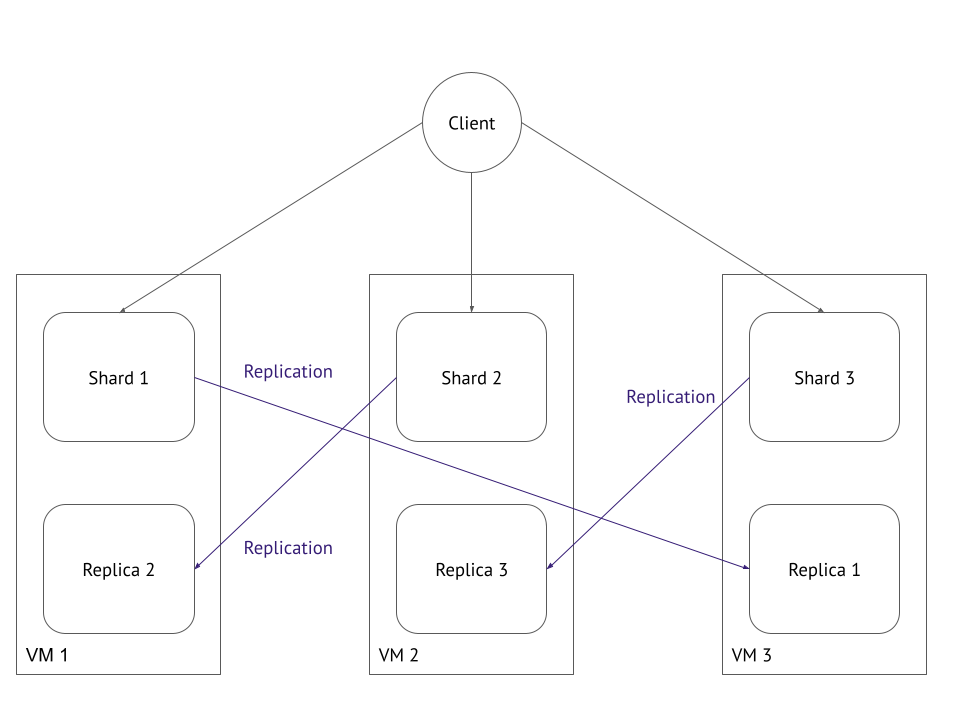

# 11.04 Микросервисы: масштабирование - Роман Поцелуев

Вы работаете в крупной компанию, которая строит систему на основе микросервисной архитектуры.
Вам как DevOps специалисту необходимо выдвинуть предложение по организации инфраструктуры, для разработки и эксплуатации.

## Задача 1: Кластеризация

Предложите решение для обеспечения развертывания, запуска и управления приложениями.
Решение может состоять из одного или нескольких программных продуктов и должно описывать способы и принципы их взаимодействия.

Решение должно соответствовать следующим требованиям:

- Поддержка контейнеров;
- Обеспечивать обнаружение сервисов и маршрутизацию запросов;
- Обеспечивать возможность горизонтального масштабирования;
- Обеспечивать возможность автоматического масштабирования;
- Обеспечивать явное разделение ресурсов доступных извне и внутри системы;
- Обеспечивать возможность конфигурировать приложения с помощью переменных среды, в том числе с возможностью безопасного хранения чувствительных данных таких как пароли, ключи доступа, ключи шифрования и т.п.

Обоснуйте свой выбор.

__Ответ:__

Благодаря малому размеру и ориентированности на приложение контейнеры идеально подходят для сред с гибкой настройкой доставки и архитектур, основанных на микрослужбах. Но контейнерной средой промышленного масштаба нельзя нормально управлять к без средств автоматизации. Эту задачу нужно передать оркестратору, то есть специальному процессу, который позволяет автоматизировать большое количество контейнеров, а также управлять ими и взаимодействием между ними. Список популярных реализаций систем оркестрации контейнеров можно посмотреть фонде [Cloud Native Computing Foundation](https://landscape.cncf.io/card-mode?category=scheduling-orchestration&grouping=category&sort=stars), возьмем несколько и составим сравнительную таблицу для наших требований.

| __Требования__ | __Kubernetes__ [1] | __Nomad__ [2] | __Mesos__ [3] | __Docker Swarm__ [4] |
| --- | --- | --- | --- | --- |
| _Поддержка контейнеров_ | Да, OCI совместимые, Docker | Да, OCI совместимые, LXC | Да, Mesos containerizer, Docker | Да, только Docker |
| _Обнаружение сервисов и маршрутизация запросов_ | Да, встроенный DNS-сервер | Нет, используется `Consul` | Да, встроенный DNS-сервер | Да, встроенный DNS-сервер |
| _Возможность горизонтального масштабирования_ | Да, `Horizontal Pod Autoscale` | Да, `Scaling Policies` | Да | Да, `service scale` |
| _Возможность автоматического масштабирования_ | Да, `HPA` и `VPA` | Да, `Autoscaler Plugins` |  Да, доступно в комбинации с `Marathon` | Нет |
| _Явное разделение ресурсов доступных извне и внутри системы_ | Да, `Services` и `Namespaces` | Да, настройка `Network` | Да, `Network namespace` | Да, `publish ports` и `overlay network` |
| _Конфигурирование приложений с помощью переменных среды_ | Да | Да, `Runtime Environment` | Да | Да, `environment` |
| _Безопасное хранение чувствительных данных_ | Да | Нет, использование сторонней системы `Vault` | Да, `Secrets` | Да, `docker secret` |

[1]: https://kubernetes.io/docs/
[2]: https://www.nomadproject.io/docs/
[3]: https://mesos.apache.org/documentation/latest/
[4]: https://docs.docker.com/engine/swarm/

Проведенный анализ показал, что под наши требования подходят первые три решения. Можно остановиться на __Kubernetes__, т.к. это на сегодня наиболее популярный инструмент для оркестрации контейнеров. К основным плюсам решения можно отнести:

- полностью соответствует нашим требованиям;
- большое количество встроенных возможностей и их можно расширять с помощью API;
- просто запустить в публичных облаках;
- полностью бесплатный инструмент с открытым исходным кодом;
- хорошая документация и большое комьюнити.

## Задача 2: Распределенный кэш * (необязательная)

Разработчикам вашей компании понадобился распределенный кэш для организации хранения временной информации по сессиям пользователей.
Вам необходимо построить Redis Cluster состоящий из трех шард с тремя репликами.

### Схема:



__Ответ:__

Создание трёх ВМ на ОС `Centos 7` выполнено с помощью скриптов `Terraform` в yandex cloud. Из скрипта `Terraform` запускается `ansible playbook`, который выполняет установку Redis из репозитория `remi`, создает и запускает службу `redis` на указанном порту, настраивает `Redis Cluster` с помощью `redis-cli`.

- [скрипты Terraform](./src/terraform/)
- [ansible playbook](./src/ansible/)
- Проверка работы кластера

```BASH
$ ssh centos@84.201.173.250
[centos@redis01 ~]$ redis-cli -p 6379 cluster nodes
1050b84255523db120d08d4532b361018d4a677c 192.168.101.11:6480@16480 slave 251da480db2bd22eaa12eec769a54f00335e4088 0 1661261869752 3 connected
6a285c01a1af8d837b3ce69bca786139d48ccf3f 192.168.101.23:6379@16379 master - 0 1661261869000 2 connected 5461-10922
05985e31ca95564ae8a8853f03b402c3ad26d4fb 192.168.101.26:6480@16480 slave 6a285c01a1af8d837b3ce69bca786139d48ccf3f 0 1661261868000 2 connected
64d2799461431d6003be1d934665073a09eefaa9 192.168.101.11:6379@16379 myself,master - 0 1661261867000 1 connected 0-5460
b7bce73383b37d10a38cbf4a11f37a6c0b0b4f7c 192.168.101.23:6480@16480 slave 64d2799461431d6003be1d934665073a09eefaa9 0 1661261867745 1 connected
251da480db2bd22eaa12eec769a54f00335e4088 192.168.101.26:6379@16379 master - 0 1661261870757 3 connected 10923-16383

[centos@redis01 ~]$ redis-cli -p 6379 cluster info
cluster_state:ok
cluster_slots_assigned:16384
cluster_slots_ok:16384
cluster_slots_pfail:0
cluster_slots_fail:0
cluster_known_nodes:6
cluster_size:3
cluster_current_epoch:3
cluster_my_epoch:1
cluster_stats_messages_ping_sent:635
cluster_stats_messages_pong_sent:589
cluster_stats_messages_sent:1224
cluster_stats_messages_ping_received:586
cluster_stats_messages_pong_received:635
cluster_stats_messages_meet_received:3
cluster_stats_messages_received:1224
total_cluster_links_buffer_limit_exceeded:0

[centos@redis01 ~]$ redis-cli -p 6379 cluster slots
1) 1) (integer) 0
   2) (integer) 5460
   3) 1) "192.168.101.11"
      2) (integer) 6379
      3) "64d2799461431d6003be1d934665073a09eefaa9"
      4) (empty array)
   4) 1) "192.168.101.23"
      2) (integer) 6480
      3) "b7bce73383b37d10a38cbf4a11f37a6c0b0b4f7c"
      4) (empty array)
2) 1) (integer) 5461
   2) (integer) 10922
   3) 1) "192.168.101.23"
      2) (integer) 6379
      3) "6a285c01a1af8d837b3ce69bca786139d48ccf3f"
      4) (empty array)
   4) 1) "192.168.101.26"
      2) (integer) 6480
      3) "05985e31ca95564ae8a8853f03b402c3ad26d4fb"
      4) (empty array)
3) 1) (integer) 10923
   2) (integer) 16383
   3) 1) "192.168.101.26"
      2) (integer) 6379
      3) "251da480db2bd22eaa12eec769a54f00335e4088"
      4) (empty array)
   4) 1) "192.168.101.11"
      2) (integer) 6480
      3) "1050b84255523db120d08d4532b361018d4a677c"
      4) (empty array)

[centos@redis01 ~]$ redis-cli -c -p 6379
127.0.0.1:6379> set x 10
-> Redirected to slot [16287] located at 192.168.101.26:6379
OK
192.168.101.26:6379> get x
"10"
```

<details><summary>Выполнение скриптов Terraform</summary>

```BASH
  $ terraform apply --auto-approve

Terraform used the selected providers to generate the following execution plan. Resource actions are indicated with
the following symbols:
  + create

Terraform will perform the following actions:

  # local_file.inventory will be created
  + resource "local_file" "inventory" {
      + content              = (known after apply)
      + directory_permission = "0777"
      + file_permission      = "0777"
      + filename             = "../ansible/inventory"
      + id                   = (known after apply)
    }

  # null_resource.cluster will be created
  + resource "null_resource" "cluster" {
      + id = (known after apply)
    }

  # null_resource.wait will be created
  + resource "null_resource" "wait" {
      + id = (known after apply)
    }

  # yandex_compute_instance.vm["redis01"] will be created
  + resource "yandex_compute_instance" "vm" {
      + allow_stopping_for_update = true
      + created_at                = (known after apply)
      + folder_id                 = (known after apply)
      + fqdn                      = (known after apply)
      + hostname                  = "redis01.netology.cloud"
      + id                        = (known after apply)
      + metadata                  = {
          + "ssh-keys" = <<-EOT EOT
        }
      + name                      = "redis01"
      + network_acceleration_type = "standard"
      + platform_id               = "standard-v1"
      + service_account_id        = (known after apply)
      + status                    = (known after apply)
      + zone                      = "ru-central1-a"

      + boot_disk {
          + auto_delete = true
          + device_name = (known after apply)
          + disk_id     = (known after apply)
          + mode        = (known after apply)

          + initialize_params {
              + block_size  = (known after apply)
              + description = (known after apply)
              + image_id    = "fd88d14a6790do254kj7"
              + name        = "root-redis01"
              + size        = 10
              + snapshot_id = (known after apply)
              + type        = "network-hdd"
            }
        }

      + network_interface {
          + index              = (known after apply)
          + ip_address         = (known after apply)
          + ipv4               = true
          + ipv6               = (known after apply)
          + ipv6_address       = (known after apply)
          + mac_address        = (known after apply)
          + nat                = true
          + nat_ip_address     = (known after apply)
          + nat_ip_version     = (known after apply)
          + security_group_ids = (known after apply)
          + subnet_id          = (known after apply)
        }

      + placement_policy {
          + host_affinity_rules = (known after apply)
          + placement_group_id  = (known after apply)
        }

      + resources {
          + core_fraction = 100
          + cores         = 2
          + memory        = 4
        }

      + scheduling_policy {
          + preemptible = (known after apply)
        }
    }

  # yandex_compute_instance.vm["redis02"] will be created
  + resource "yandex_compute_instance" "vm" {
      + allow_stopping_for_update = true
      + created_at                = (known after apply)
      + folder_id                 = (known after apply)
      + fqdn                      = (known after apply)
      + hostname                  = "redis02.netology.cloud"
      + id                        = (known after apply)
      + metadata                  = {
          + "ssh-keys" = <<-EOT EOT
        }
      + name                      = "redis02"
      + network_acceleration_type = "standard"
      + platform_id               = "standard-v1"
      + service_account_id        = (known after apply)
      + status                    = (known after apply)
      + zone                      = "ru-central1-a"

      + boot_disk {
          + auto_delete = true
          + device_name = (known after apply)
          + disk_id     = (known after apply)
          + mode        = (known after apply)

          + initialize_params {
              + block_size  = (known after apply)
              + description = (known after apply)
              + image_id    = "fd88d14a6790do254kj7"
              + name        = "root-redis02"
              + size        = 10
              + snapshot_id = (known after apply)
              + type        = "network-hdd"
            }
        }

      + network_interface {
          + index              = (known after apply)
          + ip_address         = (known after apply)
          + ipv4               = true
          + ipv6               = (known after apply)
          + ipv6_address       = (known after apply)
          + mac_address        = (known after apply)
          + nat                = true
          + nat_ip_address     = (known after apply)
          + nat_ip_version     = (known after apply)
          + security_group_ids = (known after apply)
          + subnet_id          = (known after apply)
        }

      + placement_policy {
          + host_affinity_rules = (known after apply)
          + placement_group_id  = (known after apply)
        }

      + resources {
          + core_fraction = 100
          + cores         = 2
          + memory        = 4
        }

      + scheduling_policy {
          + preemptible = (known after apply)
        }
    }

  # yandex_compute_instance.vm["redis03"] will be created
  + resource "yandex_compute_instance" "vm" {
      + allow_stopping_for_update = true
      + created_at                = (known after apply)
      + folder_id                 = (known after apply)
      + fqdn                      = (known after apply)
      + hostname                  = "redis03.netology.cloud"
      + id                        = (known after apply)
      + metadata                  = {
          + "ssh-keys" = <<-EOT EOT
        }
      + name                      = "redis03"
      + network_acceleration_type = "standard"
      + platform_id               = "standard-v1"
      + service_account_id        = (known after apply)
      + status                    = (known after apply)
      + zone                      = "ru-central1-a"

      + boot_disk {
          + auto_delete = true
          + device_name = (known after apply)
          + disk_id     = (known after apply)
          + mode        = (known after apply)

          + initialize_params {
              + block_size  = (known after apply)
              + description = (known after apply)
              + image_id    = "fd88d14a6790do254kj7"
              + name        = "root-redis03"
              + size        = 10
              + snapshot_id = (known after apply)
              + type        = "network-hdd"
            }
        }

      + network_interface {
          + index              = (known after apply)
          + ip_address         = (known after apply)
          + ipv4               = true
          + ipv6               = (known after apply)
          + ipv6_address       = (known after apply)
          + mac_address        = (known after apply)
          + nat                = true
          + nat_ip_address     = (known after apply)
          + nat_ip_version     = (known after apply)
          + security_group_ids = (known after apply)
          + subnet_id          = (known after apply)
        }

      + placement_policy {
          + host_affinity_rules = (known after apply)
          + placement_group_id  = (known after apply)
        }

      + resources {
          + core_fraction = 100
          + cores         = 2
          + memory        = 4
        }

      + scheduling_policy {
          + preemptible = (known after apply)
        }
    }

  # yandex_vpc_network.default will be created
  + resource "yandex_vpc_network" "default" {
      + created_at                = (known after apply)
      + default_security_group_id = (known after apply)
      + folder_id                 = (known after apply)
      + id                        = (known after apply)
      + labels                    = (known after apply)
      + name                      = "net"
      + subnet_ids                = (known after apply)
    }

  # yandex_vpc_subnet.default will be created
  + resource "yandex_vpc_subnet" "default" {
      + created_at     = (known after apply)
      + folder_id      = (known after apply)
      + id             = (known after apply)
      + labels         = (known after apply)
      + name           = "subnet"
      + network_id     = (known after apply)
      + v4_cidr_blocks = [
          + "192.168.101.0/24",
        ]
      + v6_cidr_blocks = (known after apply)
      + zone           = "ru-central1-a"
    }

Plan: 8 to add, 0 to change, 0 to destroy.

Changes to Outputs:
  + external_ip_address_instace = [
      + (known after apply),
      + (known after apply),
      + (known after apply),
    ]
  + internal_ip_address_instace = [
      + (known after apply),
      + (known after apply),
      + (known after apply),
    ]
yandex_vpc_network.default: Creating...
yandex_vpc_network.default: Creation complete after 1s [id=enp63r2h5jj1i0c5p5ui]
yandex_vpc_subnet.default: Creating...
yandex_vpc_subnet.default: Creation complete after 1s [id=e9bag2108qtc6vtbmmnf]
yandex_compute_instance.vm["redis03"]: Creating...
yandex_compute_instance.vm["redis02"]: Creating...
yandex_compute_instance.vm["redis01"]: Creating...
yandex_compute_instance.vm["redis03"]: Still creating... [10s elapsed]
yandex_compute_instance.vm["redis02"]: Still creating... [10s elapsed]
yandex_compute_instance.vm["redis01"]: Still creating... [10s elapsed]
yandex_compute_instance.vm["redis03"]: Still creating... [20s elapsed]
yandex_compute_instance.vm["redis02"]: Still creating... [20s elapsed]
yandex_compute_instance.vm["redis01"]: Still creating... [20s elapsed]
yandex_compute_instance.vm["redis03"]: Creation complete after 21s [id=fhmuq83j8rfe00io1khr]
yandex_compute_instance.vm["redis01"]: Creation complete after 21s [id=fhmcdlr58tkguqelfqt6]
yandex_compute_instance.vm["redis02"]: Creation complete after 21s [id=fhmjap3f6a1284t8b83f]
local_file.inventory: Creating...
local_file.inventory: Creation complete after 1s [id=91e749e2ec790fa176a02b6c08243c4281ae552e]
null_resource.wait: Creating...
null_resource.wait: Provisioning with 'local-exec'...
null_resource.wait (local-exec): Executing: ["/bin/sh" "-c" "sleep 30"]
null_resource.wait: Still creating... [10s elapsed]
null_resource.wait: Still creating... [20s elapsed]
null_resource.wait: Still creating... [30s elapsed]
null_resource.wait: Creation complete after 30s [id=145159532404960522]
null_resource.cluster: Creating...
null_resource.cluster: Provisioning with 'local-exec'...
null_resource.cluster (local-exec): Executing: ["/bin/sh" "-c" "ANSIBLE_FORCE_COLOR=1 ansible-playbook -i inventory playbook.yml"]

null_resource.cluster (local-exec): PLAY [Install Requrements Tools] ***********************************************

null_resource.cluster (local-exec): TASK [Gathering Facts] *********************************************************
null_resource.cluster (local-exec): ok: [redis02]
null_resource.cluster (local-exec): ok: [redis01]
null_resource.cluster (local-exec): ok: [redis03]

null_resource.cluster (local-exec): TASK [install-tools : Installing tools] ****************************************
null_resource.cluster: Still creating... [10s elapsed]
null_resource.cluster (local-exec): changed: [redis03] => (item=ntp)
null_resource.cluster (local-exec): changed: [redis02] => (item=ntp)
null_resource.cluster (local-exec): changed: [redis01] => (item=ntp)
null_resource.cluster (local-exec): changed: [redis03] => (item=wget)
null_resource.cluster (local-exec): changed: [redis02] => (item=wget)
null_resource.cluster: Still creating... [20s elapsed]
null_resource.cluster (local-exec): changed: [redis01] => (item=wget)

null_resource.cluster (local-exec): TASK [configure-hosts-file : Configure Hosts File] *****************************
null_resource.cluster (local-exec): changed: [redis02] => (item=redis01)
null_resource.cluster (local-exec): changed: [redis01] => (item=redis01)
null_resource.cluster (local-exec): changed: [redis03] => (item=redis01)
null_resource.cluster (local-exec): changed: [redis02] => (item=redis02)
null_resource.cluster (local-exec): changed: [redis03] => (item=redis02)
null_resource.cluster (local-exec): changed: [redis01] => (item=redis02)
null_resource.cluster (local-exec): changed: [redis03] => (item=redis03)
null_resource.cluster (local-exec): changed: [redis01] => (item=redis03)
null_resource.cluster (local-exec): changed: [redis02] => (item=redis03)

null_resource.cluster (local-exec): PLAY [Install Redis Master] ****************************************************

null_resource.cluster (local-exec): TASK [redis : Import remi GPG key.] ********************************************
null_resource.cluster (local-exec): changed: [redis03]
null_resource.cluster (local-exec): changed: [redis01]
null_resource.cluster (local-exec): changed: [redis02]

null_resource.cluster (local-exec): TASK [redis : Install remi repo.] **********************************************
null_resource.cluster (local-exec): changed: [redis02]
null_resource.cluster (local-exec): changed: [redis03]
null_resource.cluster (local-exec): changed: [redis01]

null_resource.cluster (local-exec): TASK [redis : Install redis packages from remi] ********************************
null_resource.cluster: Still creating... [30s elapsed]
null_resource.cluster: Still creating... [40s elapsed]
null_resource.cluster: Still creating... [50s elapsed]
null_resource.cluster: Still creating... [1m0s elapsed]
null_resource.cluster: Still creating... [1m10s elapsed]
null_resource.cluster (local-exec): changed: [redis01]
null_resource.cluster (local-exec): changed: [redis02]
null_resource.cluster (local-exec): changed: [redis03]

null_resource.cluster (local-exec): TASK [redis : Create redis working directory] **********************************
null_resource.cluster (local-exec): changed: [redis03] => (item={'dest': '/var/lib/redis/6379', 'mode': '0750', 'owner': 'redis', 'group': 'redis'})
null_resource.cluster (local-exec): changed: [redis02] => (item={'dest': '/var/lib/redis/6379', 'mode': '0750', 'owner': 'redis', 'group': 'redis'})
null_resource.cluster (local-exec): changed: [redis01] => (item={'dest': '/var/lib/redis/6379', 'mode': '0750', 'owner': 'redis', 'group': 'redis'})
null_resource.cluster: Still creating... [1m20s elapsed]
null_resource.cluster (local-exec): changed: [redis03] => (item={'dest': '/etc/systemd/system/redis-6379.service.d', 'mode': '0755', 'owner': 'root', 'group': 'root'})
null_resource.cluster (local-exec): changed: [redis02] => (item={'dest': '/etc/systemd/system/redis-6379.service.d', 'mode': '0755', 'owner': 'root', 'group': 'root'})
null_resource.cluster (local-exec): changed: [redis01] => (item={'dest': '/etc/systemd/system/redis-6379.service.d', 'mode': '0755', 'owner': 'root', 'group': 'root'})

null_resource.cluster (local-exec): TASK [redis : Create redis conf files] *****************************************
null_resource.cluster (local-exec): changed: [redis01]
null_resource.cluster (local-exec): changed: [redis03]
null_resource.cluster (local-exec): changed: [redis02]

null_resource.cluster (local-exec): TASK [redis : Config SELinux] **************************************************
null_resource.cluster (local-exec): failed: [redis03] (item=semanage port -a -t redis_port_t -p tcp 6379) => {"ansible_loop_var": "item", "changed": true, "cmd": ["semanage", "port", "-a", "-t", "redis_port_t", "-p", "tcp", "6379"], "delta": "0:00:02.304888", "end": "2022-08-23 13:30:59.515950", "item": "semanage port -a -t redis_port_t -p tcp 6379", "msg": "non-zero return code", "rc": 1, "start": "2022-08-23 13:30:57.211062", "stderr": "ValueError: Port tcp/6379 already defined", "stderr_lines": ["ValueError: Port tcp/6379 already defined"], "stdout": "", "stdout_lines": []}
null_resource.cluster (local-exec): failed: [redis02] (item=semanage port -a -t redis_port_t -p tcp 6379) => {"ansible_loop_var": "item", "changed": true, "cmd": ["semanage", "port", "-a", "-t", "redis_port_t", "-p", "tcp", "6379"], "delta": "0:00:02.375819", "end": "2022-08-23 13:30:59.592614", "item": "semanage port -a -t redis_port_t -p tcp 6379", "msg": "non-zero return code", "rc": 1, "start": "2022-08-23 13:30:57.216795", "stderr": "ValueError: Port tcp/6379 already defined", "stderr_lines": ["ValueError: Port tcp/6379 already defined"], "stdout": "", "stdout_lines": []}
null_resource.cluster (local-exec): failed: [redis01] (item=semanage port -a -t redis_port_t -p tcp 6379) => {"ansible_loop_var": "item", "changed": true, "cmd": ["semanage", "port", "-a", "-t", "redis_port_t", "-p", "tcp", "6379"], "delta": "0:00:02.556865", "end": "2022-08-23 13:30:59.774384", "item": "semanage port -a -t redis_port_t -p tcp 6379", "msg": "non-zero return code", "rc": 1, "start": "2022-08-23 13:30:57.217519", "stderr": "ValueError: Port tcp/6379 already defined", "stderr_lines": ["ValueError: Port tcp/6379 already defined"], "stdout": "", "stdout_lines": []}
null_resource.cluster (local-exec): failed: [redis03] (item=semanage port -a -t redis_port_t -p tcp 16379) => {"ansible_loop_var": "item", "changed": true, "cmd": ["semanage", "port", "-a", "-t", "redis_port_t", "-p", "tcp", "16379"], "delta": "0:00:00.377580", "end": "2022-08-23 13:31:00.803493", "item": "semanage port -a -t redis_port_t -p tcp 16379", "msg": "non-zero return code", "rc": 1, "start": "2022-08-23 13:31:00.425913", "stderr": "ValueError: Port tcp/16379 already defined", "stderr_lines": ["ValueError: Port tcp/16379 already defined"], "stdout": "", "stdout_lines": []}
null_resource.cluster (local-exec): failed: [redis02] (item=semanage port -a -t redis_port_t -p tcp 16379) => {"ansible_loop_var": "item", "changed": true, "cmd": ["semanage", "port", "-a", "-t", "redis_port_t", "-p", "tcp", "16379"], "delta": "0:00:00.405158", "end": "2022-08-23 13:31:00.996552", "item": "semanage port -a -t redis_port_t -p tcp 16379", "msg": "non-zero return code", "rc": 1, "start": "2022-08-23 13:31:00.591394", "stderr": "ValueError: Port tcp/16379 already defined", "stderr_lines": ["ValueError: Port tcp/16379 already defined"], "stdout": "", "stdout_lines": []}
null_resource.cluster (local-exec): failed: [redis01] (item=semanage port -a -t redis_port_t -p tcp 16379) => {"ansible_loop_var": "item", "changed": true, "cmd": ["semanage", "port", "-a", "-t", "redis_port_t", "-p", "tcp", "16379"], "delta": "0:00:00.363436", "end": "2022-08-23 13:31:01.122370", "item": "semanage port -a -t redis_port_t -p tcp 16379", "msg": "non-zero return code", "rc": 1, "start": "2022-08-23 13:31:00.758934", "stderr": "ValueError: Port tcp/16379 already defined", "stderr_lines": ["ValueError: Port tcp/16379 already defined"], "stdout": "", "stdout_lines": []}
null_resource.cluster (local-exec): failed: [redis03] (item=semanage port -a -t redis_port_t -p tcp 26379) => {"ansible_loop_var": "item", "changed": true, "cmd": ["semanage", "port", "-a", "-t", "redis_port_t", "-p", "tcp", "26379"], "delta": "0:00:00.373912", "end": "2022-08-23 13:31:02.135261", "item": "semanage port -a -t redis_port_t -p tcp 26379", "msg": "non-zero return code", "rc": 1, "start": "2022-08-23 13:31:01.761349", "stderr": "ValueError: Port tcp/26379 already defined", "stderr_lines": ["ValueError: Port tcp/26379 already defined"], "stdout": "", "stdout_lines": []}
null_resource.cluster (local-exec): ...ignoring
null_resource.cluster (local-exec): failed: [redis02] (item=semanage port -a -t redis_port_t -p tcp 26379) => {"ansible_loop_var": "item", "changed": true, "cmd": ["semanage", "port", "-a", "-t", "redis_port_t", "-p", "tcp", "26379"], "delta": "0:00:00.401601", "end": "2022-08-23 13:31:02.419173", "item": "semanage port -a -t redis_port_t -p tcp 26379", "msg": "non-zero return code", "rc": 1, "start": "2022-08-23 13:31:02.017572", "stderr": "ValueError: Port tcp/26379 already defined", "stderr_lines": ["ValueError: Port tcp/26379 already defined"], "stdout": "", "stdout_lines": []}
null_resource.cluster (local-exec): ...ignoring
null_resource.cluster: Still creating... [1m30s elapsed]
null_resource.cluster (local-exec): failed: [redis01] (item=semanage port -a -t redis_port_t -p tcp 26379) => {"ansible_loop_var": "item", "changed": true, "cmd": ["semanage", "port", "-a", "-t", "redis_port_t", "-p", "tcp", "26379"], "delta": "0:00:00.398615", "end": "2022-08-23 13:31:02.506153", "item": "semanage port -a -t redis_port_t -p tcp 26379", "msg": "non-zero return code", "rc": 1, "start": "2022-08-23 13:31:02.107538", "stderr": "ValueError: Port tcp/26379 already defined", "stderr_lines": ["ValueError: Port tcp/26379 already defined"], "stdout": "", "stdout_lines": []}
null_resource.cluster (local-exec): ...ignoring

null_resource.cluster (local-exec): TASK [redis : Manage entries in sysctl.conf] ***********************************
null_resource.cluster (local-exec): changed: [redis01] => (item={'key': 'net.core.somaxconn', 'value': '512'})
null_resource.cluster (local-exec): changed: [redis03] => (item={'key': 'net.core.somaxconn', 'value': '512'})
null_resource.cluster (local-exec): changed: [redis02] => (item={'key': 'net.core.somaxconn', 'value': '512'})
null_resource.cluster (local-exec): changed: [redis03] => (item={'key': 'vm.overcommit_memory', 'value': '1'})
null_resource.cluster (local-exec): changed: [redis02] => (item={'key': 'vm.overcommit_memory', 'value': '1'})
null_resource.cluster (local-exec): changed: [redis01] => (item={'key': 'vm.overcommit_memory', 'value': '1'})

null_resource.cluster (local-exec): TASK [redis : Create redis service] ********************************************
null_resource.cluster (local-exec): changed: [redis01]
null_resource.cluster (local-exec): changed: [redis03]
null_resource.cluster (local-exec): changed: [redis02]

null_resource.cluster (local-exec): TASK [redis : Create limits file] **********************************************
null_resource.cluster (local-exec): changed: [redis01]
null_resource.cluster (local-exec): changed: [redis03]
null_resource.cluster (local-exec): changed: [redis02]

null_resource.cluster (local-exec): TASK [redis : Start redis-6379 service] ****************************************
null_resource.cluster (local-exec): changed: [redis03]
null_resource.cluster (local-exec): changed: [redis01]
null_resource.cluster (local-exec): changed: [redis02]

null_resource.cluster (local-exec): TASK [redis : Wait for Redis Server to Become Ready] ***************************
null_resource.cluster: Still creating... [1m40s elapsed]
null_resource.cluster (local-exec): ok: [redis02]
null_resource.cluster (local-exec): ok: [redis01]
null_resource.cluster (local-exec): ok: [redis03]

null_resource.cluster (local-exec): PLAY [Install Redis Slave] *****************************************************

null_resource.cluster (local-exec): TASK [redis : Import remi GPG key.] ********************************************
null_resource.cluster (local-exec): ok: [redis03]
null_resource.cluster (local-exec): ok: [redis02]
null_resource.cluster (local-exec): ok: [redis01]

null_resource.cluster (local-exec): TASK [redis : Install remi repo.] **********************************************
null_resource.cluster (local-exec): ok: [redis01]
null_resource.cluster (local-exec): ok: [redis03]
null_resource.cluster (local-exec): ok: [redis02]

null_resource.cluster (local-exec): TASK [redis : Install redis packages from remi] ********************************
null_resource.cluster: Still creating... [1m50s elapsed]
null_resource.cluster: Still creating... [2m0s elapsed]
null_resource.cluster: Still creating... [2m10s elapsed]
null_resource.cluster (local-exec): ok: [redis01]
null_resource.cluster (local-exec): ok: [redis03]
null_resource.cluster (local-exec): ok: [redis02]

null_resource.cluster (local-exec): TASK [redis : Create redis working directory] **********************************
null_resource.cluster: Still creating... [2m20s elapsed]
null_resource.cluster (local-exec): changed: [redis01] => (item={'dest': '/var/lib/redis/6480', 'mode': '0750', 'owner': 'redis', 'group': 'redis'})
null_resource.cluster (local-exec): changed: [redis02] => (item={'dest': '/var/lib/redis/6480', 'mode': '0750', 'owner': 'redis', 'group': 'redis'})
null_resource.cluster (local-exec): changed: [redis03] => (item={'dest': '/var/lib/redis/6480', 'mode': '0750', 'owner': 'redis', 'group': 'redis'})
null_resource.cluster (local-exec): changed: [redis01] => (item={'dest': '/etc/systemd/system/redis-6480.service.d', 'mode': '0755', 'owner': 'root', 'group': 'root'})
null_resource.cluster (local-exec): changed: [redis03] => (item={'dest': '/etc/systemd/system/redis-6480.service.d', 'mode': '0755', 'owner': 'root', 'group': 'root'})
null_resource.cluster (local-exec): changed: [redis02] => (item={'dest': '/etc/systemd/system/redis-6480.service.d', 'mode': '0755', 'owner': 'root', 'group': 'root'})

null_resource.cluster (local-exec): TASK [redis : Create redis conf files] *****************************************
null_resource.cluster (local-exec): changed: [redis01]
null_resource.cluster (local-exec): changed: [redis02]
null_resource.cluster (local-exec): changed: [redis03]

null_resource.cluster (local-exec): TASK [redis : Config SELinux] **************************************************
null_resource.cluster (local-exec): changed: [redis03] => (item=semanage port -a -t redis_port_t -p tcp 6480)
null_resource.cluster (local-exec): changed: [redis02] => (item=semanage port -a -t redis_port_t -p tcp 6480)
null_resource.cluster (local-exec): changed: [redis01] => (item=semanage port -a -t redis_port_t -p tcp 6480)
null_resource.cluster: Still creating... [2m30s elapsed]
null_resource.cluster (local-exec): changed: [redis03] => (item=semanage port -a -t redis_port_t -p tcp 16480)
null_resource.cluster (local-exec): changed: [redis01] => (item=semanage port -a -t redis_port_t -p tcp 16480)
null_resource.cluster (local-exec): changed: [redis02] => (item=semanage port -a -t redis_port_t -p tcp 16480)
null_resource.cluster (local-exec): changed: [redis03] => (item=semanage port -a -t redis_port_t -p tcp 26480)
null_resource.cluster (local-exec): changed: [redis01] => (item=semanage port -a -t redis_port_t -p tcp 26480)
null_resource.cluster (local-exec): changed: [redis02] => (item=semanage port -a -t redis_port_t -p tcp 26480)

null_resource.cluster (local-exec): TASK [redis : Manage entries in sysctl.conf] ***********************************
null_resource.cluster (local-exec): ok: [redis01] => (item={'key': 'net.core.somaxconn', 'value': '512'})
null_resource.cluster (local-exec): ok: [redis02] => (item={'key': 'net.core.somaxconn', 'value': '512'})
null_resource.cluster (local-exec): ok: [redis03] => (item={'key': 'net.core.somaxconn', 'value': '512'})
null_resource.cluster (local-exec): ok: [redis01] => (item={'key': 'vm.overcommit_memory', 'value': '1'})
null_resource.cluster (local-exec): ok: [redis02] => (item={'key': 'vm.overcommit_memory', 'value': '1'})
null_resource.cluster (local-exec): ok: [redis03] => (item={'key': 'vm.overcommit_memory', 'value': '1'})

null_resource.cluster (local-exec): TASK [redis : Create redis service] ********************************************
null_resource.cluster: Still creating... [2m40s elapsed]
null_resource.cluster (local-exec): changed: [redis01]
null_resource.cluster (local-exec): changed: [redis02]
null_resource.cluster (local-exec): changed: [redis03]

null_resource.cluster (local-exec): TASK [redis : Create limits file] **********************************************
null_resource.cluster (local-exec): changed: [redis01]
null_resource.cluster (local-exec): changed: [redis02]
null_resource.cluster (local-exec): changed: [redis03]

null_resource.cluster (local-exec): TASK [redis : Start redis-6480 service] ****************************************
null_resource.cluster (local-exec): changed: [redis01]
null_resource.cluster (local-exec): changed: [redis02]
null_resource.cluster (local-exec): changed: [redis03]

null_resource.cluster (local-exec): TASK [redis : Wait for Redis Server to Become Ready] ***************************
null_resource.cluster: Still creating... [2m50s elapsed]
null_resource.cluster (local-exec): ok: [redis01]
null_resource.cluster (local-exec): ok: [redis03]
null_resource.cluster (local-exec): ok: [redis02]

null_resource.cluster (local-exec): PLAY [Configure 3 nodes redis cluster] *****************************************

null_resource.cluster (local-exec): TASK [Run redis-cli commands] **************************************************
null_resource.cluster (local-exec): changed: [redis01]

null_resource.cluster (local-exec): TASK [debug] *******************************************************************
null_resource.cluster (local-exec): ok: [redis01] => {
null_resource.cluster (local-exec):     "out.stdout_lines": [
null_resource.cluster (local-exec):         "\u001b[29;1m>>> Performing hash slots allocation on 3 nodes...",
null_resource.cluster (local-exec):         "\u001b[0mMaster[0] -> Slots 0 - 5460",
null_resource.cluster (local-exec):         "Master[1] -> Slots 5461 - 10922",
null_resource.cluster (local-exec):         "Master[2] -> Slots 10923 - 16383",
null_resource.cluster (local-exec):         "M: 64d2799461431d6003be1d934665073a09eefaa9 redis01:6379",
null_resource.cluster (local-exec):         "   slots:[0-5460] (5461 slots) master",
null_resource.cluster (local-exec):         "M: 6a285c01a1af8d837b3ce69bca786139d48ccf3f redis02:6379",
null_resource.cluster (local-exec):         "   slots:[5461-10922] (5462 slots) master",
null_resource.cluster (local-exec):         "M: 251da480db2bd22eaa12eec769a54f00335e4088 redis03:6379",
null_resource.cluster (local-exec):         "   slots:[10923-16383] (5461 slots) master",
null_resource.cluster (local-exec):         "\u001b[29;1m>>> Nodes configuration updated",
null_resource.cluster (local-exec):         "\u001b[0m\u001b[29;1m>>> Assign a different config epoch to each node",
null_resource.cluster (local-exec):         "\u001b[0m\u001b[29;1m>>> Sending CLUSTER MEET messages to join the cluster",
null_resource.cluster (local-exec):         "\u001b[0mWaiting for the cluster to join",
null_resource.cluster (local-exec):         "",
null_resource.cluster (local-exec):         "\u001b[29;1m>>> Performing Cluster Check (using node redis01:6379)",
null_resource.cluster (local-exec):         "\u001b[0mM: 64d2799461431d6003be1d934665073a09eefaa9 redis01:6379",
null_resource.cluster (local-exec):         "   slots:[0-5460] (5461 slots) master",
null_resource.cluster (local-exec):         "M: 6a285c01a1af8d837b3ce69bca786139d48ccf3f 192.168.101.23:6379",
null_resource.cluster (local-exec):         "   slots:[5461-10922] (5462 slots) master",
null_resource.cluster (local-exec):         "M: 251da480db2bd22eaa12eec769a54f00335e4088 192.168.101.26:6379",
null_resource.cluster (local-exec):         "   slots:[10923-16383] (5461 slots) master",
null_resource.cluster (local-exec):         "\u001b[32;1m[OK] All nodes agree about slots configuration.",
null_resource.cluster (local-exec):         "\u001b[0m\u001b[29;1m>>> Check for open slots...",
null_resource.cluster (local-exec):         "\u001b[0m\u001b[29;1m>>> Check slots coverage...",
null_resource.cluster (local-exec):         "\u001b[0m\u001b[32;1m[OK] All 16384 slots covered.",
null_resource.cluster (local-exec):         "\u001b[0m\u001b[29;1m>>> Adding node redis02:6480 to cluster redis01:6379",
null_resource.cluster (local-exec):         "\u001b[0m\u001b[29;1m>>> Performing Cluster Check (using node redis01:6379)",
null_resource.cluster (local-exec):         "\u001b[0mM: 64d2799461431d6003be1d934665073a09eefaa9 redis01:6379",
null_resource.cluster (local-exec):         "   slots:[0-5460] (5461 slots) master",
null_resource.cluster (local-exec):         "M: 6a285c01a1af8d837b3ce69bca786139d48ccf3f 192.168.101.23:6379",
null_resource.cluster (local-exec):         "   slots:[5461-10922] (5462 slots) master",
null_resource.cluster (local-exec):         "M: 251da480db2bd22eaa12eec769a54f00335e4088 192.168.101.26:6379",
null_resource.cluster (local-exec):         "   slots:[10923-16383] (5461 slots) master",
null_resource.cluster (local-exec):         "\u001b[32;1m[OK] All nodes agree about slots configuration.",
null_resource.cluster (local-exec):         "\u001b[0m\u001b[29;1m>>> Check for open slots...",
null_resource.cluster (local-exec):         "\u001b[0m\u001b[29;1m>>> Check slots coverage...",
null_resource.cluster (local-exec):         "\u001b[0m\u001b[32;1m[OK] All 16384 slots covered.",
null_resource.cluster (local-exec):         "\u001b[0m\u001b[29;1m>>> Send CLUSTER MEET to node redis02:6480 to make it join the cluster.",
null_resource.cluster (local-exec):         "\u001b[0mWaiting for the cluster to join",
null_resource.cluster (local-exec):         "",
null_resource.cluster (local-exec):         "\u001b[29;1m>>> Configure node as replica of redis01:6379.",
null_resource.cluster (local-exec):         "\u001b[0m\u001b[32;1m[OK] New node added correctly.",
null_resource.cluster (local-exec):         "\u001b[0m\u001b[29;1m>>> Adding node redis03:6480 to cluster redis02:6379",
null_resource.cluster (local-exec):         "\u001b[0m\u001b[29;1m>>> Performing Cluster Check (using node redis02:6379)",
null_resource.cluster (local-exec):         "\u001b[0mM: 6a285c01a1af8d837b3ce69bca786139d48ccf3f redis02:6379",
null_resource.cluster (local-exec):         "   slots:[5461-10922] (5462 slots) master",
null_resource.cluster (local-exec):         "S: b7bce73383b37d10a38cbf4a11f37a6c0b0b4f7c 192.168.101.23:6480",
null_resource.cluster (local-exec):         "   slots: (0 slots) slave",
null_resource.cluster (local-exec):         "   replicates 64d2799461431d6003be1d934665073a09eefaa9",
null_resource.cluster (local-exec):         "M: 251da480db2bd22eaa12eec769a54f00335e4088 192.168.101.26:6379",
null_resource.cluster (local-exec):         "   slots:[10923-16383] (5461 slots) master",
null_resource.cluster (local-exec):         "M: 64d2799461431d6003be1d934665073a09eefaa9 192.168.101.11:6379",
null_resource.cluster (local-exec):         "   slots:[0-5460] (5461 slots) master",
null_resource.cluster (local-exec):         "   1 additional replica(s)",
null_resource.cluster (local-exec):         "\u001b[32;1m[OK] All nodes agree about slots configuration.",
null_resource.cluster (local-exec):         "\u001b[0m\u001b[29;1m>>> Check for open slots...",
null_resource.cluster (local-exec):         "\u001b[0m\u001b[29;1m>>> Check slots coverage...",
null_resource.cluster (local-exec):         "\u001b[0m\u001b[32;1m[OK] All 16384 slots covered.",
null_resource.cluster (local-exec):         "\u001b[0m\u001b[29;1m>>> Send CLUSTER MEET to node redis03:6480 to make it join the cluster.",
null_resource.cluster (local-exec):         "\u001b[0mWaiting for the cluster to join",
null_resource.cluster (local-exec):         "",
null_resource.cluster (local-exec):         "\u001b[29;1m>>> Configure node as replica of redis02:6379.",
null_resource.cluster (local-exec):         "\u001b[0m\u001b[32;1m[OK] New node added correctly.",
null_resource.cluster (local-exec):         "\u001b[0m\u001b[29;1m>>> Adding node redis01:6480 to cluster redis03:6379",
null_resource.cluster (local-exec):         "\u001b[0m\u001b[29;1m>>> Performing Cluster Check (using node redis03:6379)",
null_resource.cluster (local-exec):         "\u001b[0mM: 251da480db2bd22eaa12eec769a54f00335e4088 redis03:6379",
null_resource.cluster (local-exec):         "   slots:[10923-16383] (5461 slots) master",
null_resource.cluster (local-exec):         "M: 64d2799461431d6003be1d934665073a09eefaa9 192.168.101.11:6379",
null_resource.cluster (local-exec):         "   slots:[0-5460] (5461 slots) master",
null_resource.cluster (local-exec):         "   1 additional replica(s)",
null_resource.cluster (local-exec):         "S: b7bce73383b37d10a38cbf4a11f37a6c0b0b4f7c 192.168.101.23:6480",
null_resource.cluster (local-exec):         "   slots: (0 slots) slave",
null_resource.cluster (local-exec):         "   replicates 64d2799461431d6003be1d934665073a09eefaa9",
null_resource.cluster (local-exec):         "M: 6a285c01a1af8d837b3ce69bca786139d48ccf3f 192.168.101.23:6379",
null_resource.cluster (local-exec):         "   slots:[5461-10922] (5462 slots) master",
null_resource.cluster (local-exec):         "   1 additional replica(s)",
null_resource.cluster (local-exec):         "S: 05985e31ca95564ae8a8853f03b402c3ad26d4fb 192.168.101.26:6480",
null_resource.cluster (local-exec):         "   slots: (0 slots) slave",
null_resource.cluster (local-exec):         "   replicates 6a285c01a1af8d837b3ce69bca786139d48ccf3f",
null_resource.cluster (local-exec):         "\u001b[32;1m[OK] All nodes agree about slots configuration.",
null_resource.cluster (local-exec):         "\u001b[0m\u001b[29;1m>>> Check for open slots...",
null_resource.cluster (local-exec):         "\u001b[0m\u001b[29;1m>>> Check slots coverage...",
null_resource.cluster (local-exec):         "\u001b[0m\u001b[32;1m[OK] All 16384 slots covered.",
null_resource.cluster (local-exec):         "\u001b[0m\u001b[29;1m>>> Send CLUSTER MEET to node redis01:6480 to make it join the cluster.",
null_resource.cluster (local-exec):         "\u001b[0mWaiting for the cluster to join",
null_resource.cluster (local-exec):         "",
null_resource.cluster (local-exec):         "\u001b[29;1m>>> Configure node as replica of redis03:6379.",
null_resource.cluster (local-exec):         "\u001b[0m\u001b[32;1m[OK] New node added correctly.",
null_resource.cluster (local-exec):         "\u001b[0m"
null_resource.cluster (local-exec):     ]
null_resource.cluster (local-exec): }

null_resource.cluster (local-exec): PLAY RECAP *********************************************************************
null_resource.cluster (local-exec): redis01                    : ok=27   changed=19   unreachable=0    failed=0    skipped=0    rescued=0    ignored=1   
null_resource.cluster (local-exec): redis02                    : ok=25   changed=18   unreachable=0    failed=0    skipped=0    rescued=0    ignored=1   
null_resource.cluster (local-exec): redis03                    : ok=25   changed=18   unreachable=0    failed=0    skipped=0    rescued=0    ignored=1   

null_resource.cluster: Creation complete after 2m57s [id=3638467722522731870]

Apply complete! Resources: 8 added, 0 changed, 0 destroyed.

Outputs:

external_ip_address_instace = toset([
  "84.201.173.250",
  "84.252.128.192",
  "84.252.131.134",
])
internal_ip_address_instace = toset([
  "192.168.101.11",
  "192.168.101.23",
  "192.168.101.26",
])
```

</details>
