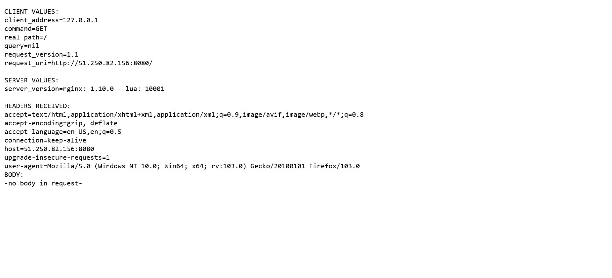
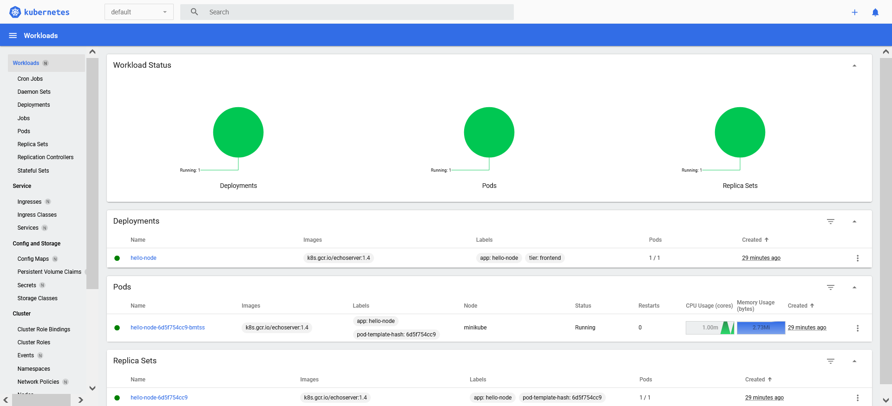

# 12.1 Компоненты Kubernetes - Роман Поцелуев

Вы DevOps инженер в крупной компании с большим парком сервисов. Ваша задача — разворачивать эти продукты в корпоративном кластере.

## Задача 1: Установить Minikube

Для экспериментов и валидации ваших решений вам нужно подготовить тестовую среду для работы с Kubernetes. Оптимальное решение — развернуть на рабочей машине Minikube.

<details><summary>Дополнительная информация</summary>
### Как поставить на AWS:
- создать EC2 виртуальную машину (Ubuntu Server 20.04 LTS (HVM), SSD Volume Type) с типом **t3.small**. Для работы потребуется настроить Security Group для доступа по ssh. Не забудьте указать keypair, он потребуется для подключения.
- подключитесь к серверу по ssh (ssh ubuntu@<ipv4_public_ip> -i <keypair>.pem)
- установите миникуб и докер следующими командами:
  - curl -LO https://storage.googleapis.com/kubernetes-release/release/`curl -s https://storage.googleapis.com/kubernetes-release/release/stable.txt`/bin/linux/amd64/kubectl
  - chmod +x ./kubectl
  - sudo mv ./kubectl /usr/local/bin/kubectl
  - sudo apt-get update && sudo apt-get install docker.io conntrack -y
  - curl -Lo minikube https://storage.googleapis.com/minikube/releases/latest/minikube-linux-amd64 && chmod +x minikube && sudo mv minikube /usr/local/bin/
- проверить версию можно командой minikube version
- переключаемся на root и запускаем миникуб: minikube start --vm-driver=none
- после запуска стоит проверить статус: minikube status
- запущенные служебные компоненты можно увидеть командой: kubectl get pods --namespace=kube-system

### Для сброса кластера стоит удалить кластер и создать заново:
- minikube delete
- minikube start --vm-driver=none

Возможно, для повторного запуска потребуется выполнить команду: sudo sysctl fs.protected_regular=0

Инструкция по установке Minikube - [ссылка](https://kubernetes.io/ru/docs/tasks/tools/install-minikube/)

**Важно**: t3.small не входит во free tier, следите за бюджетом аккаунта и удаляйте виртуалку.
</details>

**Ответ:**

Для выполнения задания виртуальная машина Ubuntu Server 20.04 LTS была развернута в Yandex Cloud с помощью скриптов [Terraform](./src/terraform/). Запуск `minikube` выполнялся с драйвером `Docker`, т.к. вложенная виртуализация не поддерживается облачным провайдером.

## Задача 2: Запуск Hello World
После установки Minikube требуется его проверить. Для этого подойдет стандартное приложение hello world. А для доступа к нему потребуется ingress.

- развернуть через Minikube тестовое приложение по [туториалу](https://kubernetes.io/ru/docs/tutorials/hello-minikube/#%D1%81%D0%BE%D0%B7%D0%B4%D0%B0%D0%BD%D0%B8%D0%B5-%D0%BA%D0%BB%D0%B0%D1%81%D1%82%D0%B5%D1%80%D0%B0-minikube)
- установить аддоны ingress и dashboard

**Ответ:**

- Проверка запуска аддонов и приложения после развертывания

```BASH
ubuntu@minikube:~$ minikube addons list | grep enabled
| dashboard                   | minikube | enabled ✅   | Kubernetes                     |
| default-storageclass        | minikube | enabled ✅   | Kubernetes                     |
| ingress                     | minikube | enabled ✅   | Kubernetes                     |
| metrics-server              | minikube | enabled ✅   | Kubernetes                     |
| storage-provisioner         | minikube | enabled ✅   | Google                         |
ubuntu@minikube:~$ kubectl get services
NAME         TYPE           CLUSTER-IP      EXTERNAL-IP   PORT(S)          AGE
hello-node   LoadBalancer   10.99.217.136   <pending>     8080:31876/TCP   12m
kubernetes   ClusterIP      10.96.0.1       <none>        443/TCP          14m
ubuntu@minikube:~$ kubectl get deployments
NAME         READY   UP-TO-DATE   AVAILABLE   AGE
hello-node   1/1     1            1           14m
```

## Задача 3: Установить kubectl

Подготовить рабочую машину для управления корпоративным кластером. Установить клиентское приложение kubectl.
- подключиться к minikube
- проверить работу приложения из задания 2, запустив port-forward до кластера

**Ответ:**

- Проброс портов

```BASH
ubuntu@minikube:~$ nohup kubectl port-forward --address='0.0.0.0' service/hello-node 8080:8080 >/dev/null 2>&1 &
[1] 26619
ubuntu@minikube:~$ nohup kubectl proxy --address='0.0.0.0' --port=9092 --disable-filter=true >/dev/null 2>&1 &
[2] 26850
ubuntu@minikube:~$ ss -tulpn
Netid     State      Recv-Q      Send-Q                 Local Address:Port            Peer Address:Port     Process                                 
udp       UNCONN     0           0                      127.0.0.53%lo:53                   0.0.0.0:*
udp       UNCONN     0           0                192.168.101.27%eth0:68                   0.0.0.0:*
tcp       LISTEN     0           4096                       127.0.0.1:49153                0.0.0.0:*
tcp       LISTEN     0           4096                       127.0.0.1:49154                0.0.0.0:*
tcp       LISTEN     0           4096                       127.0.0.1:49155                0.0.0.0:*
tcp       LISTEN     0           4096                       127.0.0.1:49156                0.0.0.0:*
tcp       LISTEN     0           4096                       127.0.0.1:49157                0.0.0.0:*
tcp       LISTEN     0           4096                         0.0.0.0:8080                 0.0.0.0:*         users:(("kubectl",pid=26619,fd=8))     
tcp       LISTEN     0           4096                   127.0.0.53%lo:53                   0.0.0.0:*
tcp       LISTEN     0           128                          0.0.0.0:22                   0.0.0.0:*
tcp       LISTEN     0           4096                       127.0.0.1:33593                0.0.0.0:*
tcp       LISTEN     0           4096                               *:9092                       *:*         users:(("kubectl",pid=26850,fd=3))     
tcp       LISTEN     0           128                             [::]:22                      [::]:*
```

- Hello node


- Kubernetes_Dashboard


## Задача 4 (*): собрать через ansible (необязательное)

Профессионалы не делают одну и ту же задачу два раза. Давайте закрепим полученные навыки, автоматизировав выполнение заданий  ansible-скриптами. При выполнении задания обратите внимание на доступные модули для k8s под ansible.
 - собрать роль для установки minikube на aws сервисе (с установкой ingress)
 - собрать роль для запуска в кластере hello world

**Ответ:**

- [Скрипты Terraform для создания ВМ](./src/terraform/)
- [Ansible скрипты для установки необходимых пакетов и запуска minikube](./src/ansible/)
- [Лог запуска Terraform](./src/terraform/12-01-terraform.out)
