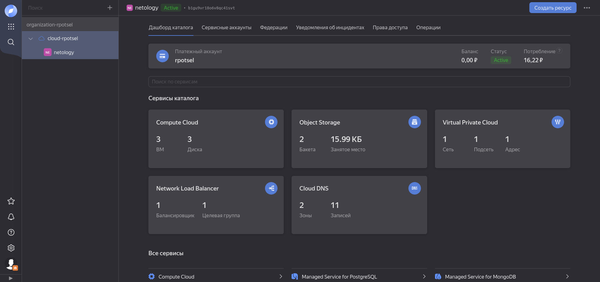
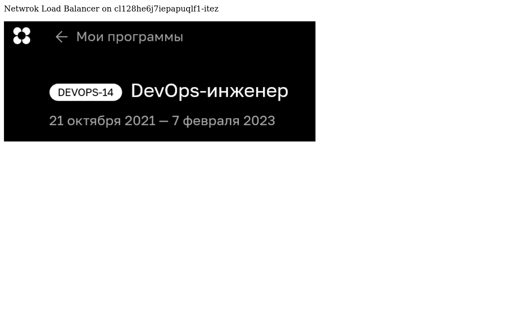

# Домашнее задание к занятию 15.2 "Вычислительные мощности. Балансировщики нагрузки".
Домашнее задание будет состоять из обязательной части, которую необходимо выполнить на провайдере Яндекс.Облако, и дополнительной части в AWS (можно выполнить по желанию). Все домашние задания в 15 блоке связаны друг с другом и в конце представляют пример законченной инфраструктуры.
Все задания требуется выполнить с помощью Terraform, результатом выполненного домашнего задания будет код в репозитории. Перед началом работ следует настроить доступ до облачных ресурсов из Terraform, используя материалы прошлых лекций и ДЗ.

---
## Задание 1. Яндекс.Облако (обязательное к выполнению)

1. Создать bucket Object Storage и разместить там файл с картинкой:
- Создать bucket в Object Storage с произвольным именем (например, _имя_студента_дата_);
- Положить в bucket файл с картинкой;
- Сделать файл доступным из Интернет.
2. Создать группу ВМ в public подсети фиксированного размера с шаблоном LAMP и web-страничкой, содержащей ссылку на картинку из bucket:
- Создать Instance Group с 3 ВМ и шаблоном LAMP. Для LAMP рекомендуется использовать `image_id = fd827b91d99psvq5fjit`;
- Для создания стартовой веб-страницы рекомендуется использовать раздел `user_data` в [meta_data](https://cloud.yandex.ru/docs/compute/concepts/vm-metadata);
- Разместить в стартовой веб-странице шаблонной ВМ ссылку на картинку из bucket;
- Настроить проверку состояния ВМ.
3. Подключить группу к сетевому балансировщику:
- Создать сетевой балансировщик;
- Проверить работоспособность, удалив одну или несколько ВМ.
4. *Создать Application Load Balancer с использованием Instance group и проверкой состояния.

Документация
- [Compute instance group](https://registry.terraform.io/providers/yandex-cloud/yandex/latest/docs/resources/compute_instance_group)
- [Network Load Balancer](https://registry.terraform.io/providers/yandex-cloud/yandex/latest/docs/resources/lb_network_load_balancer)
- [Группа ВМ с сетевым балансировщиком](https://cloud.yandex.ru/docs/compute/operations/instance-groups/create-with-balancer)

---

**Ответ:**

Выполним развертывание виртуальных машин с требуемыми параметрами в облачной платформе `Yandex Cloud`. Для автоматизации работы с инфраструктурой воспользуемся решением `Terraform`, для которого платформа `Yandex Cloud` предоставляет провайдер. Опишем созданные конфигурационные файлы `Terraform` для каждого задания.

Общие конфигурационные файлы:

* [variables.tf](./terraform-yc-alb/variables.tf) - указание переменных, используемых в сценарии развертывания;
* [provider.tf](./terraform-yc-alb/provider.tf) - объявление поставщика услуг `yandex-cloud/yandex`;
* [service_accounts.tf](./terraform-yc-alb/service_accounts.tf) - создание сервисной учетной записи, для настройки группы виртуальных машин и хранилища объекта;
* [network.tf](./terraform-yc-alb/network.tf) - описание сети и подсетей;

*Задание 1. Создать bucket Object Storage и разместить там файл с картинкой.*

* [bucket.tf](./terraform-yc-alb/bucket.tf) - создание публичного объектного хранилища и размещение в нём файла;

*Задание 2. Создать группу ВМ в public подсети фиксированного размера с шаблоном LAMP и web-страничкой, содержащей ссылку на картинку из bucket.*

* [instance_group.tf](./terraform-yc-nlb/instance_group.tf) - создание группы машин из указанного образа с использованием раздела `user_data` для запуска скрипта создания начальной страницы;

*Задание 3. Подключить группу к сетевому балансировщику.*

* [network_load_balancer.tf](./terraform-yc-nlb/network_load_balancer.tf) - описание сетевого балансировщика нагрузки с перенаправлением трафика идущего на 80 порт на созданную группу ВМ;

*Задание 4. Создать Application Load Balancer с использованием Instance group.*

* [application-load-balancer.tf](./terraform-yc-alb/application-load-balancer.tf) - описание балансировщик нагрузки уровня приложений и передающего трафик по протоколу HTTP на бэкенды.

* [security_groups](./terraform-yc-alb/security_groups.tf) - группы безопасности позволяют управлять доступом ВМ к ресурсам и группам безопасности Yandex Cloud или ресурсам в интернете, сервис `Группы безопасности` находится на стадии `Preview`, т.е. на него не действует соглашение об уровне обслуживания (SLA), но его можно использовать в разработке своих приложений или в тестовом окружении.

Выведем список созданных ресурсов после применения конфигурационных файлов [`Terraform`](./terraform-yc-nlb/) для сетевого балансировщика:

```BASH
# Список сетевых балансировщиков нагрузки и целевой группы

  $ yc load-balancer network-load-balancer list
+----------------------+--------+-------------+----------+----------------+------------------------+--------+
|          ID          |  NAME  |  REGION ID  |   TYPE   | LISTENER COUNT | ATTACHED TARGET GROUPS | STATUS |
+----------------------+--------+-------------+----------+----------------+------------------------+--------+
| enp7atv0cetaehg1b6a8 | net-lb | ru-central1 | EXTERNAL |              1 | enp78md4c6l1gp5m4r9e   | ACTIVE |
+----------------------+--------+-------------+----------+----------------+------------------------+--------+

  $ yc load-balancer target-group list
+----------------------+--------------+---------------------+-------------+--------------+
|          ID          |     NAME     |       CREATED       |  REGION ID  | TARGET COUNT |
+----------------------+--------------+---------------------+-------------+--------------+
| enp78md4c6l1gp5m4r9e | target-group | 2022-12-01 12:53:35 | ru-central1 |            3 |
+----------------------+--------------+---------------------+-------------+--------------+

# Описание созданного балансировщика

  $ yc load-balancer network-load-balancer get net-lb
id: enp7atv0cetaehg1b6a8
folder_id: b1gu9vr18o6v8qc41svt
created_at: "2022-12-01T13:34:48Z"
name: net-lb
region_id: ru-central1
status: ACTIVE
type: EXTERNAL
listeners:
  - name: net-lb-listener
    address: 51.250.86.102
    port: "80"
    protocol: TCP
    target_port: "80"
    ip_version: IPV4
attached_target_groups:
  - target_group_id: enp78md4c6l1gp5m4r9e
    health_checks:
      - name: http
        interval: 2s
        timeout: 1s
        unhealthy_threshold: "2"
        healthy_threshold: "2"
        http_options:
          port: "80"
          path: /

# Список целевых ВМ

  $ yc compute instance list
+----------------------+---------------------------+---------------+---------+-------------+---------------+
|          ID          |           NAME            |    ZONE ID    | STATUS  | EXTERNAL IP |  INTERNAL IP  |
+----------------------+---------------------------+---------------+---------+-------------+---------------+
| fhm48qiqnrnas0sner47 | cl128he6j7iepapuqlf1-apym | ru-central1-a | RUNNING |             | 192.168.20.8  |
| fhmdklb3ae8krvelfepn | cl128he6j7iepapuqlf1-itez | ru-central1-a | RUNNING |             | 192.168.20.12 |
| fhmgrcduk1kn4olkcrke | cl128he6j7iepapuqlf1-ekic | ru-central1-a | RUNNING |             | 192.168.20.6  |
+----------------------+---------------------------+---------------+---------+-------------+---------------+

# Запрос по внешнему адресу балансировщика и вывод информации о ВМ на которой размещена страница, видно о распределении запросов во группе ВМ

  $ curl -ss http://51.250.86.102/
<html><p>Netwrok Load Balancer on cl128he6j7iepapuqlf1-apym</p></html>

  $ curl -ss http://51.250.86.102/
<html><p>Netwrok Load Balancer on cl128he6j7iepapuqlf1-ekic</p></html>

  $ curl -ss http://51.250.86.102/
<html><p>Netwrok Load Balancer on cl128he6j7iepapuqlf1-itez</p></html>
```
Приведем снимки созданных объектов и запрос к балансировщику.



---

Выведем список созданных ресурсов после применения конфигурационных файлов [`Terraform`](./terraform-yc-alb/) для балансировщика нагрузки уровня приложений:

```BASH

# HTTP-роутер, определяющий правила маршрутизации HTTP-запросов в группы бэкендов

  $ yc alb http-router list
+----------------------+------------+-------------+-------------+
|          ID          |    NAME    | VHOST COUNT | ROUTE COUNT |
+----------------------+------------+-------------+-------------+
| ds79b5ctcqa6pjk4bn6m | alb-router |           1 |           1 |
+----------------------+------------+-------------+-------------+

  $ yc alb virtual-host list --http-router-name alb-router
+----------+-------------+-------------+
|   NAME   | AUTHORITIES | ROUTE COUNT |
+----------+-------------+-------------+
| alb-host |             |           1 |
+----------+-------------+-------------+

  $ yc alb virtual-host get alb-host --http-router-name alb-router
name: alb-host
routes:
  - name: route-1
    http:
      route:
        backend_group_id: ds7ntc2oma0g3r0bnrfm

# Группа бэкендов

  $ yc alb backend-group list
+----------------------+--------+---------------------+--------------+---------------+----------+
|          ID          |  NAME  |       CREATED       | BACKEND TYPE | BACKEND COUNT | AFFINITY |
+----------------------+--------+---------------------+--------------+---------------+----------+
| ds7ntc2oma0g3r0bnrfm | alb-bg | 2022-12-07 18:22:03 | HTTP         |             1 | NONE     |
+----------------------+--------+---------------------+--------------+---------------+----------+

  $ yc alb backend-group get alb-bg
id: ds7ntc2oma0g3r0bnrfm
name: alb-bg
folder_id: b1gu9vr18o6v8qc41svt
http:
  backends:
    - name: backend-1
      backend_weight: "1"
      port: "80"
      target_groups:
        target_group_ids:
          - ds70ps6tib1nubporfr1
      healthchecks:
        - timeout: 10s
          interval: 2s
          healthcheck_port: "80"
          http:
            path: /
created_at: "2022-12-07T18:22:03.396944193Z"

# Целевая группа
  $ yc alb target-group list
+----------------------+--------+--------------+
|          ID          |  NAME  | TARGET COUNT |
+----------------------+--------+--------------+
| ds70ps6tib1nubporfr1 | alb-tg |            3 |
+----------------------+--------+--------------+

  $ yc alb target-group get alb-tg
id: ds70ps6tib1nubporfr1
name: alb-tg
description: load balancer target group
folder_id: b1gu9vr18o6v8qc41svt
targets:
  - ip_address: 192.168.2.9
    subnet_id: e2llj1urlnfv3egq8ob5
  - ip_address: 192.168.2.29
    subnet_id: e2llj1urlnfv3egq8ob5
  - ip_address: 192.168.1.9
    subnet_id: e9b9mg4a08k20j0di609
created_at: "2022-12-07T18:21:27.913846516Z"

# Список целевых ВМ

  $ yc compute instance list
+----------------------+---------------------------+---------------+---------+-------------+--------------+
|          ID          |           NAME            |    ZONE ID    | STATUS  | EXTERNAL IP | INTERNAL IP  |
+----------------------+---------------------------+---------------+---------+-------------+--------------+
| epd9el56i4nj8c8aufms | cl12pgh3omq435rugapa-akat | ru-central1-b | RUNNING |             | 192.168.2.29 |
| epdp6a29mm2a3cbs3vle | cl12pgh3omq435rugapa-ovar | ru-central1-b | RUNNING |             | 192.168.2.9  |
| fhmk6oqbnvm4c6tiv8lo | cl12pgh3omq435rugapa-ydyl | ru-central1-a | RUNNING |             | 192.168.1.9  |
+----------------------+---------------------------+---------------+---------+-------------+--------------

# Балансировщик нагрузки приложений

  $ yc alb load-balancer list
+----------------------+-------+-----------+----------------+--------+
|          ID          | NAME  | REGION ID | LISTENER COUNT | STATUS |
+----------------------+-------+-----------+----------------+--------+
| ds7qhrqo666fcieht8ch | alb-1 |           |              1 | ACTIVE |
+----------------------+-------+-----------+----------------+--------+

  $ yc alb load-balancer get alb-1
id: ds7qhrqo666fcieht8ch
name: alb-1
folder_id: b1gu9vr18o6v8qc41svt
status: ACTIVE
network_id: enpgq0j4dcclgndetoas
listeners:
  - name: alb-listener
    endpoints:
      - addresses:
          - external_ipv4_address:
              address: 51.250.71.153
        ports:
          - "80"
    http:
      handler:
        http_router_id: ds79b5ctcqa6pjk4bn6m
allocation_policy:
  locations:
    - zone_id: ru-central1-b
      subnet_id: e2llj1urlnfv3egq8ob5
    - zone_id: ru-central1-a
      subnet_id: e9b9mg4a08k20j0di609
log_group_id: ckglvavnh948s544a59a
security_group_ids:
  - enp28v6j3vpj8akua3iv
created_at: "2022-12-07T18:21:21.397551694Z"

# Запрос по внешнему адресу балансировщика и вывод информации о ВМ на которой размещена страница, видно о распределении запросов во группе ВМ

  $ curl -ss 51.250.71.153
<html><p>Application Load Balancer on cl12pgh3omq435rugapa-ydyl</p></html>

  $ curl -ss 51.250.71.153
<html><p>Application Load Balancer on cl12pgh3omq435rugapa-akat</p></html>

```

Выключим одну ВМ из целевой группы и убедимся в работе приложения.

```BASH

# Выключение ВМ

  $ yc compute instance stop cl12pgh3omq435rugapa-akat
done (21s)

  $ yc compute instance list
+----------------------+---------------------------+---------------+---------+-------------+--------------+
|          ID          |           NAME            |    ZONE ID    | STATUS  | EXTERNAL IP | INTERNAL IP  |
+----------------------+---------------------------+---------------+---------+-------------+--------------+
| epd9el56i4nj8c8aufms | cl12pgh3omq435rugapa-akat | ru-central1-b | STOPPED |             | 192.168.2.29 |
| epdp6a29mm2a3cbs3vle | cl12pgh3omq435rugapa-ovar | ru-central1-b | RUNNING |             | 192.168.2.9  |
| fhmk6oqbnvm4c6tiv8lo | cl12pgh3omq435rugapa-ydyl | ru-central1-a | RUNNING |             | 192.168.1.9  |
+----------------------+---------------------------+---------------+---------+-------------+--------------+

# Запрос к адресу балансировщика возвращает корректный ответ

  $ curl -ss 51.250.71.153
<html><p>Application Load Balancer on cl12pgh3omq435rugapa-ovar</p></html>
```

Сервис `Группы безопасности` находится на стадии `Preview`, т.е. на него не действует соглашение об уровне обслуживания (SLA), но его можно использовать в разработке своих приложений или в тестовом окружении.

```BASH

  $ yc vpc security-group list
+----------------------+-----------+-------------+----------------------+
|          ID          |   NAME    | DESCRIPTION |      NETWORK-ID      |
+----------------------+-----------+-------------+----------------------+
| enp28v6j3vpj8akua3iv | alb-sg    |             | enpgq0j4dcclgndetoas |
| enp29hmlad9igqblahvd | alb-vm-sg |             | enpgq0j4dcclgndetoas |
+----------------------+-----------+-------------+----------------------+

  $ yc vpc security-group get alb-sg
id: enp28v6j3vpj8akua3iv
folder_id: b1gu9vr18o6v8qc41svt
created_at: "2022-12-07T17:35:34Z"
name: alb-sg
network_id: enpgq0j4dcclgndetoas
status: ACTIVE
rules:
  - id: enptcucsl1k15jtc54qg
    description: any
    direction: EGRESS
    protocol_name: ANY
    protocol_number: "-1"
    cidr_blocks:
      v4_cidr_blocks:
        - 0.0.0.0/0
  - id: enpqmsmte61bqaug5vlm
    description: healthchecks
    direction: INGRESS
    ports:
      from_port: "30080"
      to_port: "30080"
    protocol_name: TCP
    protocol_number: "6"
    cidr_blocks:
      v4_cidr_blocks:
        - 198.18.235.0/24
        - 198.18.248.0/24
  - id: enpsgg9nl7oht109botg
    description: ext-http
    direction: INGRESS
    ports:
      from_port: "80"
      to_port: "80"
    protocol_name: TCP
    protocol_number: "6"
    cidr_blocks:
      v4_cidr_blocks:
        - 0.0.0.0/0
  - id: enpv7p8bqt917q8qql7m
    description: ext-https
    direction: INGRESS
    ports:
      from_port: "443"
      to_port: "443"
    protocol_name: TCP
    protocol_number: "6"
    cidr_blocks:
      v4_cidr_blocks:
        - 0.0.0.0/0

  $ yc vpc security-group get alb-vm-sg
id: enp29hmlad9igqblahvd
folder_id: b1gu9vr18o6v8qc41svt
created_at: "2022-12-07T17:35:35Z"
name: alb-vm-sg
network_id: enpgq0j4dcclgndetoas
status: ACTIVE
rules:
  - id: enp7v10ecg0o9s8k3ttg
    description: balancer
    direction: INGRESS
    ports:
      from_port: "80"
      to_port: "80"
    protocol_name: TCP
    protocol_number: "6"
    security_group_id: enp28v6j3vpj8akua3iv
  - id: enp0vb6miat36u8lm64h
    description: ssh
    direction: INGRESS
    ports:
      from_port: "22"
      to_port: "22"
    protocol_name: TCP
    protocol_number: "6"
    cidr_blocks:
      v4_cidr_blocks:
        - 0.0.0.0/0
```
---
## Задание 2*. AWS (необязательное к выполнению)

Используя конфигурации, выполненные в рамках ДЗ на предыдущем занятии, добавить к Production like сети Autoscaling group из 3 EC2-инстансов с  автоматической установкой web-сервера в private домен.

1. Создать bucket S3 и разместить там файл с картинкой:
- Создать bucket в S3 с произвольным именем (например, _имя_студента_дата_);
- Положить в bucket файл с картинкой;
- Сделать доступным из Интернета.
2. Сделать Launch configurations с использованием bootstrap скрипта с созданием веб-странички на которой будет ссылка на картинку в S3. 
3. Загрузить 3 ЕС2-инстанса и настроить LB с помощью Autoscaling Group.

Resource terraform
- [S3 bucket](https://registry.terraform.io/providers/hashicorp/aws/latest/docs/resources/s3_bucket)
- [Launch Template](https://registry.terraform.io/providers/hashicorp/aws/latest/docs/resources/launch_template)
- [Autoscaling group](https://registry.terraform.io/providers/hashicorp/aws/latest/docs/resources/autoscaling_group)
- [Launch configuration](https://registry.terraform.io/providers/hashicorp/aws/latest/docs/resources/launch_configuration)

Пример bootstrap-скрипта:
```
#!/bin/bash
yum install httpd -y
service httpd start
chkconfig httpd on
cd /var/www/html
echo "<html><h1>My cool web-server</h1></html>" > index.html
```
