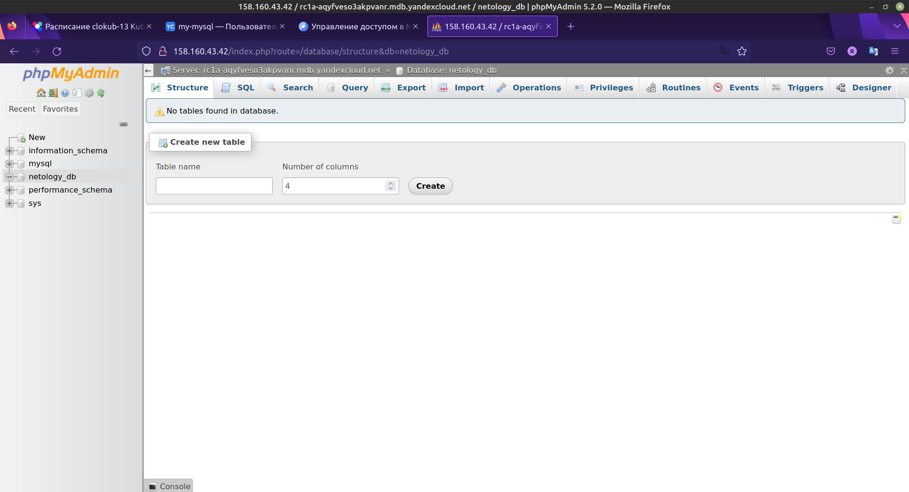

# Домашнее задание к занятию 15.4 "Кластеры. Ресурсы под управлением облачных провайдеров"

Организация кластера Kubernetes и кластера баз данных MySQL в отказоустойчивой архитектуре.
Размещение в private подсетях кластера БД, а в public - кластера Kubernetes.

---
## Задание 1. Яндекс.Облако (обязательное к выполнению)

1. Настроить с помощью Terraform кластер баз данных MySQL:
- Используя настройки VPC с предыдущих ДЗ, добавить дополнительно подсеть private в разных зонах, чтобы обеспечить отказоустойчивость 
- Разместить ноды кластера MySQL в разных подсетях
- Необходимо предусмотреть репликацию с произвольным временем технического обслуживания
- Использовать окружение PRESTABLE, платформу Intel Broadwell с производительностью 50% CPU и размером диска 20 Гб
- Задать время начала резервного копирования - 23:59
- Включить защиту кластера от непреднамеренного удаления
- Создать БД с именем `netology_db` c логином и паролем

2. Настроить с помощью Terraform кластер Kubernetes
- Используя настройки VPC с предыдущих ДЗ, добавить дополнительно 2 подсети public в разных зонах, чтобы обеспечить отказоустойчивость
- Создать отдельный сервис-аккаунт с необходимыми правами 
- Создать региональный мастер kubernetes с размещением нод в разных 3 подсетях
- Добавить возможность шифрования ключом из KMS, созданного в предыдущем ДЗ
- Создать группу узлов состоящую из 3 машин с автомасштабированием до 6
- Подключиться к кластеру с помощью `kubectl`
- *Запустить микросервис phpmyadmin и подключиться к БД, созданной ранее
- *Создать сервис типы Load Balancer и подключиться к phpmyadmin. Предоставить скриншот с публичным адресом и подключением к БД

Документация
- [MySQL cluster](https://registry.tfpla.net/providers/yandex-cloud/yandex/latest/docs/resources/mdb_mysql_cluster)
- [Создание кластера kubernetes](https://cloud.yandex.ru/docs/managed-kubernetes/operations/kubernetes-cluster/kubernetes-cluster-create)
- [K8S Cluster](https://registry.tfpla.net/providers/yandex-cloud/yandex/latest/docs/resources/kubernetes_cluster)
- [K8S node group](https://registry.tfpla.net/providers/yandex-cloud/yandex/latest/docs/resources/kubernetes_node_group)

---

**Ответ:**

Выполним развертывание виртуальных машин с требуемыми параметрами в облачной платформе `Yandex Cloud`. Для автоматизации работы с инфраструктурой воспользуемся решением `Terraform`, для которого платформа `Yandex Cloud` предоставляет провайдер. Опишем созданные конфигурационные файлы `Terraform`.

* [variables.tf](./terraform-yc/variables.tf) - указание переменных, используемых в сценарии развертывания;
* [provider.tf](./terraform-yc/provider.tf) - объявление поставщика услуг `yandex-cloud/yandex`;
* [service_accounts.tf](./terraform-yc/service_accounts.tf) - создание сервисных учетных записей `mysql-admin` и `k8s-agent` для управления кластером баз данных MySQL и кластером Kubernetes;
* [network.tf](./terraform-yc/network.tf) - описание сети и подсетей для размещения распределенного кластера MySQL и Kubernetes;
* [security_groups](./terraform-yc/security_groups.tf) - группы безопасности позволяют управлять доступом ВМ к ресурсам кластера баз данных MySQL и кластера Kubernetes, сервис `Группы безопасности` находится на стадии `Preview`, т.е. на него не действует соглашение об уровне обслуживания (SLA), но его можно использовать в разработке своих приложений или в тестовом окружении;
* [kms.tf](./terraform-yc/kms.tf) - создание симметричного ключа шифрования с помощью сервиса для создания и управления ключами шифрования, которые можно использовать для защиты секретов в кластере Kubernetes;
* [mysql.tf](./terraform-yc/mysql.tf) - создание кластера баз данных MySQL в соответствии с требованиями задания;
* [](./terraform-yc/k8s.tf) - создание кластера Kubernetes, требование по размещению нод в 3 разных подсетях не выполнимо из-за политики `Yandex Cloud` к кластеру Kubernetes `allocation_policy.locations: auto scale node groups can have only one location`. Для уменьшения расходов начальное количество узлов кластера состоит из [одного воркера и автомасштабированием до шести](./terraform-yc/k8s.tf#L73-L79).

Выведем информацию о кластере MySQL после применения конфигурационных файлов [`Terraform`](./terraform-yc/):

```BASH
# Информация о кластере MySQL
  $ yc managed-mysql cluster list
+----------------------+----------+---------------------+--------+---------+
|          ID          |   NAME   |     CREATED AT      | HEALTH | STATUS  |
+----------------------+----------+---------------------+--------+---------+
| c9qf70eggjv99mi4b7jh | my-mysql | 2023-01-08 19:28:18 | ALIVE  | RUNNING |
+----------------------+----------+---------------------+--------+---------+

  $ yc managed-mysql hosts list --cluster-name my-mysql
+-------------------------------------------+----------------------+---------+--------+---------------+-----------+--------------------+----------+-----------------+
|                   NAME                    |      CLUSTER ID      |  ROLE   | HEALTH |    ZONE ID    | PUBLIC IP | REPLICATION SOURCE | PRIORITY | BACKUP PRIORITY |
+-------------------------------------------+----------------------+---------+--------+---------------+-----------+--------------------+----------+-----------------+
| rc1a-6a24yyg22lckbybo.mdb.yandexcloud.net | c9qf70eggjv99mi4b7jh | MASTER  | ALIVE  | ru-central1-a | true      |                    |        0 |               0 |
| rc1b-uul26qylwglzam4z.mdb.yandexcloud.net | c9qf70eggjv99mi4b7jh | REPLICA | ALIVE  | ru-central1-b | false     |                    |        0 |               0 |
+-------------------------------------------+----------------------+---------+--------+---------------+-----------+--------------------+----------+-----------------+

# https://cloud.yandex.ru/docs/managed-mysql/operations/connect
# MySQL-хосты с публичным доступом поддерживают только шифрованные соединения. Чтобы использовать их, получите SSL-сертификат:
  $ wget "https://storage.yandexcloud.net/cloud-certs/CA.pem" --output-document ~/.mysql/root.crt && chmod 0600 ~/.mysql/root.crt
--2022-12-23 22:13:08--  https://storage.yandexcloud.net/cloud-certs/CA.pem
Resolving storage.yandexcloud.net (storage.yandexcloud.net)... 213.180.193.243, 2a02:6b8::1d9
Connecting to storage.yandexcloud.net (storage.yandexcloud.net)|213.180.193.243|:443... connected.
HTTP request sent, awaiting response... 200 OK
Length: 3579 (3,5K) [application/x-x509-ca-cert]
Saving to: ‘/home/rpot/.mysql/root.crt’

/home/rpot/.mysql/root.crt         100%[=============================================================>]   3,50K  --.-KB/s    in 0s      

2022-12-23 22:13:08 (826 MB/s) - ‘/home/rpot/.mysql/root.crt’ saved [3579/3579]

# Подключаемся клиентом к мастер ноде и проверяем состояние соединения
  $ mysql --host=rc1a-6a24yyg22lckbybo.mdb.yandexcloud.net \
      --port=3306 \
      --ssl-ca=~/.mysql/root.crt \
      --ssl-mode=VERIFY_IDENTITY \
      --user=netology \
      --password \
      netology_db
Enter password: 
Welcome to the MySQL monitor.  Commands end with ; or \g.
Your MySQL connection id is 278
Server version: 8.0.25-15 Percona Server (GPL), Revision 7df6366

Copyright (c) 2000, 2022, Oracle and/or its affiliates.

Oracle is a registered trademark of Oracle Corporation and/or its
affiliates. Other names may be trademarks of their respective
owners.

Type 'help;' or '\h' for help. Type '\c' to clear the current input statement.

mysql> \s
--------------
mysql  Ver 8.0.31-0ubuntu0.22.04.1 for Linux on x86_64 ((Ubuntu))

Connection id:          278
Current database:       netology_db
Current user:           netology@188.143.204.38
SSL:                    Cipher in use is TLS_AES_256_GCM_SHA384
Current pager:          stdout
Using outfile:          ''
Using delimiter:        ;
Server version:         8.0.25-15 Percona Server (GPL), Revision 7df6366
Protocol version:       10
Connection:             rc1a-6a24yyg22lckbybo.mdb.yandexcloud.net via TCP/IP
Server characterset:    utf8mb4
Db     characterset:    utf8mb4
Client characterset:    utf8mb4
Conn.  characterset:    utf8mb4
TCP port:               3306
Binary data as:         Hexadecimal
Uptime:                 7 min 57 sec

Threads: 6  Questions: 5825  Slow queries: 0  Opens: 602  Flush tables: 3  Open tables: 521  Queries per second avg: 12.211
--------------

mysql> 

\s
show tables;
```

Для подключения к кластеру MySQL с внешним IP адресом требуется использовать шифрованное соединение. Далее отключим присвоение внешнего IP `assign_public_ip = true` для узлов кластера для возможности подключения `phpmyadmin` по внутреннему IP без настройки шифрования соединения и пересоздадим кластер.

```BASH
# Информация о кластере Kubernetes в облаке
  $ yc managed-kubernetes cluster list
+----------------------+-------------------+---------------------+---------+---------+------------------------+-------------------+
|          ID          |       NAME        |     CREATED AT      | HEALTH  | STATUS  |   EXTERNAL ENDPOINT    | INTERNAL ENDPOINT |
+----------------------+-------------------+---------------------+---------+---------+------------------------+-------------------+
| catl9odha350g82inu2p | k8s-cluster-hw154 | 2023-01-09 12:29:50 | HEALTHY | RUNNING | https://158.160.51.193 | https://10.5.0.30 |
+----------------------+-------------------+---------------------+---------+---------+------------------------+-------------------+

# Информация об узлах кластера Kubernetes. Для уменьшения расходов начальное количество узлов кластера состоит из одного воркера и автомасштабированием до шести.
# yc managed-kubernetes node-groups --name k8s-node-group-hw154 list-nodes
  $ yc managed-kubernetes cluster --name k8s-cluster-hw154 list-nodes
+--------------------------------+--------------------------------+--------------------------------+-------------+--------+
|         CLOUD INSTANCE         |        KUBERNETES NODE         |           RESOURCES            |    DISK     | STATUS |
+--------------------------------+--------------------------------+--------------------------------+-------------+--------+
| fhme1cpo49o40d8n8bab           | test-ixot-cl1i84dga2l66q9c7pr6 | 2 100% core(s), 2.0 GB of      | 32.0 GB hdd | READY  |
| RUNNING_ACTUAL                 |                                | memory                         |             |        |
+--------------------------------+--------------------------------+--------------------------------+-------------+--------+

# Настройка клиента kubectl
# https://cloud.yandex.ru/docs/managed-kubernetes/operations/connect/

  $ yc managed-kubernetes cluster get-credentials k8s-cluster-hw154 --external --force

Context 'yc-k8s-cluster-hw154' was added as default to kubeconfig '/home/rpot/.kube/config'.
Check connection to cluster using 'kubectl cluster-info --kubeconfig /home/rpot/.kube/config'.

Note, that authentication depends on 'yc' and its config profile 'default'.
To access clusters using the Kubernetes API, please use Kubernetes Service Account.

  $ kubectl config get-contexts
CURRENT   NAME                   CLUSTER                               AUTHINFO                              NAMESPACE
          microk8s               microk8s-cluster                      admin                                 
*         yc-k8s-cluster-hw154   yc-managed-k8s-catl9odha350g82inu2p   yc-managed-k8s-catl9odha350g82inu2p   

# Вывод информации о кластере
  $ kubectl cluster-info
Kubernetes control plane is running at https://158.160.51.193
CoreDNS is running at https://158.160.51.193/api/v1/namespaces/kube-system/services/kube-dns:dns/proxy

To further debug and diagnose cluster problems, use 'kubectl cluster-info dump'.

  $ kubectl get nodes -o wide
NAME                             STATUS   ROLES    AGE   VERSION   INTERNAL-IP   EXTERNAL-IP     OS-IMAGE             KERNEL-VERSION      CONTAINER-RUNTIME
test-ixot-cl1i84dga2l66q9c7pr6   Ready    <none>   24m   v1.22.6   10.5.0.4      51.250.12.121   Ubuntu 20.04.4 LTS   5.4.0-124-generic   containerd://1.6.7
```

Развернем сервис phpmyadmin из [манифеста](./manifests/pma.yaml) вместе с сетевым балансировщиком нагрузки, который `Yandex Cloud` развернет на своих ресурсах.

```BASH
# Разворачивание ресурсов
  $ kubectl apply -f ../manifests/.
deployment.apps/frontend created
service/frontend-lb created

# Информация о развернутых ресурсах
  $ kubectl get all
NAME                            READY   STATUS    RESTARTS   AGE
pod/frontend-7477fd45d8-smj5h   1/1     Running   0          25m

NAME                  TYPE           CLUSTER-IP      EXTERNAL-IP     PORT(S)        AGE
service/frontend-lb   LoadBalancer   10.96.243.153   158.160.43.42   80:31470/TCP   25m
service/kubernetes    ClusterIP      10.96.128.1     <none>          443/TCP        32m

NAME                       READY   UP-TO-DATE   AVAILABLE   AGE
deployment.apps/frontend   1/1     1            1           25m

NAME                                  DESIRED   CURRENT   READY   AGE
replicaset.apps/frontend-7477fd45d8   1         1         1       25m

# Информация о сетевом балансировщике
  $  yc load-balancer network-load-balancer list
+----------------------+----------------------------------------------+-------------+----------+----------------+------------------------+--------+
|          ID          |                     NAME                     |  REGION ID  |   TYPE   | LISTENER COUNT | ATTACHED TARGET GROUPS | STATUS |
+----------------------+----------------------------------------------+-------------+----------+----------------+------------------------+--------+
| enpu8h6geqplafnl7k3e | k8s-9dac1d18e76a966ea41998b225392c98a13b930b | ru-central1 | EXTERNAL |              1 | enp80446lvhpj0hrdti2   | ACTIVE |
+----------------------+----------------------------------------------+-------------+----------+----------------+------------------------+--------+

  $ yc load-balancer network-load-balancer get k8s-9dac1d18e76a966ea41998b225392c98a13b930b
id: enpu8h6geqplafnl7k3e
folder_id: b1gu9vr18o6v8qc41svt
created_at: "2023-01-09T12:40:41Z"
name: k8s-9dac1d18e76a966ea41998b225392c98a13b930b
description: cluster catl9odha350g82inu2p, service default/frontend-lb
labels:
  cluster-name: catl9odha350g82inu2p
  service-name: frontend-lb
  service-namespace: default
  service-uid: c528988c-584d-4cd3-96b1-2407889b09c1
region_id: ru-central1
status: ACTIVE
type: EXTERNAL
listeners:
  - name: frontend
    address: 158.160.43.42
    port: "80"
    protocol: TCP
    target_port: "31470"
    ip_version: IPV4
attached_target_groups:
  - target_group_id: enp80446lvhpj0hrdti2
    health_checks:
      - name: default
        interval: 10s
        timeout: 5s
        unhealthy_threshold: "2"
        healthy_threshold: "2"
        http_options:
          port: "10256"
          path: /healthz
```

При входе по выделенному сервису внешнему IP адресу мы видим требуемое приложение.



---
## Задание 2. Вариант с AWS (необязательное к выполнению)

1. Настроить с помощью terraform кластер EKS в 3 AZ региона, а также RDS на базе MySQL с поддержкой MultiAZ для репликации и создать 2 readreplica для работы:
- Создать кластер RDS на базе MySQL
- Разместить в Private subnet и обеспечить доступ из public-сети c помощью security-group
- Настроить backup в 7 дней и MultiAZ для обеспечения отказоустойчивости
- Настроить Read prelica в кол-ве 2 шт на 2 AZ.

2. Создать кластер EKS на базе EC2:
- С помощью terraform установить кластер EKS на 3 EC2-инстансах в VPC в public-сети
- Обеспечить доступ до БД RDS в private-сети
- С помощью kubectl установить и запустить контейнер с phpmyadmin (образ взять из docker hub) и проверить подключение к БД RDS
- Подключить ELB (на выбор) к приложению, предоставить скрин

Документация
- [Модуль EKS](https://learn.hashicorp.com/tutorials/terraform/eks)