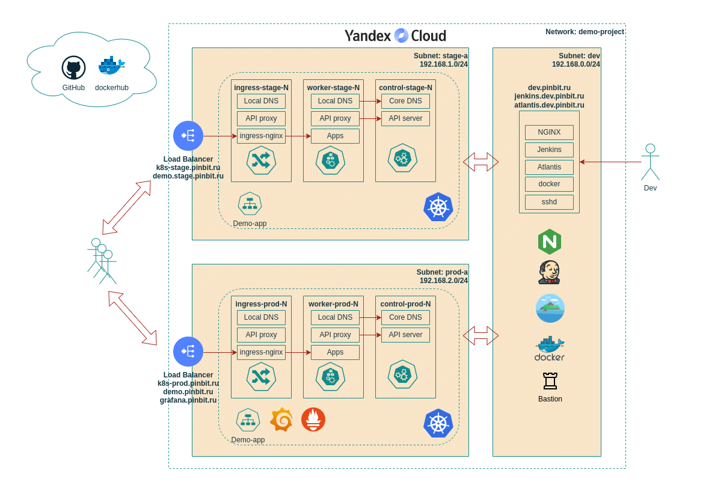
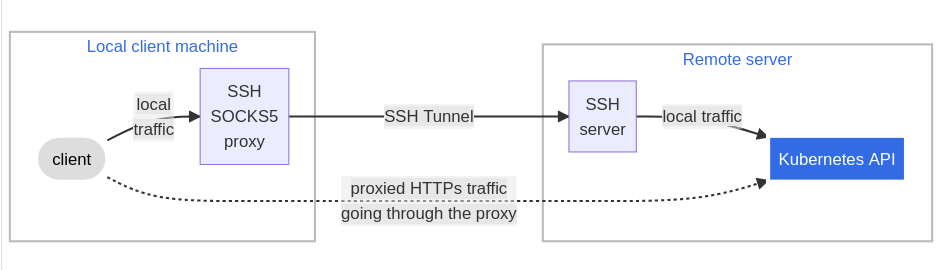

# Дипломный практикум в Yandex.Cloud
- [Дипломный практикум в Yandex.Cloud](#дипломный-практикум-в-yandexcloud)
  - [Цели:](#цели)
  - [Этапы выполнения:](#этапы-выполнения)
    - [Создание облачной инфраструктуры](#создание-облачной-инфраструктуры)
    - [Создание Kubernetes кластера](#создание-kubernetes-кластера)
    - [Создание тестового приложения](#создание-тестового-приложения)
    - [Подготовка системы мониторинга и деплой приложения](#подготовка-системы-мониторинга-и-деплой-приложения)
    - [Установка и настройка CI/CD](#установка-и-настройка-cicd)
  - [Выводы](#выводы)

---
## Цели:

1. Подготовить облачную инфраструктуру на базе облачного провайдера Яндекс.Облако.
2. Запустить и сконфигурировать Kubernetes кластер.
3. Установить и настроить систему мониторинга.
4. Настроить и автоматизировать сборку тестового приложения с использованием Docker-контейнеров.
5. Настроить CI для автоматической сборки и тестирования.
6. Настроить CD для автоматического развёртывания приложения.

---
## Этапы выполнения:


### Создание облачной инфраструктуры

Для развертывания инфраструктуры, в соответствии с требованиями задания выбрана облачная платформа [Yandex Cloud](https://cloud.yandex.ru/). Подготовка рабочего места для управления инфраструктурой инструментом [Terraform](https://www.terraform.io/) выполнена по [инструкции](https://cloud.yandex.ru/docs/tutorials/infrastructure-management/terraform-quickstart) представленной на сайте `Yandex Cloud`. Адреса внешних сервисов приложения будут зарегистрированы в сервисе управления доменными именами [Yandex Cloud DNS](https://cloud.yandex.ru/docs/dns/) в публичном домене `pinbit.ru`. Проверка права на домен и получение сертификата `Let's Encrypt` выполнена по [инструкции](https://cloud.yandex.ru/docs/certificate-manager/concepts/challenges) для типа проверки DNS. Код Terraform, используемый в практикуме размещён в [репозитории](https://github.com/RPotsel/demo-tf) на вэб-сервисе GitHub. Опишем основные компоненты кода:

- Файл сборки [Makefile](https://github.com/RPotsel/demo-tf/blob/master/Makefile) для автоматизации развёртки инфраструктуры, входным параметром будут имя проекта, workspace и процедуры: например `make PROJECT=demo-app WORKSPACE=dev tf-plan`;
- Каталог унифицированных модулей [modules](https://github.com/RPotsel/demo-tf/tree/master/modules) для `Yandex Cloud`, использующих только необходимые для целей проекта переменные:
   - Модуль [yc_vpc](https://github.com/RPotsel/demo-tf/tree/master/modules/yc_vpc) - создание подсетей и [групп безопасности](https://cloud.yandex.ru/docs/application-load-balancer/tools/k8s-ingress-controller/security-groups) нас основе переменных `virtual_private_cloud` и `security_groups`;
   - Модуль [yc_instances](https://github.com/RPotsel/demo-tf/tree/master/modules/yc_instances) - создание групп инстансов нас основе переменной `instances` и других, описанных в файле [variables.tf](https://github.com/RPotsel/demo-tf/blob/master/modules/yc_instances/variables.tf);
   - Модуль [yc_lb](https://github.com/RPotsel/demo-tf/tree/master/modules/yc_lb) - [создание сетевого балансировщика](https://cloud.yandex.ru/docs/network-load-balancer/operations/load-balancer-create) для целевой группы из указанных имен инсатансов;
- Каталог [demo-app](https://github.com/RPotsel/demo-tf/tree/master/demo-app) содержит файлы для сборки текущего проекта:
   - Скрипт для подготовки инфраструктуры [prepare.sh](https://github.com/RPotsel/demo-tf/blob/master/demo-app/prepare.sh), в задачи которого входит: [запрос сертификата](https://cloud.yandex.ru/docs/certificate-manager/operations/managed/cert-create), [создание DNS](https://cloud.yandex.ru/docs/dns/operations/zone-create-public), [добавление необходимых записей в DNS](https://cloud.yandex.ru/docs/dns/operations/resource-record-create), [создание сети](https://cloud.yandex.ru/docs/vpc/operations/network-create), [создание S3 bucket для Terraform backend с записью учетных данных в файл](https://cloud.yandex.ru/docs/storage/operations/buckets/create);
   - Файлы переменных Terraform сред [dev](https://github.com/RPotsel/demo-tf/blob/master/demo-app/dev.tfvars), [stage](https://github.com/RPotsel/demo-tf/blob/master/demo-app/stage.tfvars), [prod](https://github.com/RPotsel/demo-tf/blob/master/demo-app/prod.tfvars);
   - Terraform скрипты: [main.tf](https://github.com/RPotsel/demo-tf/blob/master/demo-app/main.tf) - создание облачной инфраструктуры с использованием унифицированных модулей проекта, [provider.tf](https://github.com/RPotsel/demo-tf/blob/master/demo-app/provider.tf) - описание подключения к облачному провайдеру и `backend`, [variables.tf](https://github.com/RPotsel/demo-tf/blob/master/demo-app/variables.tf) - необходимые входные данные.

Приведем базовую схему создаваемой инфраструктуры для выполнения целей проекта и выделим основные моменты:
- Создаются три подсети для среды разработки (dev), тестирования (stage) и эксплуатации (prod);
- Среды тестирования и эксплуатации изолированы друг от друга и интернет;
- Доступ разработчиков к средам тестирования и эксплуатации возможен через сервис `Bastion`, в нашем случае сервис `SSHD` совмещен на сервере с остальными инструментами разработки;
- Доступ в интернет для изолированных сред доступен через [NAT-шлюз](https://cloud.yandex.ru/docs/vpc/concepts/gateways);
- Адреса сетевых балансировщиков и хост разработки имеют записи в публичной DNS зоне `Yandex Cloud`;
- Обращение к сервисам среды тестирования и эксплуатации внешних пользователей осуществляется через внешние сетевые балансировщики `Yandex Cloud`, dns имена которых зарегистрированы на адрес балансировщика как псевдонимы (запись CNAME).



**Выполним развертывание облачной инфраструктуры**

<details>
  <summary>Подготовка инфраструктуры для развёртывания сред проекта...</summary>

Подготовка выполняется командой `make PROJECT=demo-app init-project` из файла сборки [Makefile](https://github.com/RPotsel/demo-tf/blob/master/Makefile). Можно выполнить скриптом [prepare.sh](./https://github.com/RPotsel/demo-tf/blob/master/demo-app/prepare.sh) с указанием имени функции. Перед запуском требуется в скрипте [prepare.sh](./https://github.com/RPotsel/demo-tf/blob/master/demo-app/prepare.sh) указать имя домена `DOMAIN_NAME`.

```BASH
  $ ./demo-app/prepare.sh cert_request
yc certificate-manager certificate request --name demo-cert --domains "*.pinbit.ru" --challenge dns
id: fpq1thcfjleposge2oov
folder_id: b1gu9vr18o6v8qc41svt
created_at: "2023-03-15T21:03:16.713688538Z"
name: degree-cert
type: MANAGED
domains:
  - '*.pinbit.ru'
status: VALIDATING
updated_at: "2023-03-15T21:03:16.713688538Z"

  $ ./demo-app/prepare.sh create_zone
yc dns zone create --name demo-zone --zone pinbit.ru. --public-visibility
yc dns zone add-records --name degree-zone --record \
        "_acme-challenge.pinbit.ru. 600 CNAME \
        fpq1thcfjleposge2oov.cm.yandexcloud.net."
yc dns zone add-records --name demo-zone --record "demo.stage.pinbit.ru. 200 CNAME k8s-stage.pinbit.ru."
yc dns zone add-records --name demo-zone --record "demo.pinbit.ru. 200 CNAME k8s-prod.pinbit.ru."
yc dns zone add-records --name demo-zone --record "grafana.pinbit.ru. 200 CNAME k8s-prod.pinbit.ru."
yc dns zone add-records --name demo-zone --record "jenkins.dev.pinbit.ru. 200 CNAME dev.pinbit.ru."
yc dns zone add-records --name demo-zone --record "atlantis.dev.pinbit.ru. 200 CNAME dev.pinbit.ru."

id: dnsbn0rnbq0huajlta3l
folder_id: b1gu9vr18o6v8qc41svt
created_at: "2023-03-15T21:06:40.607Z"
name: demo-zone
zone: pinbit.ru.
public_visibility: {}

+--------+----------------------------+-------+------------------------------------------+-----+
| ACTION |            NAME            | TYPE  |                   DATA                   | TTL |
+--------+----------------------------+-------+------------------------------------------+-----+
| +      | _acme-challenge.pinbit.ru. | CNAME | fpq1thcfjleposge2oov.cm.yandexcloud.net. | 600 |
+--------+----------------------------+-------+------------------------------------------+-----+

+--------+-----------------------+-------+----------------------+-----+
| ACTION |         NAME          | TYPE  |         DATA         | TTL |
+--------+-----------------------+-------+----------------------+-----+
| +      | demo.stage.pinbit.ru. | CNAME | k8s-stage.pinbit.ru. | 200 |
+--------+-----------------------+-------+----------------------+-----+

+--------+-----------------+-------+---------------------+-----+
| ACTION |      NAME       | TYPE  |        DATA         | TTL |
+--------+-----------------+-------+---------------------+-----+
| +      | demo.pinbit.ru. | CNAME | k8s-prod.pinbit.ru. | 200 |
+--------+-----------------+-------+---------------------+-----+

+--------+--------------------+-------+---------------------+-----+
| ACTION |        NAME        | TYPE  |        DATA         | TTL |
+--------+--------------------+-------+---------------------+-----+
| +      | grafana.pinbit.ru. | CNAME | k8s-prod.pinbit.ru. | 200 |
+--------+--------------------+-------+---------------------+-----+

+--------+------------------------+-------+----------------+-----+
| ACTION |          NAME          | TYPE  |      DATA      | TTL |
+--------+------------------------+-------+----------------+-----+
| +      | jenkins.dev.pinbit.ru. | CNAME | dev.pinbit.ru. | 200 |
+--------+------------------------+-------+----------------+-----+

+--------+-------------------------+-------+----------------+-----+
| ACTION |          NAME           | TYPE  |      DATA      | TTL |
+--------+-------------------------+-------+----------------+-----+
| +      | atlantis.dev.pinbit.ru. | CNAME | dev.pinbit.ru. | 200 |
+--------+-------------------------+-------+----------------+-----+

  $ ./demo-app/prepare.sh create_bucket
{
  "id": "ajea5m67fhtag81g3smi",
  "folder_id": "b1gu9vr18o6v8qc41svt",
  "created_at": "2023-04-20T20:09:43.542739631Z",
  "name": "demo-app-bucket-editor"
}

{ "access_key": { "id": "ajea53v7t1mvmsit41bd", "service_account_id": "ajea5m67fhtag81g3smi", "created_at": "2023-04-20T20:09:44.831212698Z", "key_id": "YCAJE********************" }, "secret": "YCNu6M**********************************" }
name: demo-app-tf-state
folder_id: b1gu9vr18o6v8qc41svt
anonymous_access_flags:
  read: false
  list: false
default_storage_class: STANDARD
versioning: VERSIONING_DISABLED
max_size: "5242880"
acl: {}
created_at: "2023-04-20T20:09:45.848695Z"

done (1s)
effective_deltas:
  - action: ADD
    access_binding:
      role_id: storage.editor
      subject:

done (1s)
effective_deltas:
  - action: ADD
    access_binding:
      role_id: kms.keys.encrypterDecrypter
      subject:
        id: ajea5m67fhtag81g3smi
        type: serviceAccount

  $ ./demo-app/prepare.sh create_network
id: enp77dav1u3pidr80e1s
folder_id: b1gu9vr18o6v8qc41svt
created_at: "2023-05-04T15:07:55Z"
name: demo-project
labels:
  env: demo-project

id: enpef49uh9e9kh8u5n3d
folder_id: b1gu9vr18o6v8qc41svt
created_at: "2023-05-04T15:07:57Z"
name: nat_rt
network_id: enp77dav1u3pidr80e1s
static_routes:
  - destination_prefix: 0.0.0.0/0
    gateway_id: enpkq1cgcpfb5j2fm9mm
```
</details>

<details>
  <summary>Развертывание инфраструктуры...</summary>

- [Результат выполнения Terraform скриптов для среды разработки **dev**](./docs/files/01_tf_dev.txt)
- [Результат выполнения Terraform скриптов для среды тестирования **stage**](./docs/files/02_tf_stage.txt)
- [Результат выполнения Terraform скриптов для среды эксплуатации **prod**](./docs/files/03_tf_prod.txt)

</details>

<details>
  <summary>Вывод информации о развернутой инфраструктуре...</summary>

```BASH
$ yc compute instance list
+----------------------+------------------+---------------+---------+---------------+--------------+
|          ID          |       NAME       |    ZONE ID    | STATUS  |  EXTERNAL IP  | INTERNAL IP  |
+----------------------+------------------+---------------+---------+---------------+--------------+
| fhm0ohn23nm3ka233k9f | control-prod-01  | ru-central1-a | RUNNING |               | 192.168.2.28 |
| fhm4a965863hq8adjf0r | ingress-prod-01  | ru-central1-a | RUNNING |               | 192.168.2.37 |
| fhmbumfln1lfj3mngtg0 | dev              | ru-central1-a | RUNNING | 51.250.76.149 | 192.168.0.29 |
| fhme3c6qbd4s6gnevcrm | worker-prod-02   | ru-central1-a | RUNNING |               | 192.168.2.19 |
| fhmigejdi7q3r8kfe310 | worker-stage-01  | ru-central1-a | RUNNING |               | 192.168.1.28 |
| fhmk0fhfj7gsemub78hp | worker-stage-02  | ru-central1-a | RUNNING |               | 192.168.1.25 |
| fhmlcjud08far2cufqtl | worker-prod-01   | ru-central1-a | RUNNING |               | 192.168.2.7  |
| fhmms7je8ccqhj416dq4 | control-stage-01 | ru-central1-a | RUNNING |               | 192.168.1.34 |
| fhmtnc2rduoija611cno | ingress-stage-01 | ru-central1-a | RUNNING |               | 192.168.1.27 |
+----------------------+------------------+---------------+---------+---------------+--------------+

$ yc load-balancer network-load-balancer list
+----------------------+-----------+-------------+----------+----------------+------------------------+--------+
|          ID          |   NAME    |  REGION ID  |   TYPE   | LISTENER COUNT | ATTACHED TARGET GROUPS | STATUS |
+----------------------+-----------+-------------+----------+----------------+------------------------+--------+
| enpceeo70aokqtliqtlu | k8s-prod  | ru-central1 | EXTERNAL |              1 | enp4ijsj0c8oejelf3s9   | ACTIVE |
| enplf7snbl9oor9sqr87 | k8s-stage | ru-central1 | EXTERNAL |              1 | enpbr5luk68irlp58l10   | ACTIVE |
+----------------------+-----------+-------------+----------+----------------+------------------------+--------+

$ yc dns zone list-records --name=demo-zone
+----------------------------+------+-------+------------------------------------------+
|            NAME            | TTL  | TYPE  |                   DATA                   |
+----------------------------+------+-------+------------------------------------------+
| _acme-challenge.pinbit.ru. |  600 | CNAME | fpq1thcfjleposge2oov.cm.yandexcloud.net. |
| atlantis.dev.pinbit.ru.    |  200 | CNAME | dev.pinbit.ru.                           |
| demo.pinbit.ru.            |  200 | CNAME | k8s-prod.pinbit.ru.                      |
| demo.stage.pinbit.ru.      |  200 | CNAME | k8s-stage.pinbit.ru.                     |
| dev.pinbit.ru.             |  200 | A     | 51.250.76.149                            |
| grafana.pinbit.ru.         |  200 | CNAME | k8s-prod.pinbit.ru.                      |
| jenkins.dev.pinbit.ru.     |  200 | CNAME | dev.pinbit.ru.                           |
| k8s-prod.pinbit.ru.        |  200 | A     | 158.160.41.132                           |
| k8s-stage.pinbit.ru.       |  200 | A     | 51.250.90.189                            |
| pinbit.ru.                 | 3600 | NS    | ns1.yandexcloud.net.                     |
|                            |      |       | ns2.yandexcloud.net.                     |
| pinbit.ru.                 | 3600 | SOA   | ns1.yandexcloud.net.                     |
|                            |      |       | mx.cloud.yandex.net. 1 10800             |
|                            |      |       | 900 604800 86400                         |
+----------------------------+------+-------+------------------------------------------+

```

</details>

---
### Создание Kubernetes кластера

Создание [Kubernetes](https://kubernetes.io/ru/docs/concepts/overview/what-is-kubernetes/) кластера на базе предварительно созданной инфраструктуры выполним с помощью `ansible` конфигураций [Kubespray](https://kubernetes.io/docs/setup/production-environment/tools/kubespray/). Автоматизация развёртки выполняется через [Makefile](./Makefile). Описание инфраструктуры для `ansible` конфигураций для каждой среды размещено в каталоге [Inventory](./ansible/inventory/). Опишем основные моменты при создании каталога `Inventory`:
- Чувствительные данные шифруются технологией [Ansible Vault](https://docs.ansible.com/ansible/latest/vault_guide/vault_encrypting_content.html) и при запуске плейбука указывается путь до файла с парольным значением;
- В проекте используется [Inventory плагин](./ansible/library/plugins/inventory/yacloud_compute.py) на `python` для пучения информации об инстансах из `Yandex Cloud` и распределение их в группы согласно значениям `labels` (требуется установка [Yandex.Cloud SDK](https://github.com/yandex-cloud/python-sdk));
- Подключение Inventory плагина выполняется через переменные окружения `ANSIBLE_INVENTORY_PLUGINS` и `ANSIBLE_INVENTORY_ENABLED` в [Makefile](./Makefile);
- Т.к. в проекте сети *stage* и *prod* изолированные, для них добавляется параметры прокси подключения в файлы конфигурации `ansible_ssh_common_args: '-o ProxyCommand="ssh -W %h:%p -q ubuntu@dev.pinbit.ru"'`;
- Для работы Ingress контроллера в файле [addons.yml](./ansible/inventory/prod/group_vars/k8s_cluster/addons.yml) выполняется настройка `Nginx Ingress` плагина, маркировка нод для аллокации только `ingress` подов.

Подключение к API Kubernetes, размещенного в изолированном сегменте с внешнего ресурса выполняется через SOCKS5 Proxy согласно [инструкции](https://kubernetes.io/docs/tasks/extend-kubernetes/socks5-proxy-access-api/).



**Создадим Kubernetes кластер в stage и prod среде**

<details>
  <summary>Создание Kubernetes кластера...</summary>

- [Результат выполнения ansible скриптов kubespray на инстансах тестовой инфраструктуры](./docs/files/11_ans-kubespray_stage.txt)
- [Результат выполнения ansible скриптов kubespray на инстансах эксплуатационной инфраструктуры](./docs/files/12_ans-kubespray_prod.txt)

</details>

<details>
  <summary>Вывод информации о Kubernetes кластере...</summary>

```BASH
  $ nohup ssh -D 1080 -q -N ubuntu@dev.pinbit.ru >/dev/null 2>&1 &
[1] 447775
  $ export HTTPS_PROXY=socks5://localhost:1080

# K8s stage

  $ export KUBECONFIG=/home/rpot/projects/devops-netology/degree-project/ansible/inventory/stage/artifacts/admin.conf 
  $ kubectl get all -A
NAMESPACE            NAME                                           READY   STATUS    RESTARTS      AGE
ingress-nginx        pod/ingress-nginx-controller-x9bvd             1/1     Running   0             26m
kube-system          pod/calico-kube-controllers-75748cc9fd-zd6fr   1/1     Running   0             27m
kube-system          pod/calico-node-8q6cn                          1/1     Running   0             28m
kube-system          pod/calico-node-9hvcn                          1/1     Running   0             28m
kube-system          pod/calico-node-sntcs                          1/1     Running   0             28m
kube-system          pod/calico-node-vdjmk                          1/1     Running   0             28m
kube-system          pod/coredns-588bb58b94-kqksk                   1/1     Running   0             25m
kube-system          pod/coredns-588bb58b94-l4zrk                   1/1     Running   0             25m
kube-system          pod/dns-autoscaler-5b9959d7fc-g7g5k            1/1     Running   0             25m
kube-system          pod/kube-apiserver-control-stage-01            1/1     Running   1             31m
kube-system          pod/kube-controller-manager-control-stage-01   1/1     Running   2 (24m ago)   31m
kube-system          pod/kube-proxy-d842h                           1/1     Running   0             29m
kube-system          pod/kube-proxy-rndtt                           1/1     Running   0             29m
kube-system          pod/kube-proxy-svjrt                           1/1     Running   0             29m
kube-system          pod/kube-proxy-xfkv2                           1/1     Running   0             29m
kube-system          pod/kube-scheduler-control-stage-01            1/1     Running   2 (24m ago)   31m
kube-system          pod/nginx-proxy-ingress-stage-01               1/1     Running   0             28m
kube-system          pod/nginx-proxy-worker-stage-01                1/1     Running   0             28m
kube-system          pod/nginx-proxy-worker-stage-02                1/1     Running   0             28m
kube-system          pod/nodelocaldns-ftnqt                         1/1     Running   0             25m
kube-system          pod/nodelocaldns-hg9vw                         1/1     Running   0             25m
kube-system          pod/nodelocaldns-r6n2p                         1/1     Running   0             25m
kube-system          pod/nodelocaldns-rm4r7                         1/1     Running   0             25m
local-path-storage   pod/local-path-provisioner-7c79c67475-ws2r4    1/1     Running   0             26m

NAMESPACE     NAME                 TYPE        CLUSTER-IP   EXTERNAL-IP   PORT(S)                  AGE
default       service/kubernetes   ClusterIP   10.233.0.1   <none>        443/TCP                  31m
kube-system   service/coredns      ClusterIP   10.233.0.3   <none>        53/UDP,53/TCP,9153/TCP   25m

NAMESPACE       NAME                                      DESIRED   CURRENT   READY   UP-TO-DATE   AVAILABLE   NODE SELECTOR                          AGE
ingress-nginx   daemonset.apps/ingress-nginx-controller   1         1         1       1            1           node-role.kubernetes.io/ingress=true   26m
kube-system     daemonset.apps/calico-node                4         4         4       4            4           kubernetes.io/os=linux                 28m
kube-system     daemonset.apps/kube-proxy                 4         4         4       4            4           kubernetes.io/os=linux                 31m
kube-system     daemonset.apps/nodelocaldns               4         4         4       4            4           kubernetes.io/os=linux                 25m

NAMESPACE            NAME                                      READY   UP-TO-DATE   AVAILABLE   AGE
kube-system          deployment.apps/calico-kube-controllers   1/1     1            1           27m
kube-system          deployment.apps/coredns                   2/2     2            2           25m
kube-system          deployment.apps/dns-autoscaler            1/1     1            1           25m
local-path-storage   deployment.apps/local-path-provisioner    1/1     1            1           26m

NAMESPACE            NAME                                                 DESIRED   CURRENT   READY   AGE
kube-system          replicaset.apps/calico-kube-controllers-75748cc9fd   1         1         1       27m
kube-system          replicaset.apps/coredns-588bb58b94                   2         2         2       25m
kube-system          replicaset.apps/dns-autoscaler-5b9959d7fc            1         1         1       25m
local-path-storage   replicaset.apps/local-path-provisioner-7c79c67475    1         1         1       26m

  $ kubectl get nodes -o wide
NAME               STATUS   ROLES           AGE   VERSION   INTERNAL-IP    EXTERNAL-IP   OS-IMAGE             KERNEL-VERSION      CONTAINER-RUNTIME
control-stage-01   Ready    control-plane   39m   v1.25.6   192.168.1.34   <none>        Ubuntu 20.04.6 LTS   5.4.0-147-generic   containerd://1.6.15
ingress-stage-01   Ready    ingress         38m   v1.25.6   192.168.1.27   <none>        Ubuntu 20.04.6 LTS   5.4.0-147-generic   containerd://1.6.15
worker-stage-01    Ready    <none>          37m   v1.25.6   192.168.1.28   <none>        Ubuntu 20.04.6 LTS   5.4.0-147-generic   containerd://1.6.15
worker-stage-02    Ready    <none>          37m   v1.25.6   192.168.1.25   <none>        Ubuntu 20.04.6 LTS   5.4.0-147-generic   containerd://1.6.15

# K8s prod

  $ export KUBECONFIG=/home/rpot/projects/devops-netology/degree-project/ansible/inventory/prod/artifacts/admin.conf 
  $ kubectl get all -A
NAMESPACE            NAME                                           READY   STATUS    RESTARTS      AGE
ingress-nginx        pod/ingress-nginx-controller-zthlz             1/1     Running   0             21m
kube-system          pod/calico-kube-controllers-75748cc9fd-ngsmn   1/1     Running   0             22m
kube-system          pod/calico-node-ckplb                          1/1     Running   0             23m
kube-system          pod/calico-node-m4cpb                          1/1     Running   0             23m
kube-system          pod/calico-node-tfzpj                          1/1     Running   0             23m
kube-system          pod/calico-node-zp67s                          1/1     Running   0             23m
kube-system          pod/coredns-588bb58b94-dndwr                   1/1     Running   0             20m
kube-system          pod/coredns-588bb58b94-znjz7                   1/1     Running   0             20m
kube-system          pod/dns-autoscaler-5b9959d7fc-hjmch            1/1     Running   0             20m
kube-system          pod/kube-apiserver-control-prod-01             1/1     Running   1             26m
kube-system          pod/kube-controller-manager-control-prod-01    1/1     Running   2 (19m ago)   26m
kube-system          pod/kube-proxy-4r6s4                           1/1     Running   0             24m
kube-system          pod/kube-proxy-b8r6r                           1/1     Running   0             24m
kube-system          pod/kube-proxy-jxqc9                           1/1     Running   0             24m
kube-system          pod/kube-proxy-xmw48                           1/1     Running   0             24m
kube-system          pod/kube-scheduler-control-prod-01             1/1     Running   2 (19m ago)   26m
kube-system          pod/nginx-proxy-ingress-prod-01                1/1     Running   0             23m
kube-system          pod/nginx-proxy-worker-prod-01                 1/1     Running   0             23m
kube-system          pod/nginx-proxy-worker-prod-02                 1/1     Running   0             23m
kube-system          pod/nodelocaldns-75tnt                         1/1     Running   0             20m
kube-system          pod/nodelocaldns-h4pnc                         1/1     Running   0             20m
kube-system          pod/nodelocaldns-kqdhn                         1/1     Running   0             20m
kube-system          pod/nodelocaldns-spm5c                         1/1     Running   0             20m
local-path-storage   pod/local-path-provisioner-7c79c67475-rbscw    1/1     Running   0             21m

NAMESPACE     NAME                 TYPE        CLUSTER-IP   EXTERNAL-IP   PORT(S)                  AGE
default       service/kubernetes   ClusterIP   10.233.0.1   <none>        443/TCP                  26m
kube-system   service/coredns      ClusterIP   10.233.0.3   <none>        53/UDP,53/TCP,9153/TCP   20m

NAMESPACE       NAME                                      DESIRED   CURRENT   READY   UP-TO-DATE   AVAILABLE   NODE SELECTOR                          AGE
ingress-nginx   daemonset.apps/ingress-nginx-controller   1         1         1       1            1           node-role.kubernetes.io/ingress=true   21m
kube-system     daemonset.apps/calico-node                4         4         4       4            4           kubernetes.io/os=linux                 23m
kube-system     daemonset.apps/kube-proxy                 4         4         4       4            4           kubernetes.io/os=linux                 26m
kube-system     daemonset.apps/nodelocaldns               4         4         4       4            4           kubernetes.io/os=linux                 20m

NAMESPACE            NAME                                      READY   UP-TO-DATE   AVAILABLE   AGE
kube-system          deployment.apps/calico-kube-controllers   1/1     1            1           22m
kube-system          deployment.apps/coredns                   2/2     2            2           20m
kube-system          deployment.apps/dns-autoscaler            1/1     1            1           20m
local-path-storage   deployment.apps/local-path-provisioner    1/1     1            1           21m

NAMESPACE            NAME                                                 DESIRED   CURRENT   READY   AGE
kube-system          replicaset.apps/calico-kube-controllers-75748cc9fd   1         1         1       22m
kube-system          replicaset.apps/coredns-588bb58b94                   2         2         2       20m
kube-system          replicaset.apps/dns-autoscaler-5b9959d7fc            1         1         1       20m
local-path-storage   replicaset.apps/local-path-provisioner-7c79c67475    1         1         1       21m

  $ kubectl get nodes -o wide
NAME              STATUS   ROLES           AGE   VERSION   INTERNAL-IP    EXTERNAL-IP   OS-IMAGE             KERNEL-VERSION      CONTAINER-RUNTIME
control-prod-01   Ready    control-plane   32m   v1.25.6   192.168.2.28   <none>        Ubuntu 20.04.6 LTS   5.4.0-147-generic   containerd://1.6.15
ingress-prod-01   Ready    ingress         31m   v1.25.6   192.168.2.37   <none>        Ubuntu 20.04.6 LTS   5.4.0-147-generic   containerd://1.6.15
worker-prod-01    Ready    <none>          31m   v1.25.6   192.168.2.7    <none>        Ubuntu 20.04.6 LTS   5.4.0-147-generic   containerd://1.6.15
worker-prod-02    Ready    <none>          31m   v1.25.6   192.168.2.19   <none>        Ubuntu 20.04.6 LTS   5.4.0-147-generic   containerd://1.6.15

```

</details>

---
### Создание тестового приложения

В соответствии с требованиями проекта подготовлено тестовое приложение [demo-app](https://github.com/RPotsel/demo-app). Собранные образы размещены в [репозитории DockerHub](https://hub.docker.com/u/rpot). 
В приложении создаются два сервиса в отдельных контейнерах. Внутренний сервис [gowebserver](https://github.com/RPotsel/demo-app/blob/main/gowebserver/Dockerfile) слушает порт 8080 и при http запросе отправляет ответ в формате http, содержащий информацию о переменной окружения `WORKSPACE`. Внешний сервис [gateway](https://github.com/RPotsel/demo-app/blob/main/gateway/Dockerfile) проксирует запросы к внутреннему сервису `gowebserver`.

---
### Подготовка системы мониторинга и деплой приложения

Подготовка системы мониторинга выполняется с помощью пакета [kube-prometheus](https://github.com/prometheus-operator/kube-prometheus). Для тестового приложения написан [helm charts](https://github.com/RPotsel/demo-app/tree/main/helm) с параметрами по умолчанию в файле [values.yaml](https://github.com/RPotsel/demo-app/blob/main/helm/demo-app/values.yaml). 

Автоматическое развертывание выполняется `ansible` скриптами, размещенными в каталоге [ansible](./ansible/). Опишем содержание каталога [ansible](./ansible/):
- Каталог [inventory](./ansible/inventory/) содержит описание инфраструктуры для `ansible` конфигураций для каждой среды;
- `Inventory плагин` [yacloud_compute.py](./ansible/library/plugins/inventory/yacloud_compute.py) для пучения информации об инстансах из `Yandex Cloud` и распределение их в группы согласно значениям `labels` (требуется установка [Yandex.Cloud SDK](https://github.com/yandex-cloud/python-sdk));
- Каталог [monitoring](./ansible/monitoring/) содержит конфигурацию и дашборд приложения `demo-app` для системы мониторинга;
- Файл [terraformrc](./ansible/files/.terraformrc) описывает настойки репозитория `terraform` для зеркала `yandex`;
- Шаблон Groovy скрипта [Jenkins_AddCredentials.groovy.j2](./ansible/templates/Jenkins_AddCredentials.groovy.j2) выполняющего добавление секретов в сервер автоматизации `Jenkins`;
- Шаблон Groovy скрипта [Jenkins_CreateGlobalEnv.groovy.j2](./ansible/templates/Jenkins_CreateGlobalEnv.groovy.j2) выполняющего добавление глобальных переменных в сервер автоматизации `Jenkins`;
- Шаблон задания [demo-app-job.xml](./ansible/templates/demo-app-job.xml) для сервера автоматизации `Jenkins`;
- `Ansible` роль [atlantis](./ansible/roles/atlantis) для установки сервера `atlantis`;
- `Ansible` роль [docker](./ansible/roles/docker) для развертывания сервиса контейнеризации `docker`;
- `Ansible` роль [java](./ansible/roles/java) для установки `JVM`;
- `Ansible` роль [jenkins](./ansible/roles/jenkins) для установки в сервера автоматизации `Jenkins` и его плагинов;
- `Ansible` роль [k8s_cli](./ansible/roles/k8s_cli) для установки консолей `kubercli` и `helm`;
- `Ansible` роль [nginx](./ansible/roles/nginxПлейбук [dev.yml](./ansible/dev.yml))для установки сервера `nginx`;
- `Ansible` плейбук [dev.yml](./ansible/dev.yml) для деплоя в **dev** среде, выполняет установку ПП `atlantis`, `docker`, `java`, `kubercli`,  `helm`, `nginx` и использует следующие параметры:
  - [atlantis.yml](./ansible/inventory/dev/group_vars/atlantis.yml) для роли `atlantis`;
  - [jenkins.yml](./ansible/inventory/dev/group_vars/jenkins.yml) для роли `jenkins`, `docker`;
  - [nginx.yml](./ansible/inventory/dev/group_vars/nginx.yml) для роли `nginx`;
- `Ansible` плейбук [stage.yml](./ansible/stage.yml) для деплоя в **stage** среде, устанавливает в кластере Kubernetes тестовое приложение и создаёт сервисный аккаунт `jenkins-robot`, добавляет на сервер `Jenkins` учётные данные сервисного аккаунта `jenkins-robot` и адрес подключения к кластеру, использует конфигурационный файл [jenkins.yml](./ansible/inventory/stage/group_vars/jenkins.yml);
- `Ansible` плейбук [prod.yml](./ansible/prod.yml) для деплоя в **prod** среде, устанавливает в кластере Kubernetes систему мониторинга, тестовое приложение и создаёт сервисный аккаунт `jenkins-robot`, добавляет на сервер `Jenkins` учётные данные сервисного аккаунта `jenkins-robot` и адрес подключения к кластеру, использует конфигурационный файл [jenkins.yml](./ansible/inventory/prod/group_vars/jenkins.yml) и каталог [monitoring](./ansible/monitoring/) содержащий конфигурацию и дашборд приложения `demo-app` для системы мониторинга.

После выполнения `ansible` плейбука [dev.yml](./ansible/dev.yml) на инстансе `dev.pinbit.ru` в среде разработки, согласно требованиям проекта выполняется установка сервера `atlantis` и `Jenkins`, копируются учетные данные для подключения у облачной инфраструктуре и хранилищу для работы `atlantis`. Конфигурация работы `atlantis` описана в файле [atlantis.yml](./ansible/inventory/dev/group_vars/atlantis.yml), в котором указаны параметры подключения в репозиторию с кодом `Terraform`. Файл [atlantis.yaml](https://github.com/RPotsel/demo-tf/blob/master/atlantis.yaml) использует сервер `atlantis` для работы с репозиторием. Доступ к вэб интерфейсу `atlantis` проксируется через сервер `nginx` по адресу http://atlantis.dev.pinbit.ru, согласно указанным в файле конфигурации [nginx.yml](./ansible/inventory/dev/group_vars/nginx.yml) настройкам. 


Плейбук [stage.yml](./ansible/stage.yml) и [prod.yml](./ansible/prod.yml) разворачивают тестовое приложение и систему мониторинга в средах тестирования и эксплуатации.

**Выполним развёртывание инструментария и проверку его работы**

<details>
  <summary>Развёртывание инструментария...</summary>

- [Результат выполнения ansible плейбука dev.yml](./docs/files/21_ans-play_dev.txt)
- [Результат выполнения ansible плейбука stage.yml](./docs/files/22_ans-play_stage.txt)
- [Результат выполнения ansible плейбука prod.yml](./docs/files/23_ans-play_prod.txt)

</details>

<details>
  <summary>Проверка работы тестового приложения...</summary>

```BASH
$ export KUBECONFIG=/home/rpot/projects/devops-netology/degree-project/ansible/inventory/stage/artifacts/admin.conf 

$ kubectl get pod -n demo-app 
NAME                       READY   STATUS    RESTARTS   AGE
backend-6579bcb6fb-5wqjh   1/1     Running   0          33m
backend-6579bcb6fb-dbzhq   1/1     Running   0          33m
backend-6579bcb6fb-pmspp   1/1     Running   0          33m
frontend-8978cdfcd-fdt29   1/1     Running   0          33m

$ curl demo.stage.pinbit.ru
Hello STAGE!
Your HTTP request method is GET

$ export KUBECONFIG=/home/rpot/projects/devops-netology/degree-project/ansible/inventory/prod/artifacts/admin.conf 

$ kubectl get pod -n demo-app 
NAME                       READY   STATUS    RESTARTS   AGE
backend-8b65bb46f-6vmbs    1/1     Running   0          27m
backend-8b65bb46f-rbwks    1/1     Running   0          27m
backend-8b65bb46f-x5dvn    1/1     Running   0          27m
frontend-8978cdfcd-g4g8n   1/1     Running   0          27m

$ curl demo.pinbit.ru
Hello PRODUCTION!
Your HTTP request method is GET
```

</details>

<details>
  <summary>Проверка системы мониторига...</summary>

```BASH
$ kubectl get service -ALL
NAMESPACE     NAME                                                 TYPE        CLUSTER-IP      EXTERNAL-IP   PORT(S)                        AGE    L
default       kubernetes                                           ClusterIP   10.233.0.1      <none>        443/TCP                        174m   
demo-app      demo-gateway-node-port                               NodePort    10.233.23.171   <none>        8091:31334/TCP                 44m    
demo-app      gowebserver                                          ClusterIP   10.233.44.154   <none>        8080/TCP                       44m    
kube-system   coredns                                              ClusterIP   10.233.0.3      <none>        53/UDP,53/TCP,9153/TCP         169m   
kube-system   prometheus-kube-prometheus-coredns                   ClusterIP   None            <none>        9153/TCP                       44m    
kube-system   prometheus-kube-prometheus-kube-controller-manager   ClusterIP   None            <none>        10257/TCP                      44m    
kube-system   prometheus-kube-prometheus-kube-etcd                 ClusterIP   None            <none>        2381/TCP                       44m    
kube-system   prometheus-kube-prometheus-kube-proxy                ClusterIP   None            <none>        10249/TCP                      44m    
kube-system   prometheus-kube-prometheus-kube-scheduler            ClusterIP   None            <none>        10259/TCP                      44m    
kube-system   prometheus-kube-prometheus-kubelet                   ClusterIP   None            <none>        10250/TCP,10255/TCP,4194/TCP   44m    
monitoring    prometheus-grafana                                   ClusterIP   10.233.2.164    <none>        80/TCP                         44m    
monitoring    prometheus-kube-prometheus-operator                  ClusterIP   10.233.12.163   <none>        443/TCP                        44m    
monitoring    prometheus-kube-prometheus-prometheus                ClusterIP   10.233.39.100   <none>        9090/TCP                       44m    
monitoring    prometheus-kube-state-metrics                        ClusterIP   10.233.2.96     <none>        8080/TCP                       44m    
monitoring    prometheus-operated                                  ClusterIP   None            <none>        9090/TCP                       44m    
monitoring    prometheus-prometheus-node-exporter                  ClusterIP   10.233.32.40    <none>        9100/TCP                       44m
```


</details>

<details>
  <summary>Проверка работы сервера Atlantis...</summary>

- [Ссылка на Pull Request с работой Atlantis](https://github.com/RPotsel/demo-tf/pull/1)


</details>

---
### Установка и настройка CI/CD

Развертывание сервера `Jenkins` выполнено на предыдущем этапе плейбуком [dev.yml](./ansible/dev.yml) на инстансе `dev.pinbit.ru` в среде разработки. Вся структура для процесса CI/CD подгружается `Jenkins` в автоматически:

- Groovy скрипт [Jenkins_AddCredentials.groovy.j2](./ansible/templates/Jenkins_AddCredentials.groovy.j2) выполняет добавление секретов в указанных в файле конфигурации [jenkins.yml](./ansible/inventory/dev/group_vars/jenkins.yml);
- Groovy скрипт [Jenkins_CreateGlobalEnv.groovy.j2](./ansible/templates/Jenkins_CreateGlobalEnv.groovy.j2) выполняет добавление глобальных переменных;
- Шаблон задания [demo-app-job.xml](./ansible/templates/demo-app-job.xml) загружается `jenkins-cli`;
- Роль [jenkins](./ansible/roles/jenkins) устанавливает необходимые плагины `Jenkins`

Жизненный цикл сборки тестового приложения описан в файле [Jenkinsfile](https://github.com/RPotsel/demo-app/blob/main/Jenkinsfile), который размещён в репозитории [тестового приложения](https://github.com/RPotsel/demo-app). Доступ к вэб интерфейсу `Jenkins` проксируется через сервер `nginx` по адресу http://jenkins.dev.pinbit.ru, согласно указанным в файле конфигурации [nginx.yml](./ansible/inventory/dev/group_vars/nginx.yml) настройкам.

**Проверим работу процессов CI/CD**

<details>
  <summary>Настрока задания...</summary>


</details>

<details>
  <summary>Выполнение задания для тестовой среды...</summary>

- [Лог выполнения задяния для тестовой среды](./docs/files/Jenkins_pipeline_stage.txt)


</details>

<details>
  <summary>Выполнение задания для среды эксплуатации...</summary>

- [Лог выполнения задяния для среды эксплуатации](./docs/files/Jenkins_pipeline_prod.txt)


</details>

---
## Выводы

Считаем, что все заявленные цели проекта достигнуты. [Подготовлена инфраструктура](https://github.com/RPotsel/demo-tf) на базе облачного провайдера Яндекс.Облако с помощью `Terraform` и `Atlantis`, создано [тестовое приложение](https://github.com/RPotsel/demo-app) с использованием Docker-контейнеров и helm charts, подготовлены [конфигурационные файлы ansible](./ansible) для развертывания необходимых инструментов, сконфигурированы кластеры Kubernetes и система мониторинга, автоматизированы процессы сборки и развёртывания тестового приложения с помощью `Jenkins`.
